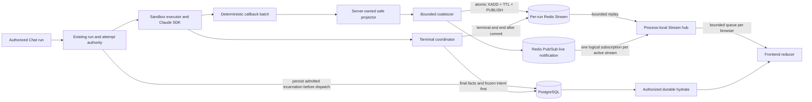

# Redis Streams SSE Event Channel v3

Status: normative source contract implemented by the v3 hard cutover; External
Acceptance pending

Design ID: `ai-platform.redis-streams-sse-event-channel.v3`

Decision: [ADR 0009](../adr/0009-redis-streams-sse-v3-live-fanout.md)

Source baseline: `0589b3eaad9c3df0422498fce489b023f6c9499c`

## Authority and precedence

This file is the sole index for the SSE v3 contract. It defines the component
boundary and points to exactly one normative owner for every detailed rule:

| Concern | Normative owner |
| --- | --- |
| Decision, rationale, supersession | [ADR 0009](../adr/0009-redis-streams-sse-v3-live-fanout.md) |
| Envelopes, callback identity, Redis key/retention, cursor/gap, SSE frames, frontend acceptance | [Wire protocol](redis-streams-sse-wire-protocol.md) |
| Admission, coalescing, authorization leases, revocation, outage, terminal convergence | [Execution control](redis-streams-sse-execution-control.md) |
| Release-atomic cutover, Nginx/gateway contract, checks, load model, External Acceptance | [Cutover and acceptance](../operations/redis-streams-sse-cutover-acceptance.md) |

ADR 0004, ADR 0003, and ADR 0002 are superseded audit history. They are not
fallback implementations, feature flags, parsers, or deployment options. When a
summary here differs from a detailed owner, the detailed owner is normative.

## Outcome

The proposed live path is:

`Claude SDK -> executor callback/worker -> safe projector -> committed semantic fact when required -> bounded coalescer -> atomic Redis Stream XADD plus PUBLISH -> process-local API fan-out -> frontend reducer`

PostgreSQL remains authoritative for run/session state, final answers,
tool/artifact facts, required safe semantic facts, audit, callback receipts,
stream incarnation, authorization epoch, and terminal publication intent. Redis
Streams is the bounded replay plane; Pub/Sub is a lossy live notification plane;
neither is permanent business truth.

There is one public Chat stream URL. Each API process owns one shared Redis
Pub/Sub connection and one logical channel subscription per active Run stream,
not per browser. Attach subscribes before it captures and replays Stream history,
then discards overlap and enters live fan-out. The final cutover removes the
v2.1 per-browser blocking `XREAD` path and legacy frontend event handlers; it
does not retain a shadow, memory, or PostgreSQL delta fallback.

## Component architecture

The Harness boundary remains intact. Engine-specific SDK objects and hidden
events terminate inside the engine adapter. Routes, Redis envelopes, callback
receipts, public projections, and reducers are platform-owned contracts.

## Existing authority reuse

Current main already has durable run/attempt transitions, callback-token binding,
an exact active sandbox runtime lease, queue/worker ownership fences, batch
receipt primitives, stream-specific admission fields, and terminal ownership.
V3 reuses those authorities and replaces only the public stream protocol and
live-reader topology. It does not create a parallel run or terminal state
machine.

A new execution ledger requires a failing test proving an unrepresentable
at-most-once property and a separately reviewed authority change. An SDK
`session_id`, Redis key, process-local flag, or response cache is never dispatch
authority.

## Invariants

- Redis admission is proven before SDK dispatch. Admission failure or uncertainty
  that cannot be resolved by deterministic same-identity retry produces zero SDK
  calls.
- Projection and filtering happen before coalescing and the atomic Redis append.
  Hidden reasoning, raw commands/tool payloads, credentials, paths, and runtime
  approval events never enter Redis or the public schema.
- One JSON Schema is the wire authority. Checked-in Python and TypeScript
  artifacts are generated from it and CI rejects drift or handwritten duplicate
  protocol definitions.
- `XADD`, active/terminal TTL refresh, and `PUBLISH` occur in one Lua operation.
  Stream and live notification carry the same canonical envelope bytes; Pub/Sub
  adds only the returned native Redis cursor wrapper.
- Each API process multiplexes active Run channels over one Pub/Sub connection.
  Each browser has bounded event and byte queues; overflow or feed uncertainty
  closes without advancing its accepted cursor.
- Attach subscribes before replay. It captures a Stream tail, replays through
  that tail, discards buffered overlap by native Redis ID and semantic event ID,
  then drains later buffered events in order.
- Each callback item has deterministic source order and semantic identity under
  one attempt/batch receipt. Duplicate response or Redis outcomes reuse that
  identity and canonical bytes.
- Cursor identity binds authorized run, positive stream incarnation, and native
  Redis ID. Malformed, foreign, and future cursors fail closed. Trim, missing key,
  or unprovable continuity emits one id-less gap and uses durable hydrate.
- The reducer sends and advances only the last cursor whose event was validated
  and successfully committed to client state. Heartbeat and gap never advance it.
- Connection/renewal performs the PostgreSQL authority lookup. Each payload uses
  the cached lease epoch/deadline plus local invalidation; PostgreSQL is not read
  per frame.
- ASGI handoff is not browser receipt. Revocation guarantees no new application
  frame after the owned gateway boundary becomes effective; real proxy behavior
  is externally measured.
- Active appends atomically refresh active-idle TTL. Terminal/end atomically set
  terminal replay TTL. Creation-time wall clock never expires a still-active
  stream.
- The terminal PostgreSQL transaction freezes exact terminal/end payload bytes,
  digest, schema, projection version, semantic IDs, and incarnation before any
  terminal Redis publish. Final hydrate replaces the partial fold.
- Redis failure never creates unbounded memory or PostgreSQL text-delta fallback.
  Safety-critical interaction cannot depend on this lossy live-notification
  plane; v3 does not restore runtime approval.
- Dormant infrastructure may precede cutover, but producer, reader, terminal, and
  frontend behavior changes are one release-atomic set guarded in CI and release
  tooling.

## User-visible sequences

### Normal and reconnect

1. The authorized attempt persists its Redis stream incarnation and opens the
   stream before executor dispatch.
2. Safe events are coalesced and atomically appended, retained, and published
   with stable semantic IDs.
3. The gateway authorizes the exact Run, attaches a bounded local subscriber,
   and waits for the shared Redis channel subscription acknowledgement.
4. It validates the cursor, captures the retained tail, replays through that
   tail, discards buffered overlap, and then emits later live notifications.
5. The browser validates and commits an event before storing its Redis-backed
   cursor.
6. Reconnect sends that exact cursor in `Last-Event-ID`; Stream replay returns
   only later retained entries before live fan-out resumes.

### Gap

1. The server authorizes the run and validates the whole cursor before Redis
   access.
2. A valid same-run cursor whose incarnation/history is unavailable produces
   `stream_replay_gap` without `id:` and closes.
3. The browser discards the incomplete live fold and calls authorized durable
   hydrate.
4. A terminal hydrate replaces the fold. An active hydrate may return a covered
   server-issued current cursor; the client never invents one.

### Terminal

1. The coordinator closes the coalescer. Healthy buffered text flushes; degraded
   transport discards only unpublished live text.
2. PostgreSQL commits the truthful terminal state, final answer/facts, degraded
   fact, and immutable publication intent.
3. Redis receives terminal then end using the frozen bytes and IDs.
4. Unknown outcomes retry identically. Missing continuity creates a new
   incarnation and an explicit gap rather than rewriting old intent bytes.
5. Authorized final hydrate replaces the provisional live answer.

## Evidence boundary

Source inspection and focused tests can prove contract shape, deterministic
identity, attach overlap handling, bounded subscribers, fail-closed branches,
cleanup, and injected fault behavior. They do not prove deployment,
Nginx/browser byte delivery, Redis Pub/Sub behavior across real API replicas, or
50-concurrent-run capacity. Those claims require the exact runtime evidence
listed in the cutover and acceptance document.
