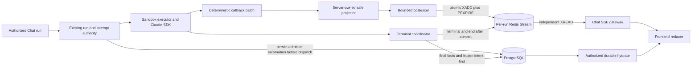

# Redis Streams SSE Event Channel v2.1

Status: accepted source contract; implementation and runtime acceptance pending

Design ID: `ai-platform.redis-streams-sse-event-channel.v2.1`

Decision: [ADR 0004](../adr/0004-redis-streams-sse-event-channel-v2-1-correction.md)

Source baseline: `c41e48dcb127ea8589b92c0b2211260c0cee3f81`

## Authority and precedence

This file is the sole index for the SSE v2.1 contract. It defines the component
boundary and points to exactly one normative owner for every detailed rule:

| Concern | Normative owner |
| --- | --- |
| Decision, rationale, supersession | [ADR 0004](../adr/0004-redis-streams-sse-event-channel-v2-1-correction.md) |
| Envelopes, callback identity, Redis key/retention, cursor/gap, SSE frames, frontend acceptance | [Wire protocol](redis-streams-sse-wire-protocol.md) |
| Admission, coalescing, authorization leases, revocation, outage, terminal convergence | [Execution control](redis-streams-sse-execution-control.md) |
| Release-atomic cutover, Nginx/gateway contract, checks, load model, External Acceptance | [Cutover and acceptance](../operations/redis-streams-sse-cutover-acceptance.md) |

ADR 0003 and ADR 0002 are superseded audit history. They are not fallback
implementations, feature flags, parsers, or deployment options. When a summary
here differs from a detailed owner, the detailed owner is normative.

## Outcome

The accepted live path is:

`Claude SDK -> executor callback/worker -> safe projector -> committed semantic fact when required -> bounded coalescer -> per-run Redis Stream XADD -> public Chat SSE XREAD -> frontend reducer`

PostgreSQL remains authoritative for run/session state, final answers,
tool/approval/artifact facts, required safe semantic facts, audit, callback
receipts, stream incarnation, authorization epoch, and terminal publication
intent. Redis is a bounded live/replay plane and never permanent business truth.

There is one public Chat stream URL. Readers use independent `XREAD`, never
`XREADGROUP`. The final cutover removes PostgreSQL text-delta writes and the
poll/sleep live reader together; it does not retain a shadow, memory, or
PostgreSQL delta fallback.

## Component architecture

The Harness boundary remains intact. Engine-specific SDK objects and hidden
events terminate inside the engine adapter. Routes, Redis envelopes, callback
receipts, public projections, and reducers are platform-owned contracts.

## Existing authority reuse

Current main already has durable run/attempt transitions, callback-token binding,
an exact active sandbox runtime lease, queue/worker ownership fences, batch
receipt primitives, and terminal ownership. V2.1 extends those authorities with
stream-specific fields and deterministic callback receipts. It does not create a
parallel run or terminal state machine.

A new execution ledger requires a failing test proving an unrepresentable
at-most-once property and a separately reviewed authority change. An SDK
`session_id`, Redis key, process-local flag, or response cache is never dispatch
authority.

## Invariants

- Redis admission is proven before SDK dispatch. Admission failure or uncertainty
  that cannot be resolved by deterministic same-identity retry produces zero SDK
  calls.
- Projection and filtering happen before coalescing and `XADD`. Hidden reasoning,
  raw commands/tool payloads, credentials, and paths never enter Redis.
- Skill/tool execution presentation enters Redis only as a strict committed
  `execution_step*` projection. The row ID, PostgreSQL run sequence, and row
  creation time are reused after commit; Redis is never called while its
  PostgreSQL transaction is open. Unsupported live approval/artifact/status
  envelope types are not advertised.
- Each callback item has deterministic source order and semantic identity under
  one attempt/batch receipt. Duplicate response or Redis outcomes reuse that
  identity and canonical bytes.
- Cursor identity binds authorized run, positive stream incarnation, and native
  Redis ID. Malformed, foreign, and future cursors fail closed. Trim, missing key,
  or unprovable continuity emits one id-less gap and uses durable hydrate.
- The reducer sends and advances only the last cursor whose event was validated
  and successfully committed to client state. Heartbeat and gap never advance it.
- Connection/renewal performs the PostgreSQL authority lookup. Each payload uses
  the cached lease epoch/deadline plus local invalidation; PostgreSQL is not read
  per frame.
- ASGI handoff is not browser receipt. Revocation guarantees no new application
  frame after the owned gateway boundary becomes effective; real proxy behavior
  is externally measured.
- Active appends atomically refresh active-idle TTL. Terminal/end atomically set
  terminal replay TTL. Creation-time wall clock never expires a still-active
  stream.
- The terminal PostgreSQL transaction freezes exact terminal/end payload bytes,
  digest, schema, projection version, semantic IDs, and incarnation before any
  terminal Redis publish. Final hydrate replaces the partial fold.
- Redis failure never creates unbounded memory or PostgreSQL text-delta fallback.
  Approval/control-sensitive work pauses or fails closed.
- Dormant infrastructure may precede cutover, but producer, reader, terminal, and
  frontend behavior changes are one release-atomic set guarded in CI and release
  tooling.

## User-visible sequences

### Normal and reconnect

1. The authorized attempt persists its Redis stream incarnation and opens the
   stream before executor dispatch.
2. Safe events are coalesced and appended with stable semantic IDs.
3. The gateway authorizes the exact run and returns Redis-backed SSE IDs.
4. The browser commits an event, then stores that cursor.
5. Reconnect sends the exact stored cursor in `Last-Event-ID`; the server returns
   only later retained entries.

### Gap

1. The server authorizes the run and validates the whole cursor before Redis
   access.
2. A valid same-run cursor whose incarnation/history is unavailable produces
   `stream_replay_gap` without `id:` and closes.
3. The browser discards the incomplete live fold and calls authorized durable
   hydrate.
4. A terminal hydrate replaces the fold. An active hydrate may return a covered
   server-issued current cursor; the client never invents one.

### Terminal

1. The coordinator closes the coalescer. Healthy buffered text flushes; degraded
   transport discards only unpublished live text.
2. PostgreSQL commits the truthful terminal state, final answer/facts, degraded
   fact, and immutable publication intent.
3. Redis receives terminal then end using the frozen bytes and IDs.
4. Unknown outcomes retry identically. Missing continuity creates a new
   incarnation and an explicit gap rather than rewriting old intent bytes.
5. Authorized final hydrate replaces the provisional live answer.

## Evidence boundary

Source inspection and focused tests can prove contract shape, deterministic
identity, fail-closed branches, cleanup, and injected fault behavior. They do not
prove deployment, Nginx/browser byte delivery, multi-replica invalidation, or
50-concurrent-run capacity. Those claims require the exact runtime evidence
listed in the cutover and acceptance document.
