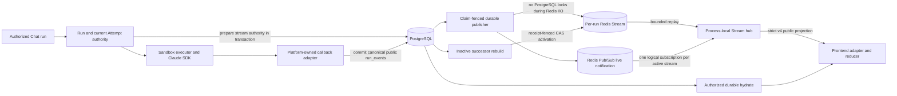

# Redis Streams SSE Event Channel v4

Status: normative source contract implemented by the v4 hard cutover; External
Acceptance pending

Design ID: `ai-platform.redis-streams-sse-event-channel.v4`

Decision: [ADR 0012](../adr/0012-recoverable-agent-kernel-event-stream-v4.md)

Source baseline: Issue #1187 fixed cutover SHA

## Authority and precedence

This file is the sole index for the active SSE v4 contract. It defines the
component boundary and points to exactly one normative owner for every detailed
rule:

| Concern | Normative owner |
| --- | --- |
| Decision, rationale, supersession | [ADR 0012](../adr/0012-recoverable-agent-kernel-event-stream-v4.md) |
| Envelopes, callback boundary, Redis replay/live, cursor/gap, SSE frames, frontend acceptance | [Wire protocol](redis-streams-sse-wire-protocol.md) |
| Admission, publication claims, authorization leases, cancellation, recovery, successor activation | [Execution control](redis-streams-sse-execution-control.md) |
| Release-atomic cutover, Nginx/gateway contract, checks, service matrix, External Acceptance | [Cutover and acceptance](../operations/redis-streams-sse-cutover-acceptance.md) |

ADR 0009 is retained as historical context for the Redis replay and live fan-
out transport. ADR 0004, ADR 0003, and ADR 0002 are superseded audit history;
none is a fallback implementation, feature flag, parser, or deployment option.
When a summary here differs from a detailed owner, the detailed owner is
normative.

## Outcome

The active path is:

`Claude SDK -> platform adapter -> committed public run_event -> publication claim -> transaction-external atomic Redis append/publish -> process-local API fan-out -> v4 frontend adapter/reducer`

PostgreSQL remains authoritative for Run/session state, attempts, final answers,
tool and artifact facts, audit, callback receipts, stream authority,
authorization epoch, committed public-event order, publication disposition,
and successor-rebuild claims. Redis Streams is the bounded replay plane;
Pub/Sub is a lossy live notification plane; neither is permanent business
truth.

There is one public Chat stream URL and one active v4 runtime. Each API process
owns one shared Redis Pub/Sub connection and one logical channel subscription
per active Run stream, not per browser. Attach subscribes before it captures and
replays Stream history, discards overlap, and then enters live fan-out. Missing
terminal history is rebuilt into an inactive successor incarnation and becomes
authoritative only after PostgreSQL verifies the complete snapshot and
persisted Redis receipt. There is no v3 negotiation, shadow runtime, or
PostgreSQL text-delta fallback.

## Component architecture

The Harness boundary remains intact. Engine-specific SDK objects and hidden
events terminate inside the engine adapter. Routes, Redis envelopes, callback
receipts, public projections, and reducers are platform-owned contracts.

## Existing authority reuse

Current main has durable Run/Attempt transitions, callback-token binding, an
exact active sandbox runtime lease, queue/worker ownership fences, callback
receipts, stream authority, authorization epochs, and terminal ownership. V4
reuses those authorities and adds durable public-event publication and fenced
successor recovery. It does not create a parallel Run or terminal state machine.

A new execution ledger requires a failing test proving an unrepresentable
at-most-once property and a separately reviewed authority change. An SDK
`session_id`, Redis key, process-local flag, or response cache is never dispatch
authority.

## Invariants

- Redis admission is proven before SDK dispatch. Admission failure or uncertainty
  that cannot be resolved by deterministic same-identity retry produces zero SDK
  calls.
- Projection, validation, and disclosure filtering happen before a public event
  is committed. Hidden reasoning, raw commands/tool payloads, credentials,
  paths, and runtime approval events never enter the canonical public envelope.
- One JSON Schema is the v4 wire authority. Checked-in Python and TypeScript
  artifacts are generated from it and CI rejects drift or handwritten duplicate
  protocol definitions.
- Publication claims commit before Redis I/O. `XADD`, active/terminal TTL
  refresh, and `PUBLISH` occur in one Lua operation; claim-token-fenced
  disposition accepts only the exact nonempty persisted receipt.
- Each API process multiplexes active Run channels over one Pub/Sub connection.
  Each browser has bounded event and byte queues; overflow or feed uncertainty
  closes without advancing its accepted cursor.
- Attach subscribes before replay. It captures a Stream tail, replays through
  that tail, discards buffered overlap by native Redis ID and semantic event ID,
  then drains later buffered events in order.
- Each committed public event has stable source order and semantic identity.
  Duplicate callbacks, publication retries, and disposition retries reuse the
  same canonical bytes and Redis receipt rather than creating another semantic
  event.
- Cursor identity binds the authorized Run, positive stream incarnation, and
  native Redis ID. Malformed, foreign, and future cursors fail closed. Trim or
  unprovable continuity emits one strict v4 `stream.gap` control with the
  server-supplied Redis cursor and triggers durable hydrate. A missing terminal
  stream uses successor-incarnation rebuild before replay; same-incarnation
  reconstruction is forbidden.
- The reducer sends and advances only the last cursor whose event was validated
  and successfully committed to client state. Semantic duplicates may advance
  transport state without mutating chat state. Terminal and matching
  `stream.end` cursors wait for terminal-hydration acceptance.
- Connection/renewal performs the PostgreSQL authority lookup. Lease acquisition
  validates the durable epoch; each payload checks the cached authority-clock
  deadline, and PostgreSQL is not read per frame. A committed epoch change
  rejects renewal, so old-epoch admission ends no later than the <=15-second
  lease deadline.
- ASGI handoff is not browser receipt. Revocation guarantees no new application
  frame after the old lease deadline; real proxy behavior is externally
  measured.
- Active appends atomically refresh active-idle TTL. Terminal/`stream.end`
  atomically set terminal replay TTL. Creation time alone does not expire a
  stream while it emits accepted events within the active-idle window.
- Terminal public rows and `stream.end` are committed under the existing Runs
  terminal authority before transaction-external Redis publication. Final
  hydrate remains the sole chat terminal-content authority.
- Redis failure never creates unbounded memory or PostgreSQL text-delta
  fallback. Retry maintenance drains indexed pending rows; recovery uses one
  inactive successor and token-fenced activation.
- Producer, publisher, recovery activation, route, frontend, workflow, checker,
  and release documentation form one release-atomic v4 set.

## User-visible sequences

### Normal and reconnect

1. The authorized attempt prepares stream authority in the same transaction
   before any public or terminal event can commit.
2. Safe canonical events commit to PostgreSQL and are claimed in business order;
   Redis append/publish runs after the claim transaction releases its locks.
3. The gateway authorizes the exact Run, attaches a bounded local subscriber,
   and waits for shared Redis subscription acknowledgement.
4. It validates the cursor, captures the retained tail, replays through that
   tail, discards buffered overlap, and emits later live notifications.
5. The browser validates and commits an event before storing its Redis-backed
   cursor. Legitimate semantic duplicates are transport-only acceptance.
6. Reconnect sends that exact cursor in `Last-Event-ID`; replay returns only
   later retained entries before live fan-out resumes.

### Gap

1. The server authorizes the Run and validates the whole cursor before Redis
   access.
2. Trim or continuity uncertainty produces a strict v4 `stream.gap` control
   with the current incarnation and server-owned Redis bounds.
3. The browser does not mutate chat state for the gap and calls authorized
   durable hydrate.
4. A missing terminal stream claims a fresh successor incarnation, constructs
   an inactive Redis candidate outside PostgreSQL locks, and activates it only
   after source fingerprint, cardinality, claim expiry, and receipt rechecks.
5. Replay restarts on the activated successor. The browser never invents a
   cursor or crosses incarnation state.

### Terminal

1. The Runs owner commits the truthful terminal state and canonical terminal
   public row under its existing transaction and lock order.
2. Durable publication claims and appends the terminal row plus matching
   `stream.end` with stable bytes, semantic IDs, and one persisted receipt.
3. Unknown Redis or disposition outcomes retry identically; no PostgreSQL lock
   is held across Redis I/O.
4. If retained terminal history is missing, successor recovery rebuilds and
   atomically activates a fresh incarnation rather than rewriting the old one.
5. The frontend holds terminal and matching `stream.end` cursors until the
   existing final hydrate callback accepts the authoritative terminal state.

## Evidence boundary

Source inspection and focused tests can prove contract shape, deterministic
identity, attach overlap handling, bounded subscribers, fail-closed branches,
cleanup, and injected fault behavior. They do not prove deployment,
Nginx/browser byte delivery, Redis Pub/Sub behavior across real API replicas, or
50-concurrent-run capacity. Those claims require the exact runtime evidence
listed in the cutover and acceptance document.
