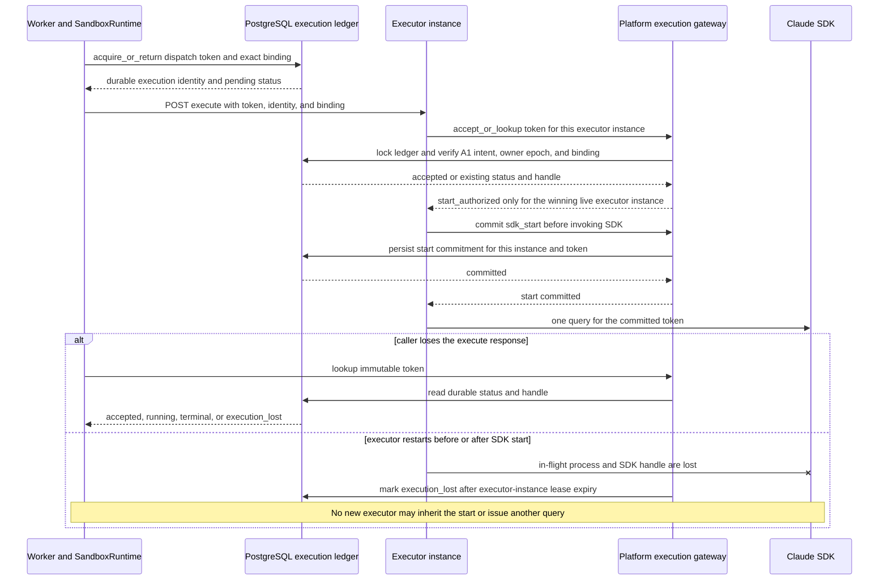
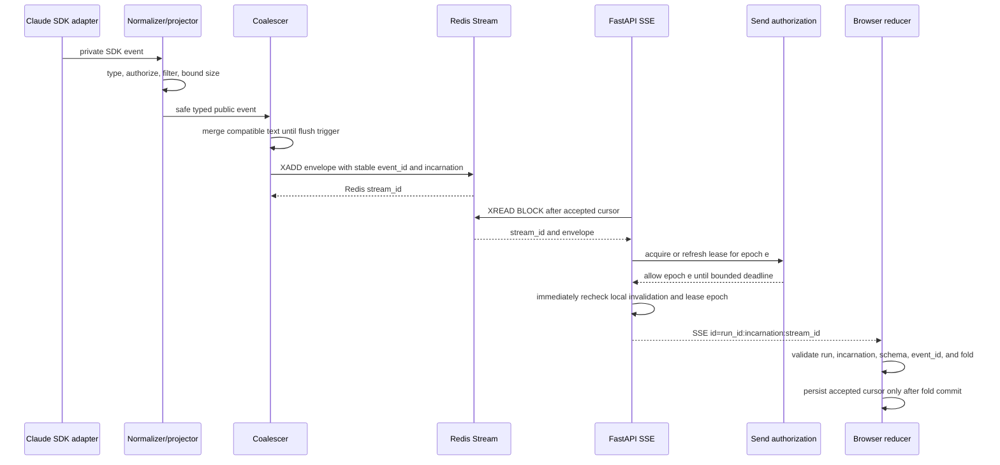
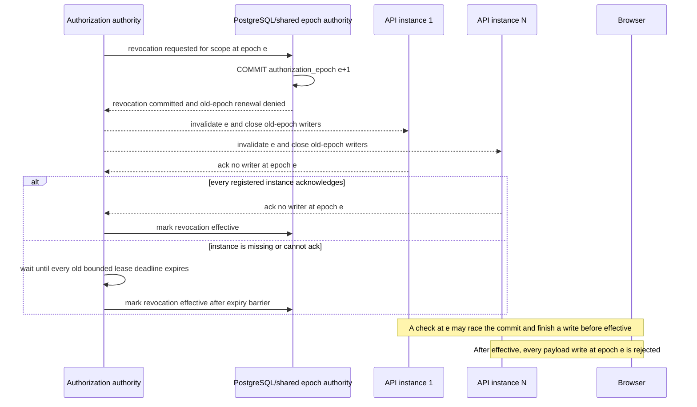
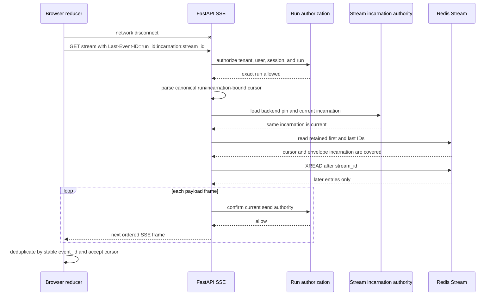
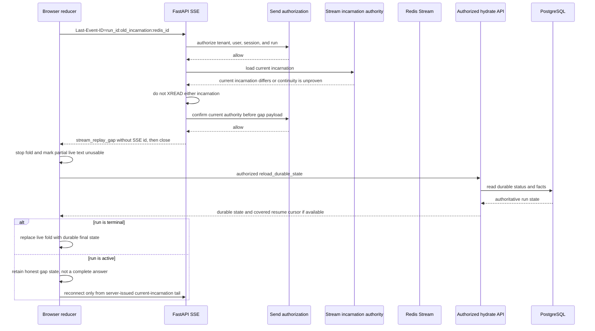
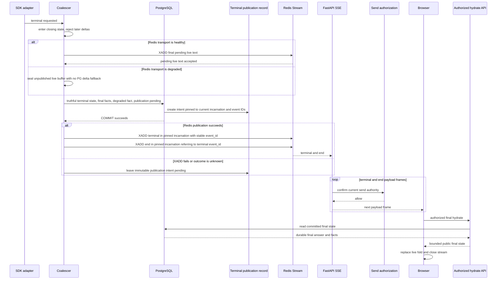
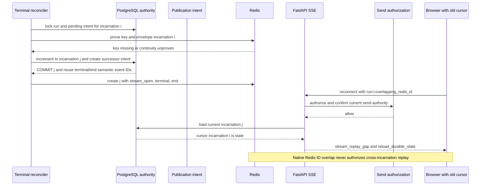

# Redis Streams SSE Event Channel

Status: active correction contract; implementation remains gated by A0-F

Design ID: `ai-platform.redis-streams-sse-event-channel.v2`

Supersedes: `ai-platform.redis-streams-sse-event-channel.v1`, accepted at
`73b37ff40f965dcfb7b9f2a9f499d7d5fb32be11` and merged as
`5d5a0c537baa0af2d9c47cb8d010a713c5240dc6`

Source baseline: `046d4b8a91d70dac51fe31d517d8d09c907a3f9f`

## Decision Summary

AI Platform will move live Agent output to this fixed flow:

`Claude Agent SDK -> typed event normalizer -> bounded in-memory coalescer -> per-run Redis Stream XADD -> FastAPI SSE XREAD -> idempotent frontend reducer`

Redis Streams is a bounded live/replay plane. PostgreSQL remains the durable
authority for run and session state, the final assistant answer, tool and
approval decisions, artifact facts, and required audit or semantic facts. Text
deltas are not durable product facts and stop being written to PostgreSQL once a
run is admitted to the Redis Streams backend.

The terminal order is invariant:

`seal live transport (flush if healthy, mark degraded otherwise) -> persist truthful final state, necessary semantics, and publication intent -> commit PostgreSQL -> XADD terminal -> XADD end`

Redis unavailability at admission fails closed before SDK dispatch. Mid-run
failure never selects an in-process stream or PostgreSQL delta writes as a silent
fallback; it follows the controlled degraded-execution policy below. A lost or
trimmed replay window produces an explicit gap and durable-state reload. The
durable final answer always replaces any partial live fold at terminal
reconciliation.

Version 2 corrects seven implementation constraints without weakening the
bounded-replay decision:

- A pure StreamBridge contract cannot enable production. PostgreSQL admission
  authority must be merged and pass a real PostgreSQL gate before any producer
  can create or dispatch a Redis-pinned run.
- Durable executor dispatch is a mandatory A2 stage after admission. It owns the
  token protocol and execution ledger; the installed SDK cannot truthfully be
  treated as a resumable idempotent execution service.
- Authorization revocation has requested, committed, and effective states. A
  commit advances a monotonic epoch and starts a cross-instance barrier; only
  barrier completion makes the zero-payload guarantee effective.
- PostgreSQL owns the revocation epoch, registered instance/ack set, database-
  clock send leases, and barrier. Redis auth-context leases and process memory
  are explicitly non-authoritative.
- A mid-run Redis outage degrades live transport, not automatically execution.
  Eligible non-interactive work may continue under bounded control and converge
  through PostgreSQL; interactive, approval, control, or unsafe work pauses or
  fails closed.
- Terminal PostgreSQL state and a pending publication intent converge the run
  even when terminal `XADD` fails or has an unknown outcome.
- The final release replaces the PostgreSQL polling/delta SSE runtime. It does
  not retain a production compatibility stack, shadow live path, or feature flag
  that can select both mechanisms.

This document selects the architecture and dispatch contracts. It does not
authorize implementation, deployment, or a runtime claim.

## User Journey

1. An authorized user starts one Agent run. A PostgreSQL admission transaction
   pins the stream backend, v2 design, tenant, session, run, attempt/generation,
   authorization epoch, public projection policy, and first monotonic stream
   incarnation together with `admission_open_pending`, an idempotent open token,
   a positive `admission_owner_epoch`, owner lease, and admission deadline. It
   commits before `stream_open`. A fenced compare-and-set confirmation records
   `stream_open_confirmed` and creates the unique durable SDK dispatch intent in
   one transaction; only that intent may reach A2.
2. A2 binds the intent's stable dispatch token to the exact admitted authority,
   durably accepts or returns one execution ledger record, and authorizes at most
   one SDK start. A response loss is resolved by status/handle lookup, never by a
   fresh token or direct SDK call. Executor loss converges to `execution_lost`
   when the installed SDK cannot resume the in-flight work.
3. Safe typed text arrives quickly in coalesced chunks. Tool, approval, artifact,
   and lifecycle events remain typed and are projected only after their durable
   authority allows them to be public.
4. A browser that disconnects reconnects with the last event it actually
   accepted. It receives only later retained events and folds duplicates
   idempotently.
5. If the retained window no longer covers the cursor, the browser is told that
   replay is incomplete. It discards the incomplete live answer, reloads the
   authorized durable run state, and resumes only from a server-issued current
   tail when the run is still active.
6. If Redis fails mid-run, live delta publication stops immediately and no
   unbounded memory or PostgreSQL delta fallback begins. Eligible non-interactive
   work may continue only while cancellation, resource, egress, and safety
   authorities remain controllable. Approval or user interaction pauses or fails
   closed when its event cannot be delivered reliably.
7. At completion, the worker seals the live transport, commits the truthful
   success, failure, or cancellation state, final answer when complete, required
   facts, degraded-transport fact, and terminal publication intent in one
   PostgreSQL transaction. Only then may terminal and end be published in Redis.
8. If Redis is absent or an `XADD` outcome is unknown, the run remains durably
   terminal rather than permanently running. The pending intent and authorized
   final hydrate converge delivery; PostgreSQL is never rolled back to make the
   stream look healthy and incomplete execution is never marked successful.

The intended user result is low first-delta latency, bounded replay across API
processes and browser reconnects, an honest gap state, and a correct durable
final answer without PostgreSQL text-delta write amplification.

## Canonical Terms

| Term | Meaning |
| --- | --- |
| Event channel | The complete typed producer-to-reducer contract, not only the SSE route. |
| Replay plane | Per-run Redis Stream entries retained for a bounded time and length. It is not permanent history. |
| Durable fact | A PostgreSQL record required to reconstruct authoritative product state after Redis and process loss. |
| Live fold | Browser state built from accepted Redis-backed events. It is provisional until final reconciliation. |
| Stream incarnation | A positive, monotonically increasing per-run continuity number persisted in PostgreSQL and embedded in the Redis key, every envelope, and every SSE cursor. It changes whenever the current Redis stream must be created again without proof of continuity. |
| Stream generation | The durable logical attempt/fold generation. It changes for a replacement attempt and is independent of physical stream incarnation. |
| Stream cursor | The canonical `<run_id>:<stream_incarnation>:<redis-id>` SSE ID. The native Redis ID orders entries only inside the same proven incarnation. |
| Accepted cursor | The last run-bound SSE ID that the reducer validated and committed to client state. Merely receiving a frame is insufficient. |
| Replay gap | Proof that a syntactically valid cursor for the authorized run is no longer covered by retained history or cannot be related safely to the current stream incarnation/generation. Foreign, malformed, and future cursors are invalid requests, not gaps. |
| Terminal announcement | A Redis event emitted only after the authoritative PostgreSQL terminal transaction commits. |
| Final reconciliation | Replacement of the live fold with the authorized PostgreSQL final answer, status, semantics, and artifacts. |
| Stream backend pin | The immutable active-run assertion `redis_streams_v2`. It is a consistency fence, not a production selector between two live streaming stacks. |
| Dispatch token | An opaque immutable A1 intent identifier whose durable binding includes design, tenant/session/run, attempt, incarnation, generation, and the winning admission-owner epoch. It is never replaced after an uncertain request. |
| Execution ledger | The A2 PostgreSQL record that owns executor acceptance, executor-instance binding, start authorization, bounded status/handle lookup, and terminal or `execution_lost` outcome for one dispatch token. |
| Authorization epoch | A positive, monotonically increasing authority version bound to each connection/send lease. Epoch advancement invalidates renewal of every older lease. |
| Revocation requested | A change has been accepted for processing but its durable authorization epoch has not committed. Existing authority remains the reported state. |
| Revocation committed | The new epoch is durable, no old-epoch lease may renew, and cross-instance invalidation/ack is in progress. The API reports revocation pending, not effective. |
| Revocation effective | Every old-epoch writer has closed and acknowledged, or every bounded old lease has expired. From this barrier onward, zero payload frames are permitted. |
| SSE send lease | A PostgreSQL-authorized, API-instance/connection/epoch-bound lease whose expiry is calculated with database time and is no more than 15 seconds. Redis auth-context operation leases are unrelated. |
| Transport degraded | Redis live/replay publication is unavailable while PostgreSQL and the bounded execution authorities may still be healthy. It is a durable fact, not permission to buffer or write PostgreSQL deltas. |

## Current-Main Diagnosis

The baseline already has useful durable primitives, but the live path puts text
deltas and polling load on PostgreSQL:

- Claude `on_text` sends every delta to `event_sink` in
  [`claude_agent_worker.py`](https://github.com/demonsxxxxxx/ai-platform/blob/839f851bc0954d1d97910c07489fc750bdb01b2b/app/executors/claude_agent_worker.py#L2008-L2015).
- The worker opens a transaction for the event and persists an
  `assistant_delta` through `append_user_event` in
  [`worker.py`](https://github.com/demonsxxxxxx/ai-platform/blob/839f851bc0954d1d97910c07489fc750bdb01b2b/app/worker.py#L2399-L2437).
- The current ledger atomically allocates per-run cursors, supports exact batch
  receipts, terminal drain fences, and incremental reads in
  [`app/streaming/postgres.py`](https://github.com/demonsxxxxxx/ai-platform/blob/839f851bc0954d1d97910c07489fc750bdb01b2b/app/streaming/postgres.py#L116-L333).
  Historical rows and necessary semantic facts may remain readable, but these
  primitives cease to be a live SSE cursor/page and do not justify retaining
  each text delta.
- The public LambChat SSE route accepts `Last-Event-ID`, but reconnect seeds fold
  state by reading the full durable prefix. Its loop rereads the run, event page,
  and artifacts, then sleeps one second in
  [`lambchat_compat.py`](https://github.com/demonsxxxxxx/ai-platform/blob/839f851bc0954d1d97910c07489fc750bdb01b2b/app/routes/lambchat_compat.py#L1393-L1528).
- The frontend creates a fresh `fetchStream` request without explicitly sending
  its last accepted cursor. It accepts `event.id` or falls back to an unrelated
  UUID and has no sequence-coverage test in
  [`sseConnection.ts`](https://github.com/demonsxxxxxx/ai-platform/blob/839f851bc0954d1d97910c07489fc750bdb01b2b/frontend/web/src/hooks/useAgent/sseConnection.ts#L368-L511).
- The current shared Redis client has one event-loop-local pool with a default
  maximum of ten connections. Long blocking reads therefore need an explicitly
  separate pool or reservation; they cannot consume the same small pool used by
  publishers and queue/auth operations. See
  [`redis_client.py`](https://github.com/demonsxxxxxx/ai-platform/blob/839f851bc0954d1d97910c07489fc750bdb01b2b/app/redis_client.py#L63-L96) and
  [`settings.py`](https://github.com/demonsxxxxxx/ai-platform/blob/839f851bc0954d1d97910c07489fc750bdb01b2b/app/settings.py#L17-L18).

The root cause is architectural: PostgreSQL is doing high-frequency transport
work and the SSE route polls that durable store. Client smoothing, a larger UI
buffer, or a shorter polling interval cannot remove the write and query
amplification or establish bounded replay semantics.

## Non-Goals

- This design does not implement A-F, change a route, add schema, or select a
  deployment topology.
- It does not create a second public SSE product route. The existing LambChat-
  compatible URL remains only as the public transport contract; C replaces its
  implementation with Redis `XREAD` and cannot proxy or fall back to the
  PostgreSQL poller. Native history/playback APIs remain durable-history and
  diagnostics interfaces, never live-stream fallbacks.
- It does not make Redis a transcript, audit ledger, run authority, artifact
  authority, or final-answer authority.
- It does not use `XREADGROUP`; browsers are independent readers, not competing
  consumers of work.
- It does not expose raw Claude SDK events, prompts, credentials, commands,
  private tool payloads, storage keys, runtime paths, or tenant internals.
- It does not complete the separate public-projection tightening campaign. It
  does require the existing safe projection and secret filtering to run before
  every `XADD`.
- It does not promise lossless live text across a producer-process crash. The
  coalescer bounds the possible pending loss; PostgreSQL final reconciliation
  provides product correctness.
- It does not treat source or test evidence as Docker, deployment, browser, or
  real multi-instance acceptance.

## Fixed-SHA Reference Evidence

### DeerFlow 2.0

Fixed source:
[`99c926b7bbcd0570870bc24ceb13ab934935f49c`](https://github.com/bytedance/deer-flow/commit/99c926b7bbcd0570870bc24ceb13ab934935f49c)

- The FastAPI route
  [`POST /api/threads/{thread_id}/runs/stream`](https://github.com/bytedance/deer-flow/blob/99c926b7bbcd0570870bc24ceb13ab934935f49c/backend/app/gateway/routers/thread_runs.py#L844-L868)
  starts a run and returns an SSE consumer over a stream bridge.
- [`StreamEvent`, `StreamGap`, and `StreamBridge`](https://github.com/bytedance/deer-flow/blob/99c926b7bbcd0570870bc24ceb13ab934935f49c/backend/packages/harness/deerflow/runtime/stream_bridge/base.py#L16-L80)
  define event IDs for `Last-Event-ID`, heartbeat/end sentinels, and explicit
  retained-bound gaps whose recovery is durable-state reload.
- [`RedisStreamBridge`](https://github.com/bytedance/deer-flow/blob/99c926b7bbcd0570870bc24ceb13ab934935f49c/backend/packages/harness/deerflow/runtime/stream_bridge/redis.py#L51-L75)
  uses one Redis Stream per run and `XREAD` across gateway workers. Its default
  TTL at this SHA is 86,400 seconds, not two hours.
- Its subscriber takes retained-bound snapshots, detects trim gaps, then uses a
  blocking `XREAD` only as a wake-up in
  [`redis.py`](https://github.com/bytedance/deer-flow/blob/99c926b7bbcd0570870bc24ceb13ab934935f49c/backend/packages/harness/deerflow/runtime/stream_bridge/redis.py#L205-L350).

Adopt: explicit bridge boundary, run-local Redis streams, run-bound reconnect,
heartbeat without cursor movement, and explicit gap recovery. Do not copy its
retry count, TTL, or endpoint contract without ai-platform acceptance.

### LobeHub

Fixed source:
[`b38ce0c38ca9a01f022616d52b64df4e51241e85`](https://github.com/lobehub/lobe-chat/commit/b38ce0c38ca9a01f022616d52b64df4e51241e85)

- [`StreamEventManager`](https://github.com/lobehub/lobe-chat/blob/b38ce0c38ca9a01f022616d52b64df4e51241e85/apps/server/src/modules/AgentRuntime/StreamEventManager.ts#L137-L216)
  uses a per-operation key, direct `XADD MAXLEN ~ 1000`, and a two-hour expiry.
  It deliberately uses a separate blocking connection so `XREAD BLOCK` does
  not serialize publishers behind a shared connection.
- Blocking subscription uses `XREAD` and preserves Redis IDs in
  [`subscribeStreamEvents`](https://github.com/lobehub/lobe-chat/blob/b38ce0c38ca9a01f022616d52b64df4e51241e85/apps/server/src/modules/AgentRuntime/StreamEventManager.ts#L297-L350).
- Bounded long polling resolves `$` to a concrete tail with `XREVRANGE` before
  `XREAD`, and history reads use `XREVRANGE`, in
  [`readEventsOnce` and `getStreamHistory`](https://github.com/lobehub/lobe-chat/blob/b38ce0c38ca9a01f022616d52b64df4e51241e85/apps/server/src/modules/AgentRuntime/StreamEventManager.ts#L390-L470).
- Large final-state fields are stripped because canonical messages live in the
  database, as documented in
  [`StreamEventManager.ts`](https://github.com/lobehub/lobe-chat/blob/b38ce0c38ca9a01f022616d52b64df4e51241e85/apps/server/src/modules/AgentRuntime/StreamEventManager.ts#L45-L57).

This fixed file defines text/reasoning chunk types, but it directly serializes
events to `XADD`; it does not prove a separate text/reasoning coalescing buffer.
AI Platform's bounded coalescer is therefore our design decision, not a copied
LobeHub fact.

### Open WebUI

Fixed source:
[`01f4282f1ffe0d6212f58d3afbeae21fffd0c4be`](https://github.com/open-webui/open-webui/commit/01f4282f1ffe0d6212f58d3afbeae21fffd0c4be)

[`createOpenAITextStream`](https://github.com/open-webui/open-webui/blob/01f4282f1ffe0d6212f58d3afbeae21fffd0c4be/src/lib/apis/streaming/index.ts#L26-L88)
pipes bytes through `TextDecoderStream` and `EventSourceParserStream`, then
parses OpenAI-style SSE deltas. This is useful parser evidence only. That path
contains no durable store, retained cursor contract, or final-state
reconciliation, so a direct ordinary-model proxy is not the durable replay core
for background Agent runs.

Upstream source proves design patterns, not ai-platform runtime behavior.

## Component Architecture

```mermaid
flowchart LR
    U["Authorized run request"] --> A1["PostgreSQL admission authority"]
    A1 -->|"commit pin, pending, open token, owner epoch, and lease"| PG[("PostgreSQL durable authority")]
    PG -->|"open token and owner epoch"| W["StreamBridge stream_open"]
    W -->|"matching open proof"| A1C["Fenced confirm CAS plus dispatch intent"]
    A1C -->|"committed dispatch token"| A2["A2 durable executor dispatch ledger"]
    A2 -->|"token-aware claim and lookup"| EX["Sandbox executor instance"]
    EX -->|"at most one authorized start"| SDK["Claude Agent SDK adapter"]
    SDK --> N["Typed event normalizer"]
    N --> P["Tenant/run authorization and safe projection"]
    P --> C["Bounded per-run coalescer"]
    C --> W
    W -->|"XADD"| R[("Per-run Redis Stream")]
    R -->|"XREAD BLOCK"| X["FastAPI stream reader"]
    X --> S["LambChat SSE adapter"]
    S --> F["Idempotent frontend reducer"]
    N -->|"semantic and terminal facts"| T["Terminal coordinator"]
    T --> PG
    PG --> H["Authorized durable hydrate"]
    H --> F
    T -->|"only after PG commit"| W
```



`app.streaming` owns the event envelope, cursor, gap, heartbeat, Redis
read/write, and terminal publication contracts. Claude, LambChat, and frontend
code are adapters. This preserves the Harness replacement boundary in
`runtime-authorities.md`.

## Executor Dispatch Sequence



The `start_authorized` and `sdk_start` transitions are intentionally fail-closed.
The executor records a durable pre-start commitment before calling the SDK. A
crash after that commitment but before the SDK call may produce no execution; it
still terminalizes `execution_lost` rather than risking a duplicate start. A
same-process response loss may be resolved only by the winning executor
instance's lookup. An executor restart has a new instance identity and cannot
claim successful same-handle resumption.

## Normal Streaming Sequence



The immediate pre-write check closes ordinary stale-cache paths but cannot make
authorization commit and a network write one atomic transaction. Version 2 uses
an explicit barrier instead of claiming otherwise:



The maximum committed-to-effective window is the maximum issued send lease and
is normatively no more than 15 seconds in v2; deployments may configure a lower
value. The API reports `access_revocation_requested` before commit while the old
authority is still effective, `access_revocation_pending` after commit, and
`access_revoked` only after the barrier. Timeout, missing acknowledgement,
shared-authority error, or an attempted old-epoch renewal closes the connection
fail closed. Stage F measures
the check-to-commit-to-write race across multiple API instances and proves zero
payload after the recorded effective barrier.

## Reconnect Sequence



## Gap Sequence



## Terminal Sequence



If the PostgreSQL transaction fails, neither terminal nor end may be added. If
the PostgreSQL commit succeeds and either `XADD` fails or has an unknown outcome,
the durable publication intent remains pending. A reconciler retries the same
stable terminal and end semantic `event_id` values only in the intent's pinned
incarnation while that incarnation remains provable; duplicate Redis entries are
harmless to the reducer.

The terminal coordinator does not acknowledge completion or release the durable
execution lease until the terminal transaction commits. After rollback it
reports `terminal_recovery_pending` when PostgreSQL remains readable and retries
under the same attempt/generation. If the process crashes, expiry of the existing
execution lease transfers recovery to the durable maintenance owner. Within one
execution-lease expiry plus one maintenance interval after PostgreSQL is
available, that owner must either commit the truthful terminal transaction and
publication intent or commit a failure/cancellation terminal transaction. If
PostgreSQL itself is unavailable, the public state is authority unavailable, not
running-success or success; recovery resumes fail closed when authority returns.

The terminal transaction records exactly one truthful execution outcome:

- success only after the SDK completed and produced the authoritative final
  answer/facts, even when live transport was degraded;
- failure or cancellation when execution did not complete, including loss of a
  required approval/control/safety channel or uncontrollable resource, egress,
  or cancellation authority;
- a paused, non-success state when an approval or user interaction can be held
  safely for recovery.

Every outcome records the transport-degraded fact when applicable and creates a
pending terminal publication intent. Redis failure never leaves the run
permanently `running`, never turns incomplete execution into success, and never
causes text deltas to be written to PostgreSQL. Authorized durable status/final
hydrate remains available while terminal publication is pending.

If the target key is missing or its incarnation cannot be proven, the reconciler
must not recreate it under the old incarnation. Under a PostgreSQL row lock it
marks the original immutable-target intent as superseded by rebuild, increments
the run's current incarnation, and creates a successor intent that pins the new
incarnation while reusing the same terminal and end semantic `event_id` values.
It then creates the new incarnation with `stream_open`, followed by terminal and
end. This preserves semantic idempotency without presenting two physical streams
as one continuous replay.



## Typed Event Contract

### Internal Redis envelope

Every entry stores bounded fields with this conceptual shape:

```json
{
  "schema": "ai-platform.stream-event.v2",
  "event_id": "sev_immutable_id",
  "tenant_scope": "stable_nonreversible_scope",
  "run_id": "run_id",
  "attempt_id": "attempt_id",
  "stream_incarnation": 1,
  "stream_generation": 1,
  "event_type": "assistant_text_delta",
  "emitted_at": "RFC3339_UTC",
  "projection_version": "public-stream-v1",
  "payload": {
    "delta": "bounded public-safe text"
  }
}
```

Rules:

- `schema`, `event_id`, `tenant_scope`, `run_id`, `attempt_id`,
  `stream_incarnation`, `stream_generation`, `event_type`, `emitted_at`,
  `projection_version`, and `payload` are required.
- `event_id` is allocated before `XADD` and reused for retry after an unknown
  outcome. Redis Stream ID is transport order; `event_id` is semantic
  idempotency.
- `tenant_scope` is a stable keyed projection, not a raw tenant label. The
  authorized route derives the same scope before accessing the key.
- Redis payloads are already safe public projections. The SSE adapter may remove
  internal routing fields, but it must never be the first secret filter.
- Unknown schema versions, event types, extra fields, invalid UTF-8, oversized
  payloads, or mismatched tenant/run/attempt/incarnation/generation fail closed
  before `XADD` or fold.
- Text and reasoning deltas are different event types and never coalesce across
  type, attempt, projection version, or policy boundary.
- `stream_incarnation` is the physical replay-continuity fence. It is persisted
  with the backend pin in PostgreSQL and must match the key, envelope, cursor,
  and terminal publication intent. It is never inferred from a Redis ID.
- `stream_generation` is the logical fold/attempt fence and is persisted with the
  run. A replacement attempt increments
  it and appends `stream_reset` before any new-generation user-visible event.
  Readers reject mixing generations and reducers discard the superseded fold.
  A generation change does not by itself permit incarnation reuse or replacement.
- Tool, approval, artifact, and terminal events contain identifiers and bounded
  public summaries only after their PostgreSQL facts commit. Raw inputs,
  outputs, arguments, commands, credentials, paths, and storage keys are absent.

Initial event types are:

| Type | Authority before XADD | Coalescing | Durable reconciliation |
| --- | --- | --- | --- |
| `stream_open` | Admitted backend pin, incarnation, and generation | No | Run backend pin, incarnation, and generation |
| `stream_reset` | Committed replacement generation | No | Run generation and attempt authority |
| `assistant_text_delta` | Safe text projector | Yes | Final assistant message |
| `assistant_reasoning_delta` | Explicit public reasoning policy | Yes, separate buffer | Final public answer does not require reasoning replay |
| `run_status` | Durable run transition when semantic | No | Run row |
| `tool_lifecycle` | Durable tool fact | No | Tool fact/history |
| `approval_required` | Durable approval request | No | Approval authority |
| `artifact_ready` | Committed artifact record | No | Artifact record/download contract |
| `terminal` | Committed final transaction | No | Run status, final answer, facts |
| `end` | A committed terminal and terminal publication intent | No | Same terminal fact |

### Public SSE projection

The wire frame uses:

```text
id: <run_id>:<stream_incarnation>:<redis_milliseconds>-<redis_sequence>
event: <public_event_type>
data: <bounded JSON public projection>
```

The public payload does not include `tenant_scope`, `attempt_id`, private trace
IDs, raw internal event type names, or Redis key material. The cursor carries the
positive decimal `stream_incarnation`; the payload includes the bounded
`stream_generation` needed to prevent cross-attempt folding.

## Stream Incarnation Authority, Key, And Cursor Contract

- PostgreSQL is the only durable allocator of `stream_incarnation`. The run
  admission transaction creates positive incarnation `1` together with the
  immutable `redis_streams_v2` backend pin and design version. The allocation
  commits before `stream_open` and SDK dispatch. Historical pre-cutover rows have
  no Redis incarnation and are hydrate-only; they cannot resume, retry, or become
  an active live stream.
- Key: `ai-platform:sse:v2:{<tenant_scope>:<run_id>}:<stream_incarnation>:events`.
  The braces keep every sequential incarnation for one tenant/run in one Redis
  Cluster hash slot. Exactly one incarnation is current; an older key may remain
  only until its bounded TTL and is never selected after PostgreSQL advances.
- Creation is fenced by the durable run row. A missing current key, an unprovable
  first/current envelope, Redis continuity loss, or an authorized rebuild takes
  the row lock and increments the incarnation before any new `XADD`. No producer,
  API reader, startup repair, or reconciler may recreate a missing key with an
  already issued incarnation.
- Every entry contains the same incarnation as its key. Admission/rebuild creates
  `stream_open` as the first entry before SDK dispatch or recovery publication.
  A replacement attempt changes `stream_generation`, then appends `stream_reset`;
  it does not change incarnation unless Redis continuity also needs rebuilding.
- Admission persists `admission_open_pending`, a unique open token derived from
  the immutable run/incarnation/generation/attempt, plus the owner identity, a
  positive monotonic `admission_owner_epoch`, an owner lease, and a bounded
  deadline in the first PostgreSQL transaction. `stream_open` is idempotent for
  that exact token: an existing first envelope is success only when every pinned
  field matches; mismatch fails closed.
- Takeover is a PostgreSQL row-lock transition allowed only while admission is
  pending and the prior lease is expired according to the database clock. It
  replaces the owner, increments `admission_owner_epoch`, and never reuses an old
  epoch or changes the open token/pins. A delayed old-owner Redis success or
  unknown-result retry may supply evidence about that token, but its stale epoch
  cannot confirm admission, create dispatch authority, renew the lease, or call
  the SDK.
- `stream_open_confirmed` is a compare-and-set transaction requiring all of:
  admission is still `admission_open_pending`; the immutable open token and
  run/incarnation/generation/attempt match; the caller's owner identity and epoch
  are current; the owner lease is still valid by database time; and the first
  Redis envelope proves the exact pin. Zero rows updated is a stale/fenced result.
  The same transaction records `stream_open_confirmed` and inserts exactly one
  immutable `sdk_dispatch_intent` with a `dispatch_token`, uniquely constrained
  by run/attempt/incarnation/generation and the winning owner epoch. Confirmation
  without that intent rolls back.
- A1 creates authority but does not own executor delivery. A2 consumes only the
  committed intent and creates or returns one `sdk_execution_ledger` row whose
  opaque `dispatch_token` and `execution_identity` are bound to design,
  tenant/session/run, attempt, incarnation, generation, and winning
  `admission_owner_epoch`. Duplicate tokens with any different binding and every
  stale-owner call fail closed.
- A2 replaces the current direct-POST/process-local replay claim with durable
  token acceptance, executor-instance binding, status/handle lookup, and a
  database-committed pre-start transition. Every `ExecutorTaskRequest`, gateway
  claim, executor request, callback, lookup, and worker recovery carries and
  validates the same token and execution identity. An uncertain outer POST is
  resolved by lookup, never by minting a token or directly calling the SDK.
- The installed Claude SDK `session_id` is conversation continuity, not a durable
  idempotency key or resumable in-flight handle. Only the live executor instance
  that won the ledger claim may perform the one SDK query. Executor restart or
  loss before/after SDK start cannot transfer that authorization; after its
  bounded instance lease expires, the ledger records `execution_lost` and D
  commits a truthful non-success terminal state. A crash after the durable
  pre-start commitment but before the SDK call may execute zero times; this is the
  explicit at-most-once tradeoff used to prevent duplicate work.
- Failure, timeout, crash, or an unknown open result never changes the pin and
  never directly authorizes SDK dispatch. The current owner retries the same
  token; after lease expiry a maintenance owner takes over with a higher fence.
  By one admission-lease expiry plus one maintenance interval after PostgreSQL
  and Redis are available, it must either confirm the same open or commit a
  truthful pre-dispatch admission failure. Once D is present, D owns any
  corresponding publication intent. Thus an admitted v2 row cannot remain
  permanently running solely because open failed.
- Terminal publication intent durably stores the backend pin, design version,
  target incarnation, terminal semantic `event_id`, and end semantic `event_id`.
  A retry reuses that exact target only when the key/envelopes prove it. Rebuild
  creates the successor intent described above; it never mutates the old target.
- `XADD` uses Redis-generated IDs (`*`). The stored ID is the ordering authority
  inside one incarnation, not a wall-clock business timestamp or stream identity.
- Public SSE ID is `<run_id>:<stream_incarnation>:<redis-id>`, where incarnation,
  Redis milliseconds, and Redis sequence are canonical unsigned decimal values
  with no sign or leading zero (except the single value `0`). The run ID grammar
  is the existing bounded canonical public run identifier.
- `Last-Event-ID` accepts only that canonical form. `$`, negative/leading-sign
  numbers, whitespace variants, missing or extra separators, a foreign run, a
  future incarnation, and a Redis ID later than the current incarnation's tail
  fail closed as invalid. A valid same-run older incarnation is a replay gap,
  never a Redis lookup against either the old or current numeric suffix.
- No header means an authorized initial subscriber reads from the earliest
  retained entry only when the retained prefix begins with the current
  incarnation/generation's `stream_open`. A missing/trimmed origin is a gap. Because
  admission creates the origin before SDK dispatch, an absent key is never
  silently treated as an empty healthy stream; public clients never send `$`.
- Heartbeats have no `id:` field and do not advance the accepted cursor.
- `stream_replay_gap` has no `id:` field and closes the response after the
  frame. A gap cannot be acknowledged as progress.
- `terminal` and `end` each have Redis-backed IDs. `end` references the stable
  terminal `event_id`; the reducer accepts both idempotently.

## A1 And A2 Implementation Ownership

A1 has one transaction-path lease over these exact files and symbols:

- `app/schema.sql` adds `sse_stream_admissions`,
  `sse_authorization_scopes`, `sse_api_instances`, `sse_send_leases`, and
  `sse_revocation_acks`, including unique keys, monotonic checks, foreign keys,
  and database-clock expiry indexes. No later stage creates equivalent schema.
- `app/streaming/postgres.py` adds transaction-owned repository functions
  `create_stream_admission`, `take_over_stream_admission`,
  `confirm_stream_open_and_create_dispatch_intent`,
  `register_sse_api_instance`, `acquire_sse_send_lease`,
  `lookup_sse_send_authority`, `request_sse_revocation`,
  `commit_sse_revocation`, `ack_sse_revocation`,
  `take_over_sse_revocation_barrier`, and
  `advance_sse_revocation_effective`.
- New `app/streaming/admission.py::PostgresStreamAdmissionAuthority` owns the
  pending/open/takeover/confirm service state machine. New
  `app/streaming/authorization.py::PostgresSseAuthorizationAuthority` owns API
  registration, send-lease acquisition/recheck, revocation orchestration, and
  the effective barrier. Both receive transaction-owned connections and never
  treat Redis or process memory as authority.

A2 has one executor-dispatch lease over these exact files and symbols:

- `app/schema.sql` adds `sdk_execution_ledger`, uniquely keyed by dispatch token
  and by the admitted run/attempt/incarnation/generation. It persists execution
  identity, execution-owner epoch, executor instance/lease, state, bounded public
  status, opaque handle, start/terminal timestamps, and loss reason.
- New `app/runtime/sandbox/execution_ledger.py::PostgresExecutorExecutionLedger`
  owns `acquire_or_return`, `lookup_status`, `take_over_before_start`,
  `commit_sdk_start`, `mark_running`, `mark_terminal`, and
  `mark_execution_lost`. Each method validates the complete A1 intent binding.
- `app/runtime/sandbox/contracts.py::ExecutorTaskRequest` adds the dispatch token,
  execution identity/fence, incarnation, generation, admission-owner epoch, and
  executor-instance identity. New `ExecutorExecutionStatus` is the only bounded
  status/handle response contract.
- `app/routes/runtime_callbacks.py` adds authenticated internal
  `acquire_executor_execution` and `lookup_executor_execution` gateway handlers;
  the existing callback-token binding is extended to the execution identity.
- `app/runtime/sandbox/executor_client.py::SandboxExecutorClient.execute` and new
  `lookup_execution`, plus `app/runtime/sandbox/runtime.py::SandboxRuntime.submit`
  and `_call_execute_task`, must resolve timeout/409/response loss by immutable
  token lookup. They never retry with a fresh token.
- `app/runtime/sandbox/executor_app.py::create_executor_app`, `execute_task`, and
  new `lookup_task_execution` replace the process-local `execute_claimed` boolean
  with gateway-backed token acceptance and a per-process executor-instance ID.
  Only a newly returned `start_authorized` result permits the SDK boundary.
- `app/executors/claude_agent_worker.py::_submit_prepared_run_to_sandbox_runtime`
  propagates the A1 intent binding and consumes durable status; it cannot call a
  direct SDK fallback. `app/executors/claude_agent_sdk_runner.py::run_claude_agent_sdk`
  accepts the already committed execution identity for diagnostics but must not
  claim that `ClaudeAgentOptions.session_id` is an idempotency or resume key.

The A2 state machine is
`intent_ready -> accepted -> start_committed -> running -> succeeded|failed|execution_lost`.
Before `start_committed`, expiry of the database-clock executor-instance lease
may permit a monotonically fenced takeover of the same token; the old instance's
later start commit updates zero rows. At or after `start_committed`, ownership is
never transferred. Loss of that instance converges to `execution_lost`; neither
the opaque ledger handle nor the SDK session ID authorizes another SDK query.
Every duplicate with the same binding returns current status/handle, while a
duplicate token with different binding returns a fenced conflict.

## Gap And Durable Reload Contract

The reader first authorizes the run, parses the whole cursor, and loads the
durable backend pin/current incarnation. It rejects a malformed, foreign-run,
future-incarnation, or future-Redis-ID `Last-Event-ID` as invalid without reading
or resetting Redis. For a syntactically valid cursor bound to the authorized run,
it returns a gap when any of these is true:

- the key disappeared after a client had accepted an ID;
- approximate trimming moved the earliest ID past the requested ID;
- a restarted/replaced Redis instance or restored snapshot cannot prove coverage;
- the requested incarnation is older than the current durable incarnation;
- the key/envelope incarnation differs from PostgreSQL or cannot be proven;
- the cursor entry is absent or its generation cannot be related safely to the
  current durable run generation;
- an initial subscription no longer retains the current `stream_open` origin.

The hostile identity case is normative: after a browser accepts
`run_id:7:1700000000000-0`, loss of incarnation `7` followed by a rebuild at
incarnation `8` may produce the same native Redis ID `1700000000000-0`. The old
cursor still yields only `stream_replay_gap`; the reader performs no `XREAD` using
that suffix and never treats lexical Redis ID overlap as continuity proof.

The bounded public gap data is:

```json
{
  "schema": "ai-platform.stream-gap.v2",
  "reason": "stream_incarnation_mismatch",
  "requested_event_id": "run_id:7:redis_id",
  "requested_stream_incarnation": 7,
  "current_stream_incarnation": 8,
  "earliest_available_event_id": "run_id:8:redis_id",
  "latest_available_event_id": "run_id:8:redis_id",
  "recovery": "reload_durable_state"
}
```

Allowed bounded reasons are `retained_history_unavailable`, `stream_missing`,
`stream_continuity_unproven`, and `stream_incarnation_mismatch`. Bounds and the
current incarnation may be omitted when Redis/PostgreSQL cannot prove them. The
client must not choose a resume cursor from this event. The authorized durable
hydrate response decides:

- terminal run: replace the live fold with PostgreSQL final state and stop;
- active run: discard the incomplete answer as a complete representation and
  retain an explicit recovery state. Reconnect only when the hydrate API can
  issue a covered current-generation tail; while Redis cannot prove one, use
  bounded authorized status reconciliation without a stream cursor;
- unknown or unauthorized run: fail closed without another stream attempt.

No code concatenates pre-gap and post-gap text and presents it as a complete
answer. Terminal hydration is the convergence point.

## Memory, Redis, And PostgreSQL Responsibilities

| Layer | Owns | Must not own |
| --- | --- | --- |
| Process memory | Small compatible text/reasoning buffers, timers, and one run-local producer state machine | Replay after process loss, terminal authority, unbounded queues |
| Redis Streams | Ordered bounded public-safe events inside one proven incarnation, reconnect cursor, retained bounds, terminal/end delivery | Permanent history, stream-incarnation allocation, final answer, authorization, artifact/tool/approval truth |
| PostgreSQL | Run/session authority, final answer, tool/approval/artifact facts, necessary audit/semantic facts, backend/design pin, current stream incarnation, A2 execution ledger, SSE authorization epoch/send leases/revocation barrier, immutable-target terminal publication intents | Per-text-delta transport after Redis cutover |

Consistency boundaries:

- Text becomes visible only after `XADD` succeeds. A callback does not report
  delivery merely because the text entered memory.
- A process crash may lose only the configured unflushed buffer. It cannot lose
  a committed final answer. The pending-loss bound is measured in stage F.
- Semantic events whose authority is PostgreSQL are emitted only after their
  own transaction commits.
- Terminal/end are never written in the PostgreSQL transaction and never before
  its successful commit.
- Redis loss turns replay into a gap; it never causes a historical
  `assistant_delta` backfill into PostgreSQL.
- Native Redis IDs are compared only after durable/current, key, envelope, and
  cursor incarnations agree. Incarnation mismatch short-circuits to gap.
- Final hydration replaces the live text; it does not append another answer.

## Coalescer And Flush Contract

Each run and event type has at most one active buffer. Candidate starting
defaults, subject to stage F capacity acceptance, are:

- maximum flush age: 40 ms;
- maximum encoded payload: 8 KiB per text entry;
- maximum pending bytes: 64 KiB per run and 8 MiB per process;
- no coalescing across run, attempt, incarnation, generation, event type,
  projection version, or policy;
- text is merged only in source order and only after normalization.

Flush occurs on the first of:

- age limit;
- encoded-size limit;
- newline or explicit semantic boundary when it improves immediate readability;
- transition to a non-coalescible event;
- per-run or process high-water mark;
- cancellation, error, SDK completion, worker shutdown, or terminal request.

At a hard memory bound, the producer synchronously flushes. If it cannot `XADD`
within the bounded Redis timeout, it seals and discards the unpublished live
transport buffer, records transport degradation, and stops accepting live SDK
deltas. It does not drop the oldest buffer while pretending continuity, write
text deltas to PostgreSQL, or allocate an unbounded retry queue. The execution
policy then continues only eligible non-interactive work, safely pauses an
interaction, or terminalizes failure/cancellation as defined below.

## Redis Retention, Reads, And Connections

Candidate starting values are `MAXLEN ~ 10000`, TTL two hours, `XREAD COUNT 128`,
`BLOCK 15000` ms, and a 15-second heartbeat. The v2 authorization lease has a
normative maximum of 15,000 ms and may be configured lower. Each actual block is
`min(15000 ms, authorization_deadline - now)` and cannot outlive the lease. These
retention/read/heartbeat values are not production defaults until stage F proves
the formulas; the authorization-lease maximum remains a safety ceiling.

Approximate per-run replay time is:

`replay_seconds ~= MAXLEN / p99_post_coalesce_events_per_second`

Approximate Redis memory for retained streams is:

`redis_bytes ~= retained_runs * min(MAXLEN, event_rate * TTL_seconds) * (avg_entry_bytes + redis_overhead)`

The accepted `MAXLEN` must satisfy:

`MAXLEN >= ceil(target_replay_seconds * p99_event_rate * safety_factor)`

while the measured Redis memory stays below the operator-approved budget. TTL
handles idle/terminal cleanup; MAXLEN bounds hot runs. Approximate trimming is
allowed only because the reader detects the resulting gap.

Blocking readers and publishers use separate pool capacity. For each API
process:

`read_pool >= active_SSE_connections_on_process + reconnect_burst + 2`

For each producer process:

`publish_pool >= concurrent_streaming_runs + terminal_reconcilers + 2`

Redis server capacity must cover:

`sum(all_process_pools) + queue_auth_clients + admin_clients + 20_percent_margin`

Maximum authoritative authorization refresh demand is approximately:

`auth_check_qps ~= active_SSE_connections / auth_lease_seconds + reconnect_qps + outbound_payload_frames_per_second`

Every payload frame requires a send lease bound to the current monotonic
`authorization_epoch` and a bounded deadline. The adapter immediately rechecks
that the lease epoch has not been invalidated before writing. Epoch advancement
denies renewal and broadcasts invalidation to every registered API instance;
each instance closes old-epoch writers and acknowledges quiescence. A
process-local cache without this shared epoch, invalidation, acknowledgement, and
expiry barrier is not authority.

Revocation state is reported precisely:

- `requested`: the authority change has not committed; the prior epoch remains
  authoritative and the API reports `access_revocation_requested`;
- `committed`: the new epoch is durable, old leases cannot renew, and the public
  API reports `access_revocation_pending` while invalidation/acks are incomplete;
- `effective`: every old-epoch writer acknowledged closed or its maximum
  15-second lease expired. The API reports `access_revoked`; only this barrier
  establishes zero payload afterward.

A missing instance acknowledgement does not let the system declare success. It
holds the committed state until the bounded expiry barrier, closes on authority
errors, and emits a bounded diagnostic. The check-to-commit-to-write race may
produce a frame before `effective`; that bounded window is measured rather than
hidden by an impossible commit-time zero-frame promise.

The current shared pool of ten is not assumed sufficient. A blocking `XREAD`
connection is dedicated for the response lifetime and always released on close,
cancel, auth revocation, timeout, or error. Publishers never queue behind that
blocked connection.

## Backpressure And Slow Consumers

- SDK callback backpressure is synchronous at the coalescer hard bound.
- Redis producer retries only a bounded same-event operation when the outcome is
  unknown; no automatic new semantic event is created.
- SSE reads use bounded count and response write queues. A client whose network
  queue exceeds the configured event/byte ceiling is disconnected and must
  reconnect with its accepted cursor.
- Slow browsers never slow all producers and never create consumer-group
  pending entries. Independent `XREAD` readers receive the same stream.
- A browser slower than retention gets a gap and durable reconciliation rather
  than an unbounded server buffer.
- Admission quotas remain tenant/user/run authority. Redis connection and
  memory pressure add global backpressure; they do not reuse per-user rejection
  as proof of infrastructure capacity.

## Failure And Race Matrix

| Scenario | Required behavior |
| --- | --- |
| Redis unavailable at run admission | Reject or hold admission fail closed; do not start a Redis-pinned SDK run and do not select memory fallback. |
| PostgreSQL admission commits and `stream_open` fails or is unknown | Keep `admission_open_pending`; never dispatch SDK directly. Retry the same idempotent open token and immutable pin. Takeover after lease expiry increments the persisted owner fence. Fenced confirmation atomically creates the unique dispatch intent or commits a truthful pre-dispatch admission failure within the bounded recovery deadline. |
| Delayed old-owner `stream_open` response after takeover | The old epoch may report matching Redis evidence, but confirm CAS updates zero rows because the owner fence is stale. It cannot create a dispatch intent, renew, or dispatch. The current owner alone may confirm using the unchanged token. RED asserts stale CAS rejection and one dispatch intent. |
| Unknown `stream_open` XADD with two-owner retry | Owner e times out after an unknown XADD; takeover commits e+1 and retries the same token. Existing exact envelope is idempotent success, while any late e confirmation is fenced. Exactly one confirm transaction and one uniquely bound dispatch intent win. |
| Process crashes after confirm commit and before A2 dispatch | The atomic confirmation leaves one pending `sdk_dispatch_intent`. Recovery presents that immutable token to A2; no path re-confirms admission, invents a token, or directly starts the SDK. |
| Executor accepts a token and the execute response is lost | Retry/maintenance performs authenticated `lookup_execution` for the same token. The winning live executor returns its durable status/handle; the caller never sends a fresh token or interprets transport loss as permission to start. |
| Duplicate dispatch token | Exact duplicate binding returns the existing ledger status/handle. Any changed run, attempt, incarnation, generation, owner epoch, design, or executor claim is a fenced conflict and performs zero SDK calls. |
| Stale admission owner reaches A2 | `acquire_or_return` validates the committed A1 intent and winning owner epoch in the same transaction. A stale owner updates zero rows, receives no start authorization, and cannot attach to the current execution. |
| Executor restarts before SDK start commitment | The new executor has a new instance identity. Only after the old database-clock instance lease expires may it take over the same token with a higher execution-owner epoch; the old instance's later start commit is rejected. At most one start authorization commits. |
| Executor crashes after start commitment but before SDK call | The commitment is not transferable. After executor-instance expiry the ledger records `execution_lost`; zero SDK calls is an accepted at-most-once outcome and no retry starts work. |
| Executor restarts after SDK start | The installed SDK offers no durable in-flight resume handle. The ledger/status endpoint returns `execution_lost` or a previously durable terminal result; a replacement executor does not call the SDK with the same session ID. |
| Redis fails during eligible non-interactive work | Stop live deltas, seal bounded memory, record transport degradation, and continue controlled SDK execution only while cancellation/resource/egress/safety authority remains reliable. Commit the truthful final result and pending publication intent in PostgreSQL; clients converge through durable status/final hydrate. |
| Redis fails while approval, user interaction, or a control/safety event is required | Pause before the dependent side effect or fail closed. If a safe bounded pause cannot be maintained, terminalize failure/cancellation; never continue as though the event was delivered. |
| Redis fails and execution later fails or is cancelled | Commit failure/cancellation, degraded-transport fact, required semantics, and a pending terminal publication intent in PostgreSQL. Do not leave the run running. |
| Redis restarts or loses data | If continuity cannot be proven, increment the durable incarnation before rebuild. Every prior-incarnation accepted cursor is a gap, even when new native Redis IDs overlap. Redis persistence may improve availability but is not a correctness dependency. |
| Trim passes a cursor | Emit `stream_replay_gap` without an ID, close, reload durable state. |
| Duplicate XADD after unknown result | Entries share stable `event_id`; reducers apply once while cursor advances through every Redis entry. |
| Cursor belongs to another run | Reject before Redis read. Never reinterpret the incarnation or numeric suffix against the selected run. |
| Cursor belongs to an older incarnation | Emit gap and close before Redis read. Never compare its native Redis ID with the current incarnation. |
| Cursor names a future incarnation or ID later than tail | Fail closed as invalid/future cursor; do not block forever or reset to the beginning. |
| Multiple browsers | Each authorizes and issues independent `XREAD`; no `XREADGROUP`. |
| Slow browser | Bound the write queue, disconnect, then reconnect or gap. |
| Producer process crashes with pending text | Lose at most the configured pending bound; never invent replay. Final PostgreSQL reconciliation remains correct. |
| PostgreSQL terminal transaction rolls back | Do not emit terminal/end or release/ack the execution lease. Report `terminal_recovery_pending` when authority is readable; retry the same attempt/generation. Crash recovery transfers on lease expiry, and within one lease expiry plus one maintenance interval after PG availability must commit truthful terminal facts/intent or failure/cancellation. |
| PostgreSQL commits and terminal XADD fails | Keep the immutable-target publication intent pending. Retry in its proven incarnation; if continuity is lost, create a successor intent/new incarnation with the same terminal/end semantic IDs. |
| Terminal XADD outcome is unknown | Retry the same stable terminal/end `event_id` values only against the pinned proven incarnation; duplicate entries are reducer-idempotent. |
| Late delta races terminal | Terminal coordinator atomically enters `closing` before flushing. Reject and measure any later delta; never append it after terminal. |
| Authorization commit races a checked payload write | The lease is bound to epoch e and rechecked immediately before write, but a write may finish before the e+1 barrier is effective. Record and bound that window; never claim commit-time zero frames. |
| Authorization is revoked during blocked XREAD | Epoch advancement denies renewal and broadcasts invalidation. Instances cancel old-epoch reads and ack; missing ack waits for the maximum 15-second old lease to expire. Zero payload is guaranteed only after `revocation_effective`. |
| API instance dies without acknowledgement | Registration expiry does not claim quiescence. PostgreSQL keeps the barrier committed until every old send lease is closed or its database-clock deadline expires, then records effective; the run cannot remain pending forever. |
| Stale revocation acknowledgement | An ack with the wrong scope epoch, instance ID/incarnation, barrier-owner epoch, or an outstanding old writer updates zero rows and cannot advance effective. |
| New API instance joins after revocation commit | Registration returns only the new authorization epoch. The instance cannot acquire an old send lease, join the old writer snapshot, acknowledge for an old incarnation, or extend the barrier. |
| Revocation barrier owner dies and maintenance takes over | After the database-clock owner lease expires, takeover row-locks the scope and increments `barrier_owner_epoch`; late work from the former owner is fenced. Effective still requires valid acks or expiry of every old send lease. |
| Payload attempt after effective barrier | `lookup_sse_send_authority` rejects the old epoch/lease before write on every instance. RED proves zero payload after the recorded PostgreSQL effective timestamp, including dead-instance, stale-ack, join, and takeover cases. |
| ACL/Agent publication/tenant authority changes | Advance the authorization epoch and enter committed/pending state. Heartbeat cannot renew old authority. Deny/error closes without payload; effective is recorded only after ack/expiry barrier. |
| Tenant/run mismatch in an envelope | Quarantine/error the entry, stop that response, and record redacted diagnostics; never forward it. |
| Secret filter cannot classify a payload | Reject before XADD. No raw fallback event is permitted. |

## Hard Cutover, Historical Data, And Rollback

The final source and image contain exactly one live SSE runtime. Admission
persists `redis_streams_v2` and the v2 design/incarnation as consistency fences;
they are not a feature-flag choice among production backends. No configuration
may enable PostgreSQL polling, Redis shadow live streaming, PG+Redis text dual-
write, dual cursor parsing, dual terminal authority, or process-memory fallback.
The full A0-A2+B-E set is release-atomic: intermediate source slices are not a
deployable compatibility stack and v2 admission remains disabled until the old
live path has been deleted and F is ready to test the single runtime.

Startup and admission fail closed when any of these is true:

- the reviewed A1 admission/revocation authority, reviewed A2 executor authority,
  or either real-database/protocol gate is absent;
- `app/worker.py` or `app/routes/runtime_callbacks.py` can persist an
  `assistant_delta` to PostgreSQL;
- `app/routes/lambchat_compat.py::chat_session_stream` can call
  `list_run_events`, use the old sequence cursor/event page/fold, sleep/poll, or
  proxy/fallback instead of serving the Redis XREAD adapter;
- frontend reconnect can invent an event ID, poll `/status` to reconstruct live
  progress, accept a two-component PG cursor, or omit the last accepted
  incarnation-bound cursor;
- the Redis producer, reader, gap hydrate, terminal publication, and frontend
  reducer versions are not one accepted set;
- intent/key/envelope/cursor incarnation or the accepted design SHA differs
  across API, worker, executor, and frontend.

Historical `run_events` rows may remain stored for audit/retention, and their
sequence may remain internal history ordering. They are not a live cursor,
reconnect source, or terminal stream. Old chats are read from durable session,
message/final-answer, tool, approval, artifact, and audit facts through history
and final-hydrate APIs. Historical per-delta aliases are not replayed into Redis
and no v1 parser/backend remains runnable.

No migration is required merely to preserve delta rows. If a pre-cutover audit
finds terminal chats whose final business answer is missing, a separately
reviewed offline idempotent migration may backfill only that final fact. It runs
with live admission disabled, records eligible/updated/skipped/error counts plus
an input/output checksum, exits successfully only when the eligible missing-final
count is zero, and is then removed or disabled. It never turns historical deltas
into a runtime adapter or copies them into Redis.

Deployment rollback is an immutable-image switch with backward-compatible
schema, not a flag inside the current image. Before switching images, active v2
runs drain, safely pause, or terminalize; an unresolved v2 publication intent
remains owned by the v2 recovery image and blocks rollback completion. The older
image cannot resume a v2 cursor/execution or reinterpret its incarnation. The
current image never ships the older poller as a hidden rollback path, and omitted
text deltas cannot be reconstructed.

## Authorization, Filtering, And Logging

### Durable revocation transaction and barrier

`request_sse_revocation` locks the authorization-scope row and records
`requested` without changing the reported epoch. `commit_sse_revocation` locks
the same row, verifies that request, increments `authorization_epoch` exactly
once, denies every old-epoch renewal, records `committed`, and snapshots the old-
epoch send leases plus their API-instance incarnation. All lease and barrier
deadlines use PostgreSQL `clock_timestamp()` and may never exceed 15 seconds.

Registration has an opaque `api_instance_id`, a monotonically new
`instance_incarnation` on every process start, and a database-clock registration
lease. An instance joining after revocation commit receives only the new epoch;
it is not part of the old writer set and cannot acknowledge for an old instance.
`ack_sse_revocation` succeeds only for the exact scope, committed epoch, and
snapshotted instance incarnation after that instance has closed every old-epoch
connection/lease. A stale epoch/incarnation, duplicate with different facts, or
an ack while an old writer remains updates zero rows and is fail-closed.

`advance_sse_revocation_effective` row-locks the scope and succeeds only when
every snapshotted old writer has a valid quiescence acknowledgement, or PostgreSQL
database time is later than every old send-lease deadline. A dead API instance
therefore cannot hold the barrier forever, but its registration expiry alone is
not proof of quiescence; the hard send-lease expiry is the fence. Barrier-owner
failure is recovered only after its database-clock lease expires by
`take_over_sse_revocation_barrier`, which increments a positive
`barrier_owner_epoch`; stale owners and acknowledgements cannot mark effective.
Any PostgreSQL error, clock/row mismatch, missing registration, or uncertain
transition denies send authority and preserves `access_revocation_pending`.

C owns no revocation schema or state transition. It registers through
`PostgresSseAuthorizationAuthority`, acquires a scope/epoch/connection-bound send
lease, calls `lookup_sse_send_authority` immediately before every payload, closes
on invalidation/error, and acknowledges only after its old writers are gone. The
Redis `app.auth_sessions.AuthOperation` lease (90 seconds by default through
`_operation_lease_seconds`) serializes browser auth-context mutation; its Redis
epoch/TTL is neither an SSE send lease nor evidence that this barrier completed.

- Resolve principal, tenant, workspace, session, run, and run ownership before
  deriving a Redis key or reading retained bounds.
- Bind every normalized event to the admitted tenant/run/attempt before safe
  projection. A generic hidden/unknown event is rejected, not forwarded.
- Apply explicit field allowlists, string/array/object bounds, UTF-8 validation,
  secret-like key/value rejection, and path/URL/command/storage-key removal
  before `XADD`.
- Public reasoning output requires an explicit policy; absence means no
  `assistant_reasoning_delta` event.
- Tool, approval, and artifact projection reads the committed PostgreSQL fact;
  uncommitted callback payload is never public authority.
- Reauthorize long-lived SSE responses periodically and on every reconnect.
- The authorization authority durably advances a positive monotonic
  `authorization_epoch` for the affected principal/tenant/workspace/session/run
  scope. Every connection and send lease binds that exact epoch and expires no
  later than the configured `XREAD BLOCK` interval (15,000 ms initially).
- Revocation, ACL change, Agent unpublication, tenant invalidation, or authority
  error denies old-epoch renewal, broadcasts invalidation to all registered API
  instances, cancels blocked reads, closes writers, and collects acknowledgements.
- Before every event/data payload frame, including gap, terminal, and end, the
  adapter immediately rechecks its lease epoch and local invalidation state. For
  a batch, check each frame. A process-local unexpired timestamp alone is
  insufficient.
- The durable state machine is `requested -> committed -> effective`.
  `committed` means the epoch advanced and revocation is pending; `effective`
  means all old-epoch writers acknowledged closed or all old leases expired.
  Only effective promises zero later payload. A frame that passed an epoch-e
  check may finish between e+1 commit and the effective barrier.
- The initial committed-to-effective upper bound is 15 seconds. Missing ack,
  timeout, or shared-authority error cannot be reported as effective early and
  closes affected connections fail closed. The user/API sees
  `access_revocation_pending` until the barrier records effective.
- Heartbeats have no payload/id, require a current-epoch lease, and never extend
  an old lease.
- Logs contain event type, schema, bounded timing/size metrics, hashed run scope,
  Redis result category, cursor relation, and numeric requested/current
  incarnation in sampled redacted traces. They never contain event payload,
  prompt, delta text, credentials, raw tenant label, private tool data, storage
  key, command, or authorization header.
- Metrics use bounded labels. Run IDs, event IDs, and cursor strings belong in
  sampled redacted traces, not unbounded metric dimensions.
- Required bounded metrics include `sse_auth_recheck_total` by fixed trigger and
  result, `sse_auth_revocation_close_total` by fixed reason,
  `sse_auth_revocation_latency_seconds`,
  `sse_auth_revocation_missing_ack_total`,
  `sse_payload_after_revocation_commit_total`, and
  `sse_payload_after_revocation_effective_total`. The commit counter measures the
  bounded race and must drain before effective; alert immediately if the
  after-effective counter is nonzero or effective latency exceeds 15 seconds.
  Never label them by run/user/tenant.

## A0-F Dependency Graph

```mermaid
flowchart LR
    A0["A0 Envelope, cursor, and pure StreamBridge contract"] --> A1["A1 PostgreSQL admission and revocation authority"]
    A1 --> A2["A2 Durable executor dispatch authority"]
    A2 --> B["B SDK normalizer and coalescer producer"]
    B --> C["C SSE XREAD adapter"]
    C --> D["D Terminal convergence, intent, and stop-PG-delta policy"]
    D --> E["E Frontend parser, reducer, and recovery"]
    E --> F["F Real Redis, PG, multi-API, and browser acceptance"]
```



Stages are serial. A0 is a pure contract and cannot enable production. A1 must
merge and pass its real PostgreSQL admission/revocation gate, then A2 must merge
and pass its durable-ledger/executor-protocol gate before B may produce events or
dispatch any Redis-pinned run. Production admission remains disabled until all
later required stages and F acceptance pass. At most one production writer and
one non-conflicting read-only verifier may be active. A shared file has exactly
one writer; later stages request a bounded handoff instead of editing across an
active lease.

Every stage dispatch includes the following mandatory fields verbatim in its
task record: target/user result; clean worktree/branch; exact base/head;
exclusive writable files and forbidden paths; accepted design SHA/version and
predecessor SHA; RED tests; focused commands; terminal evidence packet;
review/PR/deploy ceiling; next gate.

### A0. Envelope, cursor, and pure StreamBridge contract

- Target/user result: establish typed envelopes, run-bound cursors, Redis key
  derivation, durable-incarnation interfaces/fakes, retained-bound gap detection,
  independent reads, pool separation, and fail-closed Redis behavior without
  changing product adapters or production schema.
- Clean worktree/branch: new Codex worktree from fresh main; branch
  `codex/sse-a0-streambridge-v2`.
- Exact base/head: record four-way main proof before edit and every new commit.
- Exclusive files: new focused `app/streaming` contract/Redis modules,
  `app/redis_client.py`, `app/settings.py`, and direct new tests. One A0 owner.
- Forbidden: SDK adapters, worker terminal logic, routes, frontend, schema,
  migrations, Compose, CI, deployment, and docs outside an authorized index.
- Prerequisite: independently reviewed design SHA with
  `ai-platform.redis-streams-sse-event-channel.v2`.
- RED: invalid/foreign/future cursors; trim/missing-key gaps; duplicate semantic
  IDs; accepted old cursor then key loss/rebuild with overlapping native Redis
  IDs yields only gap and zero `XREAD`; cross-incarnation replay rejection;
  separate blocking/publish pools; Redis outage with zero memory fallback;
  multiple independent readers; pool cleanup; no A0 flag or fake can enable
  production or dispatch an SDK run.
- Focused commands: direct A0 pytest modules with
  `--basetemp .pytest-tmp/run-sse-a0`, changed Ruff, compileall, diff check, exact
  governance, immutable pre-push readiness.
- Terminal packet: exact base/head/merge-base, changed paths, tests and counts,
  pool/cursor/gap invariants, readiness result, unresolved real-Redis gate.
- Ceiling: source contract PR only; no production enablement, schema, dispatch,
  merge without fixed-SHA review, deploy, Redis mutation, or runtime claim.
- Candidate `b6f3c0878c5c68358e57664174828b7404959a84` is discarded and is not v2
  authority. It may not be reused, rebased, or treated as A0 or any later stage.
- Next gate: fixed-SHA A0 review and normal merge, then A1.

### A1. PostgreSQL admission and revocation authority

- Target/user result: atomically persist the immutable backend/design pin,
  monotonic `stream_incarnation`, attempt/generation authority, and current
  `authorization_epoch` plus `admission_open_pending`, idempotent open token,
  positive monotonic `admission_owner_epoch`, owner lease, and deadline; commit
  before `stream_open`, then use the fenced confirm CAS to atomically commit
  `stream_open_confirmed` plus the unique durable SDK dispatch intent. Also own
  the authorization-scope epoch/state, API-instance registration/incarnation,
  database-clock send leases, acknowledgement set, and fenced effective barrier.
- Clean worktree/branch: new worktree from main containing reviewed A0; branch
  `codex/sse-a1-pg-admission-v2`.
- Exclusive files/symbols: `app/schema.sql`; the named A1 functions in
  `app/streaming/postgres.py`; new
  `app/streaming/admission.py::PostgresStreamAdmissionAuthority` and
  `app/streaming/authorization.py::PostgresSseAuthorizationAuthority`; the A0
  adapter call; and direct real-PostgreSQL tests. One A1 owner holds every shared
  transaction-path lease.
- Forbidden: producer callbacks, public SSE routes, terminal convergence,
  frontend, Compose, deployment, or a production feature default.
- Prerequisite: reviewed/merged v2 design and A0 SHAs.
- RED: no backend pin without design version; monotonic incarnation under two
  real database connections; attempt/generation mismatch; transaction rollback;
  Redis unavailable before admission; `stream_open` failure and unknown outcome;
  idempotent retry with exact matching envelope; mismatched existing envelope;
  takeover increments `admission_owner_epoch`; delayed old-owner response after
  takeover updates zero confirmation rows and creates no intent; unknown
  `stream_open` XADD with two-owner retry produces one confirm/intent; crash after
  confirm commit preserves the same intent for A2; missing owner recovery after
  lease expiry; admission deadline commits pre-dispatch failure instead of
  permanent running; request/commit/effective revocation transactions; two API
  instances with check-e/commit-e+1/write; dead instance lease expiry; stale ack;
  new instance join; barrier-owner takeover; zero payload after effective; DB
  error/clock uncertainty fail closed; Redis auth-context epoch/90-second lease
  cannot authorize or complete the barrier; retry/resume cannot change pin; A0-
  only configuration cannot admit a Redis run.
- Focused gate: unit tests plus an isolated real PostgreSQL integration selector
  under `--basetemp .pytest-tmp/run-sse-a1`, schema checks, Ruff, compileall,
  diff check, governance, and immutable readiness. A missing DSN is
  `EVIDENCE_BLOCKED`, never a pass.
- Ceiling: source/migration PR and real-PG evidence only; no executor protocol,
  producer, public traffic, deploy, or runtime claim. A2 cannot begin until A1 is
  reviewed, merged, and the real PostgreSQL gate is recorded.
- Next gate: A2 from exact merged A0+A1 main.

### A2. Durable executor dispatch authority

- Target/user result: carry the A1 dispatch token through a token-aware executor
  request, durably acquire or return one execution ledger/status/handle, fence
  stale owners and duplicate bindings, authorize at most one SDK start, and
  converge executor/SDK loss without inventing same-handle resumption.
- Clean worktree/branch: new worktree from main containing reviewed A0+A1; branch
  `codex/sse-a2-executor-dispatch-v2`.
- Exact base/head: fresh four-way proof; pin accepted design, A0, and A1 merge
  SHAs plus the recorded A1 real-PostgreSQL gate.
- Exclusive files/symbols: `app/schema.sql::sdk_execution_ledger`; new
  `app/runtime/sandbox/execution_ledger.py::PostgresExecutorExecutionLedger`;
  `app/runtime/sandbox/contracts.py::ExecutorTaskRequest` and
  `ExecutorExecutionStatus`; `app/routes/runtime_callbacks.py` acquire/lookup
  handlers; `SandboxExecutorClient.execute`/`lookup_execution`;
  `SandboxRuntime.submit`/`_call_execute_task`; executor-app execute/lookup;
  `ClaudeAgentWorker._submit_prepared_run_to_sandbox_runtime`;
  `run_claude_agent_sdk`; and direct ledger/gateway/client/executor/worker tests.
- Forbidden: A1 admission/revocation state, producer/coalescer callbacks, public
  SSE routes, terminal convergence, frontend, Compose, deployment, or a production
  feature default.
- Prerequisite: reviewed/merged v2 design and A0+A1 SHAs, including A1's real-
  PostgreSQL evidence. A2 may not weaken the A1 intent binding or use a direct SDK
  call as recovery.
- RED: accept then execute-response loss and immutable lookup; same-token retry;
  duplicate token with equal binding returns status/handle; duplicate with changed
  binding is fenced; stale admission owner updates zero rows; executor restart
  before start permits only post-expiry higher-fence takeover; crash after
  `start_committed` before SDK call becomes `execution_lost`; restart after SDK
  start cannot resume or restart the query; callback/status/handle lookup survives
  API/worker process loss; outer timeout and HTTP 409 perform lookup rather than a
  second POST; process-local `execute_claimed` and SDK `session_id` alone fail the
  gate. Every case measures SDK calls and proves count <= 1.
- Focused gate: unit tests plus isolated real-PostgreSQL two-connection ledger
  races and executor process-restart selectors under
  `--basetemp .pytest-tmp/run-sse-a2`; installed SDK boundary inspection/tests,
  schema checks, Ruff, compileall, diff check, governance, immutable readiness. A
  missing DSN or untested installed SDK boundary is `EVIDENCE_BLOCKED`.
- Terminal packet: exact refs/paths/schema, token binding/state transitions,
  per-RED SDK call counts, response-loss/restart/status evidence, readiness, and
  explicit residual that in-flight SDK work is not resumable.
- Ceiling: source/migration/protocol PR and real-PG evidence only; no producer,
  public traffic, deployment, or runtime claim. B cannot begin until A2 is
  independently reviewed, merged, and its gate is recorded.
- Next gate: B from exact merged A0+A1+A2 main.

### B. SDK normalizer and coalescer producer

- Target/user result: convert private Claude SDK events to authorized typed
  projections, coalesce text with hard memory/time bounds, and publish through A0
  with low latency and no raw payload leakage. Replace every live
  `assistant_delta` PostgreSQL production path with Redis-only publication.
- Clean worktree/branch: new worktree from main containing A0+A1+A2; branch
  `codex/sse-b-sdk-producer-v2`.
- Exact base/head: fresh four-way proof; pin accepted A0, A1, and A2 merge SHAs.
- Exclusive files/symbols: Claude adapter/runner/projector modules and one focused
  coalescer/normalizer adapter; `app/worker.py::_canonical_assistant_delta_event`
  plus the `emit_event`/`append_user_event` assistant-delta branch;
  `app/routes/runtime_callbacks.py::record_executor_callback` assistant-delta
  canonicalization/batch branch; `tests/test_worker.py`,
  `tests/test_runtime_callbacks.py`, and direct producer tests. B removes PG
  delta writes but
  preserves durable tool/approval/artifact/audit callback facts and does not edit
  A0/A1/A2-owned core.
- Forbidden: worker terminal transaction, routes, repositories, schema,
  frontend, deployment, and config outside A0's accepted interface.
- Prerequisite: reviewed v2 design and accepted/merged A0+A1+A2 SHAs, including
  the recorded real PostgreSQL A1 and executor-protocol A2 gates. Without both,
  B cannot produce or dispatch a Redis-pinned run in tests, canary, or
  production.
- RED: 40 ms/size/boundary flush; ordering; UTF-8 byte bounds; cross-type/run/
  attempt/incarnation/generation non-coalescing; process/global cap; Redis timeout
  backpressure; unknown SDK event; secret/private payload; shutdown flush; late
  callback rejection at the producer boundary; Redis failure stops live deltas
  without PG-delta or unbounded-memory fallback; worker callback and runtime
  callback produce zero PostgreSQL `assistant_delta` inserts while required
  semantic facts remain durable.
- Focused commands: B pytest modules with
  `--basetemp .pytest-tmp/run-sse-b`, installed SDK boundary tests where already
  supported, Ruff, compileall, diff check, governance, immutable readiness.
- Terminal packet: exact refs/paths, observed flush latency and memory bounds,
  hostile filtering cases, check counts, readiness, residual process-crash and
  real-Redis risk.
- Ceiling: source PR only; no merge without independent SDK/security review and
  no runtime/deploy claim.
- Next gate: accepted B merge, then C.

### C. SSE XREAD adapter

- Target/user result: replace the existing public Chat URL's PostgreSQL polling
  implementation with authorized `XREAD BLOCK`, standard `Last-Event-ID`,
  heartbeat, explicit gap, bounded response queues, and independent multi-browser
  reads. The URL remains; the poller does not proxy, fallback, or remain callable.
- Clean worktree/branch: new worktree from main containing A0-A2+B; branch
  `codex/sse-c-xread-adapter-v2`.
- Exact base/head: fresh four-way proof and accepted A0-A2+B SHAs.
- Exclusive files/symbols: `app/routes/lambchat_compat.py::chat_session_stream`
  and its route tests; a focused Redis adapter module if extracted; deletion of
  `_CompatibilityWireEvent`, `_CompatibilityFoldState`,
  `_compatibility_events_for_run_page`, `_durable_cursor_id`, and live uses of
  `RunCursor`, `parse_last_event_id`, and `event_page`. Durable history/final
  hydrate projects business facts without those per-delta aliases.
  `tests/test_lambchat_compat.py`, `tests/test_lambchat_streaming_replay.py`,
  `tests/test_lambchat_projection_contract.py`, and
  `tests/test_lambchat_public_lifecycle_singletons.py` are deleted or rewritten
  to the Redis wire/gap/revocation contract. One C owner.
- Forbidden: native second SSE route, old `list_run_events` poll/sleep/fold path,
  status or memory fallback, SDK/producer, worker terminal transaction, schema,
  frontend, Compose, deployment.
- Prerequisite: reviewed design and accepted A0-A2+B SHAs.
- RED: absent/valid/malformed/foreign/future `Last-Event-ID`; no-ID heartbeat;
  stale/cross-incarnation and trim/missing-key gap then close; ACL denial before
  Redis; monotonic authorization epoch; connection/send lease binds epoch;
  check-at-e then commit-e+1 then write race; cross-instance invalidation and
  acknowledgements; one instance missing ack waits for bounded lease expiry;
  requested/committed/effective API states; zero payload only after effective;
  revocation-to-effective at most 15,000 ms; heartbeat cannot extend stale
  authority; slow client queue bound; two browsers see the same entries; no
  `XREADGROUP`; route source contains no `list_run_events`, one-second sleep, old
  two-component cursor parser, compatibility live fold, or proxy/fallback.
- Focused commands: C pytest modules with
  `--basetemp .pytest-tmp/run-sse-c`, Ruff, compileall, diff check, governance,
  immutable readiness.
- Terminal packet: refs/paths, wire frames, auth/gap/heartbeat results, check
  counts, readiness, residual real network/proxy/browser gate.
- Ceiling: source PR only; no merge without fixed-SHA public-contract review and
  no browser/runtime/deploy claim.
- Next gate: accepted C merge, then D.

### D. Terminal convergence, publication intent, and stop-PG-delta policy

- Target/user result: enforce the already cut-over zero-PG-delta contract, persist truthful
  success/failure/cancel/pause outcomes, final/semantic and transport-degraded
  facts plus terminal publication intent, and enforce PG commit before
  terminal/end with idempotent reconciliation. Retire remaining PostgreSQL live-
  cursor/page/terminal transport symbols and add the repository absence gate.
- Clean worktree/branch: new worktree from main containing A0-C; branch
  `codex/sse-d-pg-convergence-v2`.
- Exact base/head: fresh four-way proof and accepted A0-C SHAs.
- Exclusive files/symbols: worker integration, repositories, `app/schema.sql`,
  terminal coordinator, `app/streaming/authority.py` live-only `RunCursor`/
  `parse_last_event_id`/`PublicDelta`/`event_page`,
  `app/streaming/postgres.py` live page APIs, new
  `tools/check_sse_runtime_cutover.py`, `tests/test_streaming_authority.py`,
  `tests/test_streaming_postgres.py`, `tests/test_streaming_repository.py`,
  `tests/test_streaming_schema_postgres.py`, and direct negative tests. D
  keeps internal history ordering and necessary batch/audit facts only when no
  live route consumes them, and is sole owner of shared transaction paths.
- Forbidden: SDK internals, SSE route, frontend, unrelated schema, deletion of
  durable final/message/tool/approval/artifact/audit facts, Compose, deployment.
- Prerequisite: reviewed design and accepted A0-C SHAs.
- RED: every run produces zero PG text-delta rows; historical rows remain stored
  but are not a live replay source;
  A1 backend/design/incarnation authority is reused rather than reallocated;
  startup rejects any double-write/poller/fallback configuration; mid-run Redis outage with successful eligible
  non-interactive final; approval-required pause/fail closed; uncontrollable
  resource/egress/cancellation terminal failure; PG rollback emits no terminal;
  PG commit then terminal `XADD` failure/unknown outcome leaves the run terminal
  and intent pending; proven-incarnation retry versus unproven-key successor
  intent/new incarnation; unknown outcome duplicate; late delta; failure and
  cancellation transactions; no path leaves the run permanently running; the
  negative checker rejects old route polling/sleep, PG assistant-delta writes,
  old live cursor/page/fold symbols, dual backend flags, and dual terminal paths.
- Focused commands: D unit and opt-in isolated PostgreSQL integration tests with
  `--basetemp .pytest-tmp/run-sse-d`, schema checks, Ruff, compileall, diff check,
  `python tools/check_sse_runtime_cutover.py`, governance, immutable readiness. An
  absent DSN is reported as skipped, never passed.
- Terminal packet: refs/paths/migration, SQL before/after write counts, ordering
  fault injection, rollback behavior, check counts, readiness, residual real
  multi-process Redis+PG gate.
- Ceiling: source PR and migration review only; no merge without independent DB/
  concurrency review, no production migration, deploy, or runtime claim.
- Next gate: accepted D merge, then E.

### E. Frontend parser, reducer, and recovery

- Target/user result: parse SSE safely, persist the last accepted run-bound
  cursor, deduplicate semantic events, detect/obey gaps, hydrate durable final
  state, and make live/history rendering converge exactly once. Remove every
  frontend fallback that invents a transport ID or reconstructs live progress by
  polling PostgreSQL status/history.
- Clean worktree/branch: new worktree from main containing A0-D; branch
  `codex/sse-e-frontend-recovery-v2`.
- Exact base/head: fresh four-way proof and accepted A0-D SHAs.
- Exclusive files/symbols: `frontend/web/src/hooks/useAgent/sseConnection.ts`
  parser/reconnect code, including deletion of the UUID event-ID fallback,
  `queryAuthoritativeRunStatus` reconnect path, and
  `MAX_CONSECUTIVE_SSE_RECONNECTS` status-poll budget; the accepted-cursor
  reducer; durable final/history hydrate integration; and direct frontend tests.
  `frontend/web/src/hooks/useAgent/__tests__/sseConnection.test.ts` cases that
  assert authoritative-status polling, compatibility status, run-event replay,
  or heartbeat-close polling budgets are deleted or rewritten for v2.
  History message/UI UUIDs and durable `getEvents`/final hydrate remain because
  they are not transport cursors. One E owner.
- Forbidden: backend, schema, routes, generic Chat redesign, presentation-only
  smoothing, dependencies unless separately authorized, Compose, deployment.
- Prerequisite: reviewed design and accepted A0-D wire contract SHA.
- RED: fragmented UTF-8/SSE frames; malformed JSON/schema; cursor accepted only
  after reducer commit; duplicate semantic ID with later cursor; foreign run;
  heartbeat no cursor; explicit gap discards incomplete fold and reloads;
  terminal hydrate replaces rather than appends; live/history parity; stale
  reconnect generation/incarnation, including overlapping native Redis IDs;
  bounded Redis reconnects carrying exact `Last-Event-ID`; missing payload ID
  fails/gaps instead of `uuid()`; no status-before-reconnect or PG history replay;
  `access_revocation_pending`; transport-degraded status and final hydrate while
  terminal publication is pending; unavailable state. Tests that asserted
  authoritative-status polling, raw compatibility status, heartbeat-close polling
  budgets, or replayed `run_event` reconnect are deleted or rewritten for the v2
  cursor/gap contract.
- Focused commands: `corepack pnpm exec tsx --test` for direct modules, scoped
  ESLint, TypeScript no-emit, production build, projection audit, diff check,
  `python tools/check_sse_runtime_cutover.py`, governance, immutable readiness.
- Terminal packet: refs/paths, test counts, exact cursor/gap/final scenarios,
  build/projection evidence, readiness, residual real-browser and capacity gate.
- Ceiling: frontend source PR only; no merge without fixed-SHA review and no
  claim based on source-text assertions or synthetic DOM alone.
- Next gate: accepted E merge, then F.

### F. Real Redis, PostgreSQL, multi-API, and browser acceptance

- Target/user result: prove latency, replay, gaps, revocation fencing, degraded
  execution policy, terminal reconciliation,
  isolation, connection/memory capacity, and rollback on the exact accepted
  A0-E subject using real services and browsers.
- Clean worktree/branch: dedicated acceptance owner from exact merged A0-E main;
  any harness source uses `codex/sse-f-runtime-acceptance-v2` and a separate
  lease from production mutation.
- Exact base/head: exact merged source, image digests, config fingerprint, Redis/
  PG versions, API/worker replica counts, and browser build.
- Exclusive files: dedicated acceptance tests/harness and reviewed redacted
  evidence only. Runtime mutation requires a separately granted single release
  owner and lease.
- Forbidden: product fixes during measurement, automatic retries, secret/env
  capture, unrelated deployment, per-user rejection presented as capacity.
- Prerequisite: reviewed/merged A0-E SHAs, accepted design SHA/version, Docker-
  capable environment, real Redis/PG, authorized identities, rollback plan.
- RED/acceptance: first-delta and inter-delta p50/p95/p99; 1/2/N API and worker
  instances; disconnect/reconnect within window; forced trim/missing key gap;
  Redis restart/outage/rebuild with overlapping native IDs; PG rollback and
  commit/XADD/reconciler-incarnation race; duplicates; cross-run/incarnation/
  tenant denial; check-at-e/commit-e+1/write race across multiple API instances;
  missing invalidation ack and expiry barrier; zero payload after recorded
  effective and <=15-second committed-to-effective window; Redis mid-run outage
  with successful eligible final, approval pause/fail, failure terminal, PG
  commit plus terminal-XADD unknown; no run permanently running; multiple
  browsers; slow consumers; terminal/history parity; no delta rows in PG;
  old chats hydrate from durable business facts without per-delta replay; exact
  negative repository gate reports no poll loop/sleep, PG delta writer, old live
  cursor/fold, frontend UUID/status-poll fallback, dual-mode flag, or parked Slice
  A authority; connection/auth-refresh/memory formulas; immutable-image rollback
  and backward-compatible schema; cleanup to zero.
- Focused commands: dedicated integration selectors with
  `--basetemp .pytest-tmp/run-sse-f`, frontend browser suite, bounded capacity
  harness, exact readiness for harness source. No routine full pytest.
- Terminal packet: exact source/images/runtime subjects, raw counts and
  percentiles, Redis memory/clients, PG write/query counts, gap/terminal evidence,
  privacy scan, cleanup/rollback, stop conditions, and failures without retries.
- Ceiling: F may recommend production acceptance only under its explicit release
  charter. It cannot self-review A0-E, merge its own findings, or call source/test
  evidence runtime verified.
- Next gate: independent evidence review, then a separately authorized release
  decision.

## Cutover Negative Acceptance Gate

`tools/check_sse_runtime_cutover.py` is a required D-through-F CI gate. It uses
Python AST/import inspection plus bounded TypeScript source inspection and fails
with the owning file/symbol when any forbidden live mechanism is present:

- `chat_session_stream` calls `repositories.list_run_events`, `event_page`, the
  old two-component `parse_last_event_id`, `asyncio.sleep`, a status poller, or a
  proxy/fallback instead of the Redis XREAD adapter;
- `_CompatibilityWireEvent`, `_CompatibilityFoldState`,
  `_compatibility_events_for_run_page`, or `_durable_cursor_id` remains in
  production source; durable history/final hydrate must not reconstruct their
  per-delta compatibility fold;
- `app/worker.py` or `record_executor_callback` can route `assistant_delta` into
  `append_user_event`, `append_event`, `append_event_batch`, or another
  PostgreSQL insert;
- old live `RunCursor`/`PublicDelta`/`event_page` APIs remain imported by a public
  stream adapter, or a PostgreSQL sequence is serialized as an SSE ID;
- `sseConnection.ts` can use `event.id || parsed.event_id || uuid()`, call
  `queryAuthoritativeRunStatus` during reconnect, use
  `MAX_CONSECUTIVE_SSE_RECONNECTS` to status-poll live progress, reconnect without
  the accepted incarnation-bound ID, or treat history events as live replay;
- production source/config contains `postgres_legacy`,
  `redis_streams_shadow_v2`, a selectable second live terminal/cursor authority,
  or any executable reference to the discarded `b6f3c0878c5c68358e57664174828b7404959a84`.

The checker explicitly permits PostgreSQL `run_events` for non-delta audit/
semantic retention, durable history/final hydrate APIs, history ordering that is
never exposed as an SSE cursor, and UUIDs used only for UI messages/submission
idempotency. Direct RED tests accompany every rule, so renaming a forbidden
symbol without removing the call/import/data-flow still fails. F reruns the gate
against the exact image source before any runtime acceptance.

## Evidence Layers

| Layer | Can prove | Cannot prove |
| --- | --- | --- |
| Source | Contract shape, ownership, fail-closed branches, fixed upstream patterns | Redis/PG behavior under real concurrency, browser behavior, deployment |
| Focused tests | Deterministic events, fault injection, parser/reducer behavior, SQL integration when real DSN is used | Production capacity, proxy buffering, process scheduling, real outage recovery |
| Immutable readiness and fixed-SHA review | Candidate scope, governance, repeatable checks, independent findings | Merge, deployment, or runtime acceptance |
| Real integration | Real Redis/PG and multi-process semantics for exact source/config | Production unless environment and release subject match |
| Browser/runtime acceptance | User-visible reconnect/gap/final behavior for exact deployed subject | Unmeasured tenants, load, or later commits |

No earlier layer is labeled `211 verified`, s72 verified, production accepted, or
gate closable without the later evidence actually being observed.

## Hostile Self-Review Checklist

The v2 source candidate is not ready for independent review until all answers below
remain closed after exact Markdown and diagram validation:

- Dependency: A0 has no production enablement; A1 is merged and passes a real
  PostgreSQL admission/revocation gate; A2 is merged and passes its durable
  ledger/executor-protocol gate before B can produce or dispatch any run.
- Admission dispatch: a persisted monotonic owner epoch fences takeover; confirm
  CAS requires pending state, exact token/pins, current owner fence, and a valid
  lease; the same transaction creates one unique dispatch intent. Delayed stale
  success, two-owner unknown XADD retry, and confirm-before-dispatch crash REDs
  prove stale CAS rejection and one intent. A2 response-loss, duplicate, stale-
  owner, and executor-restart REDs prove at most one SDK start and truthful
  `execution_lost`, never invented same-handle resumption.
- Cursor: run/incarnation-bound, canonical, accepted only after fold;
  future/foreign invalid and older incarnation gaps before Redis read.
- Gap: missing/trimmed/restarted stream never masquerades as complete replay;
  accepted old cursor plus rebuild and overlapping native Redis IDs is only gap;
  only durable hydrate issues a current-incarnation resume cursor.
- Terminal: healthy pending text flushes, or degraded live transport is sealed;
  truthful success/failure/cancel/pause and intent commit in PG before
  terminal/end; pending intent pins one incarnation; successor intent handles
  rebuild without changing semantic IDs; final hydrate replaces live text.
- Redis outage: admission fails closed without SDK dispatch; eligible
  non-interactive execution may continue only under controlled authorities;
  approval/interaction pauses or fails; failure/cancel commits terminal facts;
  no unbounded memory or PG-delta fallback and no run stays permanently running.
- PG commit race: rollback emits nothing; successful commit is never undone;
  duplicate terminal publication is semantic-idempotent.
- Tenant leak: authorization precedes key access, envelope scope is verified,
  projection/filtering precedes XADD, and every payload lease binds a monotonic
  epoch. The check-to-commit-to-write race is bounded; missing instance ack waits
  for lease expiry; only the recorded effective barrier promises zero later
  payload; logs contain no payload.
- Capacity: buffer, replay, connection, authorization-check, response queue, and
  Redis memory formulas have hard limits and stage F measurements.
- Cutover: the final source has no old poll/sleep, PG assistant-delta writer, live
  PG cursor/page/fold, frontend ID/status-poll fallback, dual mode, or second
  terminal authority. Historical rows remain audit data and old chats hydrate
  durable facts without delta replay.
- Rollback: a prior immutable image and backward-compatible schema are the only
  rollback; the current image has no switchable legacy runtime, and historical
  text deltas cannot be reconstructed or promised.

## Design Acceptance Gate

Implementation may start only after:

1. the v2 architecture, ADR 0003, ADR 0002 supersession pointer, and docs index
   are committed at one exact 40-hex SHA;
2. independent fixed-SHA architecture/security/concurrency review reports no
   unresolved Critical or Important finding;
3. the accepted SHA and design ID are recorded in the A0 dispatch;
4. every implementation stage accepts its predecessor's merged SHA and keeps
   source, review, deployment, and runtime evidence separate.

No v1 acceptance, rejected head, frozen Slice A candidate, source test, or local
review is implementation authority for v2. GitHub formal review is optional under
repository policy; a recorded independent local fixed-SHA review may satisfy the
review gate, but an empty GitHub `reviewDecision` is never described as approval.
