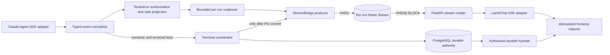
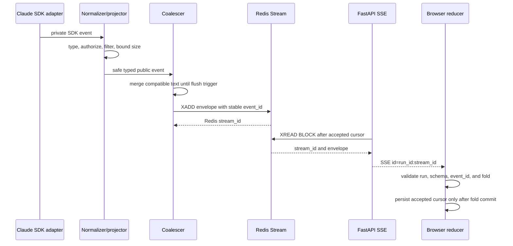
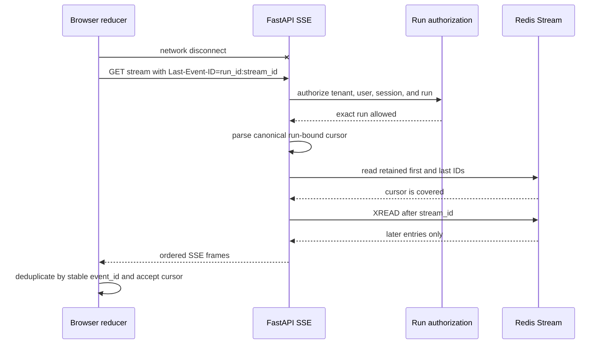
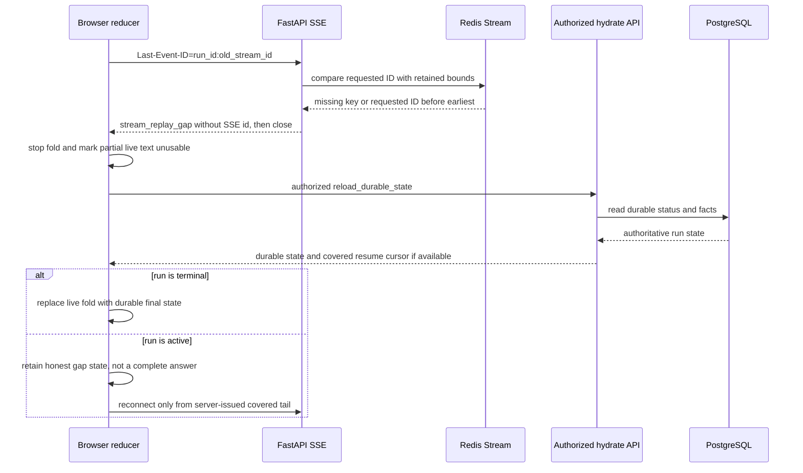
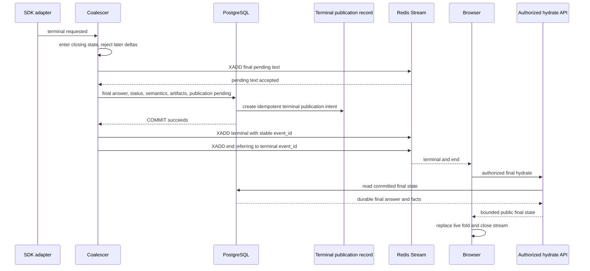
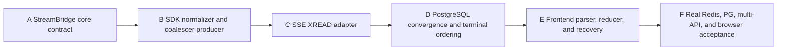

# Redis Streams SSE Event Channel

Status: proposed; implementation is blocked pending independent fixed-SHA review

Design ID: `ai-platform.redis-streams-sse-event-channel.v1`

Source baseline: `839f851bc0954d1d97910c07489fc750bdb01b2b`

## Decision Summary

AI Platform will move live Agent output to this fixed flow:

`Claude Agent SDK -> typed event normalizer -> bounded in-memory coalescer -> per-run Redis Stream XADD -> FastAPI SSE XREAD -> idempotent frontend reducer`

Redis Streams is a bounded live/replay plane. PostgreSQL remains the durable
authority for run and session state, the final assistant answer, tool and
approval decisions, artifact facts, and required audit or semantic facts. Text
deltas are not durable product facts and stop being written to PostgreSQL once a
run is admitted to the Redis Streams backend.

The terminal order is invariant:

`flush pending -> persist final state and necessary semantics -> commit PostgreSQL -> XADD terminal -> XADD end`

Production Redis unavailability fails closed. It never selects an in-process
stream as a silent fallback. A lost or trimmed replay window produces an
explicit gap and durable-state reload. The durable final answer always replaces
any partial live fold at terminal reconciliation.

This document selects the architecture and dispatch contracts. It does not
authorize implementation, deployment, or a runtime claim.

## User Journey

1. An authorized user starts one Agent run. Admission pins the stream backend,
   design version, tenant, session, run, attempt, and public projection policy.
2. Safe typed text arrives quickly in coalesced chunks. Tool, approval, artifact,
   and lifecycle events remain typed and are projected only after their durable
   authority allows them to be public.
3. A browser that disconnects reconnects with the last event it actually
   accepted. It receives only later retained events and folds duplicates
   idempotently.
4. If the retained window no longer covers the cursor, the browser is told that
   replay is incomplete. It discards the incomplete live answer, reloads the
   authorized durable run state, and resumes only from a server-issued current
   tail when the run is still active.
5. At completion, the worker first flushes pending text, commits the final
   answer and required facts to PostgreSQL, and only then announces terminal and
   end in Redis. The browser hydrates the durable final answer and artifacts,
   replacing its live fold rather than treating deltas as final truth.
6. If Redis disappears after the PostgreSQL commit, the run stays terminal.
   Status reconciliation and the durable terminal publication record recover
   delivery; PostgreSQL is never rolled back to make the stream look healthy.

The intended user result is low first-delta latency, bounded replay across API
processes and browser reconnects, an honest gap state, and a correct durable
final answer without PostgreSQL text-delta write amplification.

## Canonical Terms

| Term | Meaning |
| --- | --- |
| Event channel | The complete typed producer-to-reducer contract, not only the SSE route. |
| Replay plane | Per-run Redis Stream entries retained for a bounded time and length. It is not permanent history. |
| Durable fact | A PostgreSQL record required to reconstruct authoritative product state after Redis and process loss. |
| Live fold | Browser state built from accepted Redis-backed events. It is provisional until final reconciliation. |
| Stream cursor | The Redis Stream ID suffix in a run-bound SSE ID. |
| Accepted cursor | The last run-bound SSE ID that the reducer validated and committed to client state. Merely receiving a frame is insufficient. |
| Replay gap | Proof that a syntactically valid cursor for the authorized run is no longer covered by retained history or cannot be related safely to the selected stream generation. Foreign, malformed, and future cursors are invalid requests, not gaps. |
| Terminal announcement | A Redis event emitted only after the authoritative PostgreSQL terminal transaction commits. |
| Final reconciliation | Replacement of the live fold with the authorized PostgreSQL final answer, status, semantics, and artifacts. |
| Stream backend pin | The immutable per-run choice of legacy PostgreSQL streaming or Redis Streams v1. |

## Current-Main Diagnosis

The baseline already has useful durable primitives, but the live path puts text
deltas and polling load on PostgreSQL:

- Claude `on_text` sends every delta to `event_sink` in
  [`claude_agent_worker.py`](https://github.com/demonsxxxxxx/ai-platform/blob/839f851bc0954d1d97910c07489fc750bdb01b2b/app/executors/claude_agent_worker.py#L2008-L2015).
- The worker opens a transaction for the event and persists an
  `assistant_delta` through `append_user_event` in
  [`worker.py`](https://github.com/demonsxxxxxx/ai-platform/blob/839f851bc0954d1d97910c07489fc750bdb01b2b/app/worker.py#L2399-L2437).
- The current ledger atomically allocates per-run cursors, supports exact batch
  receipts, terminal drain fences, and incremental reads in
  [`app/streaming/postgres.py`](https://github.com/demonsxxxxxx/ai-platform/blob/839f851bc0954d1d97910c07489fc750bdb01b2b/app/streaming/postgres.py#L116-L333).
  Those primitives remain useful for legacy rows and necessary semantic facts;
  they do not justify retaining each text delta.
- The public LambChat SSE route accepts `Last-Event-ID`, but reconnect seeds fold
  state by reading the full durable prefix. Its loop rereads the run, event page,
  and artifacts, then sleeps one second in
  [`lambchat_compat.py`](https://github.com/demonsxxxxxx/ai-platform/blob/839f851bc0954d1d97910c07489fc750bdb01b2b/app/routes/lambchat_compat.py#L1393-L1528).
- The frontend creates a fresh `fetchStream` request without explicitly sending
  its last accepted cursor. It accepts `event.id` or falls back to an unrelated
  UUID and has no sequence-coverage test in
  [`sseConnection.ts`](https://github.com/demonsxxxxxx/ai-platform/blob/839f851bc0954d1d97910c07489fc750bdb01b2b/frontend/web/src/hooks/useAgent/sseConnection.ts#L368-L511).
- The current shared Redis client has one event-loop-local pool with a default
  maximum of ten connections. Long blocking reads therefore need an explicitly
  separate pool or reservation; they cannot consume the same small pool used by
  publishers and queue/auth operations. See
  [`redis_client.py`](https://github.com/demonsxxxxxx/ai-platform/blob/839f851bc0954d1d97910c07489fc750bdb01b2b/app/redis_client.py#L63-L96) and
  [`settings.py`](https://github.com/demonsxxxxxx/ai-platform/blob/839f851bc0954d1d97910c07489fc750bdb01b2b/app/settings.py#L17-L18).

The root cause is architectural: PostgreSQL is doing high-frequency transport
work and the SSE route polls that durable store. Client smoothing, a larger UI
buffer, or a shorter polling interval cannot remove the write and query
amplification or establish bounded replay semantics.

## Non-Goals

- This design does not implement A-F, change a route, add schema, or select a
  deployment topology.
- It does not create a second public SSE product route. LambChat-compatible Chat
  remains the public adapter; native event/playback APIs remain history and
  diagnostics.
- It does not make Redis a transcript, audit ledger, run authority, artifact
  authority, or final-answer authority.
- It does not use `XREADGROUP`; browsers are independent readers, not competing
  consumers of work.
- It does not expose raw Claude SDK events, prompts, credentials, commands,
  private tool payloads, storage keys, runtime paths, or tenant internals.
- It does not complete the separate public-projection tightening campaign. It
  does require the existing safe projection and secret filtering to run before
  every `XADD`.
- It does not promise lossless live text across a producer-process crash. The
  coalescer bounds the possible pending loss; PostgreSQL final reconciliation
  provides product correctness.
- It does not treat source or test evidence as Docker, deployment, browser, or
  real multi-instance acceptance.

## Fixed-SHA Reference Evidence

### DeerFlow 2.0

Fixed source:
[`99c926b7bbcd0570870bc24ceb13ab934935f49c`](https://github.com/bytedance/deer-flow/commit/99c926b7bbcd0570870bc24ceb13ab934935f49c)

- The FastAPI route
  [`POST /api/threads/{thread_id}/runs/stream`](https://github.com/bytedance/deer-flow/blob/99c926b7bbcd0570870bc24ceb13ab934935f49c/backend/app/gateway/routers/thread_runs.py#L844-L868)
  starts a run and returns an SSE consumer over a stream bridge.
- [`StreamEvent`, `StreamGap`, and `StreamBridge`](https://github.com/bytedance/deer-flow/blob/99c926b7bbcd0570870bc24ceb13ab934935f49c/backend/packages/harness/deerflow/runtime/stream_bridge/base.py#L16-L80)
  define event IDs for `Last-Event-ID`, heartbeat/end sentinels, and explicit
  retained-bound gaps whose recovery is durable-state reload.
- [`RedisStreamBridge`](https://github.com/bytedance/deer-flow/blob/99c926b7bbcd0570870bc24ceb13ab934935f49c/backend/packages/harness/deerflow/runtime/stream_bridge/redis.py#L51-L75)
  uses one Redis Stream per run and `XREAD` across gateway workers. Its default
  TTL at this SHA is 86,400 seconds, not two hours.
- Its subscriber takes retained-bound snapshots, detects trim gaps, then uses a
  blocking `XREAD` only as a wake-up in
  [`redis.py`](https://github.com/bytedance/deer-flow/blob/99c926b7bbcd0570870bc24ceb13ab934935f49c/backend/packages/harness/deerflow/runtime/stream_bridge/redis.py#L205-L350).

Adopt: explicit bridge boundary, run-local Redis streams, run-bound reconnect,
heartbeat without cursor movement, and explicit gap recovery. Do not copy its
retry count, TTL, or endpoint contract without ai-platform acceptance.

### LobeHub

Fixed source:
[`b38ce0c38ca9a01f022616d52b64df4e51241e85`](https://github.com/lobehub/lobe-chat/commit/b38ce0c38ca9a01f022616d52b64df4e51241e85)

- [`StreamEventManager`](https://github.com/lobehub/lobe-chat/blob/b38ce0c38ca9a01f022616d52b64df4e51241e85/apps/server/src/modules/AgentRuntime/StreamEventManager.ts#L137-L216)
  uses a per-operation key, direct `XADD MAXLEN ~ 1000`, and a two-hour expiry.
  It deliberately uses a separate blocking connection so `XREAD BLOCK` does
  not serialize publishers behind a shared connection.
- Blocking subscription uses `XREAD` and preserves Redis IDs in
  [`subscribeStreamEvents`](https://github.com/lobehub/lobe-chat/blob/b38ce0c38ca9a01f022616d52b64df4e51241e85/apps/server/src/modules/AgentRuntime/StreamEventManager.ts#L297-L350).
- Bounded long polling resolves `$` to a concrete tail with `XREVRANGE` before
  `XREAD`, and history reads use `XREVRANGE`, in
  [`readEventsOnce` and `getStreamHistory`](https://github.com/lobehub/lobe-chat/blob/b38ce0c38ca9a01f022616d52b64df4e51241e85/apps/server/src/modules/AgentRuntime/StreamEventManager.ts#L390-L470).
- Large final-state fields are stripped because canonical messages live in the
  database, as documented in
  [`StreamEventManager.ts`](https://github.com/lobehub/lobe-chat/blob/b38ce0c38ca9a01f022616d52b64df4e51241e85/apps/server/src/modules/AgentRuntime/StreamEventManager.ts#L45-L57).

This fixed file defines text/reasoning chunk types, but it directly serializes
events to `XADD`; it does not prove a separate text/reasoning coalescing buffer.
AI Platform's bounded coalescer is therefore our design decision, not a copied
LobeHub fact.

### Open WebUI

Fixed source:
[`01f4282f1ffe0d6212f58d3afbeae21fffd0c4be`](https://github.com/open-webui/open-webui/commit/01f4282f1ffe0d6212f58d3afbeae21fffd0c4be)

[`createOpenAITextStream`](https://github.com/open-webui/open-webui/blob/01f4282f1ffe0d6212f58d3afbeae21fffd0c4be/src/lib/apis/streaming/index.ts#L26-L88)
pipes bytes through `TextDecoderStream` and `EventSourceParserStream`, then
parses OpenAI-style SSE deltas. This is useful parser evidence only. That path
contains no durable store, retained cursor contract, or final-state
reconciliation, so a direct ordinary-model proxy is not the durable replay core
for background Agent runs.

Upstream source proves design patterns, not ai-platform runtime behavior.

## Component Architecture



`app.streaming` owns the event envelope, cursor, gap, heartbeat, Redis
read/write, and terminal publication contracts. Claude, LambChat, and frontend
code are adapters. This preserves the Harness replacement boundary in
`runtime-authorities.md`.

## Normal Streaming Sequence



## Reconnect Sequence



## Gap Sequence



## Terminal Sequence



If the PostgreSQL transaction fails, neither terminal nor end may be added. If
the PostgreSQL commit succeeds and either `XADD` fails or has an unknown outcome,
the durable publication intent remains pending. A reconciler retries the same
stable semantic `event_id`; duplicate Redis entries are harmless to the reducer.

## Typed Event Contract

### Internal Redis envelope

Every entry stores bounded fields with this conceptual shape:

```json
{
  "schema": "ai-platform.stream-event.v1",
  "event_id": "sev_immutable_id",
  "tenant_scope": "stable_nonreversible_scope",
  "run_id": "run_id",
  "attempt_id": "attempt_id",
  "stream_generation": 1,
  "event_type": "assistant_text_delta",
  "emitted_at": "RFC3339_UTC",
  "projection_version": "public-stream-v1",
  "payload": {
    "delta": "bounded public-safe text"
  }
}
```

Rules:

- `schema`, `event_id`, `tenant_scope`, `run_id`, `attempt_id`,
  `stream_generation`, `event_type`, `emitted_at`, `projection_version`, and
  `payload` are required.
- `event_id` is allocated before `XADD` and reused for retry after an unknown
  outcome. Redis Stream ID is transport order; `event_id` is semantic
  idempotency.
- `tenant_scope` is a stable keyed projection, not a raw tenant label. The
  authorized route derives the same scope before accessing the key.
- Redis payloads are already safe public projections. The SSE adapter may remove
  internal routing fields, but it must never be the first secret filter.
- Unknown schema versions, event types, extra fields, invalid UTF-8, oversized
  payloads, or mismatched tenant/run/attempt fail closed before `XADD` or fold.
- Text and reasoning deltas are different event types and never coalesce across
  type, attempt, projection version, or policy boundary.
- `stream_generation` is persisted with the run. A replacement attempt increments
  it and appends `stream_reset` before any new-generation user-visible event.
  Readers reject mixing generations and reducers discard the superseded fold.
- Tool, approval, artifact, and terminal events contain identifiers and bounded
  public summaries only after their PostgreSQL facts commit. Raw inputs,
  outputs, arguments, commands, credentials, paths, and storage keys are absent.

Initial event types are:

| Type | Authority before XADD | Coalescing | Durable reconciliation |
| --- | --- | --- | --- |
| `stream_open` | Admitted backend pin and generation | No | Run backend pin and generation |
| `stream_reset` | Committed replacement generation | No | Run generation and attempt authority |
| `assistant_text_delta` | Safe text projector | Yes | Final assistant message |
| `assistant_reasoning_delta` | Explicit public reasoning policy | Yes, separate buffer | Final public answer does not require reasoning replay |
| `run_status` | Durable run transition when semantic | No | Run row |
| `tool_lifecycle` | Durable tool fact | No | Tool fact/history |
| `approval_required` | Durable approval request | No | Approval authority |
| `artifact_ready` | Committed artifact record | No | Artifact record/download contract |
| `terminal` | Committed final transaction | No | Run status, final answer, facts |
| `end` | A committed terminal and terminal publication intent | No | Same terminal fact |

### Public SSE projection

The wire frame uses:

```text
id: <run_id>:<redis_milliseconds>-<redis_sequence>
event: <public_event_type>
data: <bounded JSON public projection>
```

The public payload does not include `tenant_scope`, `attempt_id`, private trace
IDs, raw internal event type names, or Redis key material. It does include the
bounded opaque `stream_generation` needed to prevent cross-attempt folding.

## Redis Key And Cursor Contract

- Key: `ai-platform:sse:v1:{<tenant_scope>:<run_id>}:events`. The braces define
  one Redis Cluster hash tag for the exact tenant/run stream.
- One run has one stream. A generation or attempt change stays in the typed
  envelope and is fenced; it does not create an ungoverned parallel stream.
- Admission creates `stream_open` before SDK dispatch. A replacement attempt
  commits a new generation, then appends `stream_reset` before its visible
  events. The cursor entry and current durable generation must agree.
- `XADD` uses Redis-generated IDs (`*`). The stored ID is the ordering authority
  for live replay, not a wall-clock business timestamp.
- Public SSE ID is `<run_id>:<redis-id>`. This binds a numeric Redis ID to a run
  and lets the server reject cross-run cursors before touching Redis.
- `Last-Event-ID` accepts only the canonical run-bound form. `$`, negative or
  leading-sign numbers, whitespace variants, extra separators, a foreign run,
  and an ID later than the current tail fail closed.
- No header means an authorized initial subscriber reads from the earliest
  retained entry only when the retained prefix still begins with the current
  generation's `stream_open`. A missing/trimmed origin is a gap. Because
  admission creates the origin before SDK dispatch, an absent key is never
  silently treated as an empty healthy stream; public clients never send `$`.
- Heartbeats have no `id:` field and do not advance the accepted cursor.
- `stream_replay_gap` has no `id:` field and closes the response after the
  frame. A gap cannot be acknowledged as progress.
- `terminal` and `end` each have Redis-backed IDs. `end` references the stable
  terminal `event_id`; the reducer accepts both idempotently.

## Gap And Durable Reload Contract

The reader first rejects a malformed, foreign-run, or future `Last-Event-ID` as
an invalid request without reading or resetting the stream. For a syntactically
valid cursor bound to the authorized run, it returns a gap when any of these is
true:

- the key disappeared after a client had accepted an ID;
- approximate trimming moved the earliest ID past the requested ID;
- a restarted or replaced Redis instance cannot prove coverage;
- the cursor entry is absent or its generation cannot be related to the current
  durable run generation safely;
- an initial subscription no longer retains the current `stream_open` origin.

The bounded public gap data is:

```json
{
  "schema": "ai-platform.stream-gap.v1",
  "reason": "retained_history_unavailable",
  "requested_event_id": "run_id:redis_id",
  "earliest_available_event_id": "run_id:redis_id",
  "latest_available_event_id": "run_id:redis_id",
  "recovery": "reload_durable_state"
}
```

Bounds may be omitted when Redis cannot prove them. The client must not choose a
resume cursor from this event. The authorized durable hydrate response decides:

- terminal run: replace the live fold with PostgreSQL final state and stop;
- active run: discard the incomplete answer as a complete representation and
  retain an explicit recovery state. Reconnect only when the hydrate API can
  issue a covered current-generation tail; while Redis cannot prove one, use
  bounded authorized status reconciliation without a stream cursor;
- unknown or unauthorized run: fail closed without another stream attempt.

No code concatenates pre-gap and post-gap text and presents it as a complete
answer. Terminal hydration is the convergence point.

## Memory, Redis, And PostgreSQL Responsibilities

| Layer | Owns | Must not own |
| --- | --- | --- |
| Process memory | Small compatible text/reasoning buffers, timers, and one run-local producer state machine | Replay after process loss, terminal authority, unbounded queues |
| Redis Streams | Ordered bounded public-safe events, reconnect cursor, retained bounds, terminal/end delivery | Permanent history, final answer, authorization, artifact/tool/approval truth |
| PostgreSQL | Run/session authority, final answer, tool/approval/artifact facts, necessary audit/semantic facts, backend pin, terminal publication intent | Per-text-delta transport after Redis cutover |

Consistency boundaries:

- Text becomes visible only after `XADD` succeeds. A callback does not report
  delivery merely because the text entered memory.
- A process crash may lose only the configured unflushed buffer. It cannot lose
  a committed final answer. The pending-loss bound is measured in stage F.
- Semantic events whose authority is PostgreSQL are emitted only after their
  own transaction commits.
- Terminal/end are never written in the PostgreSQL transaction and never before
  its successful commit.
- Redis loss turns replay into a gap; it never causes a historical
  `assistant_delta` backfill into PostgreSQL.
- Final hydration replaces the live text; it does not append another answer.

## Coalescer And Flush Contract

Each run and event type has at most one active buffer. Candidate starting
defaults, subject to stage F capacity acceptance, are:

- maximum flush age: 40 ms;
- maximum encoded payload: 8 KiB per text entry;
- maximum pending bytes: 64 KiB per run and 8 MiB per process;
- no coalescing across run, attempt, event type, projection version, or policy;
- text is merged only in source order and only after normalization.

Flush occurs on the first of:

- age limit;
- encoded-size limit;
- newline or explicit semantic boundary when it improves immediate readability;
- transition to a non-coalescible event;
- per-run or process high-water mark;
- cancellation, error, SDK completion, worker shutdown, or terminal request.

At a hard memory bound, the producer synchronously flushes. If it cannot `XADD`
within the bounded Redis timeout, it propagates stream unavailability and stops
accepting more SDK deltas. It does not drop the oldest buffer, write text deltas
to PostgreSQL, or allocate an unbounded retry queue.

## Redis Retention, Reads, And Connections

Candidate starting values are `MAXLEN ~ 10000`, TTL two hours, `XREAD COUNT 128`,
`BLOCK 15000` ms, and a 15-second heartbeat. They are not production defaults
until stage F proves the formulas and the desired reconnect window.

Approximate per-run replay time is:

`replay_seconds ~= MAXLEN / p99_post_coalesce_events_per_second`

Approximate Redis memory for retained streams is:

`redis_bytes ~= retained_runs * min(MAXLEN, event_rate * TTL_seconds) * (avg_entry_bytes + redis_overhead)`

The accepted `MAXLEN` must satisfy:

`MAXLEN >= ceil(target_replay_seconds * p99_event_rate * safety_factor)`

while the measured Redis memory stays below the operator-approved budget. TTL
handles idle/terminal cleanup; MAXLEN bounds hot runs. Approximate trimming is
allowed only because the reader detects the resulting gap.

Blocking readers and publishers use separate pool capacity. For each API
process:

`read_pool >= active_SSE_connections_on_process + reconnect_burst + 2`

For each producer process:

`publish_pool >= concurrent_streaming_runs + terminal_reconcilers + 2`

Redis server capacity must cover:

`sum(all_process_pools) + queue_auth_clients + admin_clients + 20_percent_margin`

The current shared pool of ten is not assumed sufficient. A blocking `XREAD`
connection is dedicated for the response lifetime and always released on close,
cancel, auth revocation, timeout, or error. Publishers never queue behind that
blocked connection.

## Backpressure And Slow Consumers

- SDK callback backpressure is synchronous at the coalescer hard bound.
- Redis producer retries only a bounded same-event operation when the outcome is
  unknown; no automatic new semantic event is created.
- SSE reads use bounded count and response write queues. A client whose network
  queue exceeds the configured event/byte ceiling is disconnected and must
  reconnect with its accepted cursor.
- Slow browsers never slow all producers and never create consumer-group
  pending entries. Independent `XREAD` readers receive the same stream.
- A browser slower than retention gets a gap and durable reconciliation rather
  than an unbounded server buffer.
- Admission quotas remain tenant/user/run authority. Redis connection and
  memory pressure add global backpressure; they do not reuse per-user rejection
  as proof of infrastructure capacity.

## Failure And Race Matrix

| Scenario | Required behavior |
| --- | --- |
| Redis unavailable at run admission | Reject or hold admission fail closed; do not start a Redis-pinned SDK run and do not select memory fallback. |
| Redis fails during text streaming | Stop accepting deltas, bound/cancel SDK work, persist the correct terminal failure or recovery fact in PostgreSQL, and expose durable status reconciliation. |
| Redis restarts or loses data | Treat prior accepted cursors as gaps. Redis persistence may improve availability but is not a correctness dependency. |
| Trim passes a cursor | Emit `stream_replay_gap` without an ID, close, reload durable state. |
| Duplicate XADD after unknown result | Entries share stable `event_id`; reducers apply once while cursor advances through every Redis entry. |
| Cursor belongs to another run | Reject before Redis read. Never reinterpret the numeric suffix against the selected run. |
| Cursor is later than tail | Fail closed as invalid/future cursor; do not block forever or reset to the beginning. |
| Multiple browsers | Each authorizes and issues independent `XREAD`; no `XREADGROUP`. |
| Slow browser | Bound the write queue, disconnect, then reconnect or gap. |
| Producer process crashes with pending text | Lose at most the configured pending bound; never invent replay. Final PostgreSQL reconciliation remains correct. |
| PostgreSQL terminal transaction rolls back | Do not emit terminal/end. Run stays nonterminal or failed according to durable recovery. |
| PostgreSQL commits and terminal XADD fails | Keep durable terminal publication intent pending. Reader/status reconciliation hydrates final state; reconciler retries the stable event. |
| Terminal XADD outcome is unknown | Retry the same stable terminal `event_id`; duplicate entries are reducer-idempotent. |
| Late delta races terminal | Terminal coordinator atomically enters `closing` before flushing. Reject and measure any later delta; never append it after terminal. |
| Authorization changes during a long stream | Reauthorize on reconnect and bounded heartbeat intervals. Close without payload when authority is lost. |
| Tenant/run mismatch in an envelope | Quarantine/error the entry, stop that response, and record redacted diagnostics; never forward it. |
| Secret filter cannot classify a payload | Reject before XADD. No raw fallback event is permitted. |

## PostgreSQL Compatibility And Migration

### Per-run backend pin

Admission persists one immutable backend and design version per run:

- `postgres_legacy`;
- `redis_streams_shadow_v1`;
- `redis_streams_v1`.

A process-level feature flag controls which backend new runs may receive, but
every active run follows its persisted pin. Restart, retry, resume, browser
reconnect, and worker recovery cannot switch an existing run between planes.

### Modes

1. `postgres_legacy`: current PostgreSQL delta writes and polling remain. Redis
   Stream production for public text is disabled.
2. `redis_streams_shadow_v1`: PostgreSQL remains the live authority while a
   non-public, short-lived Redis shadow validates envelope and capacity. This is
   allowed only for bounded nonproduction or explicitly admitted canaries.
3. `redis_streams_v1`: public text deltas go only to Redis. PostgreSQL keeps
   final/semantic facts and legacy rows remain readable for old runs.

### Double-write prohibition

Startup and admission fail closed when any of these is true:

- `redis_streams_v1` and PostgreSQL text-delta persistence are both enabled;
- a public SSE route can read a shadow stream;
- a run has more than one backend pin;
- a retry or resume attempts to change its pin;
- the Redis producer is enabled without the matching Redis reader, gap hydrate,
  terminal publication, and frontend reducer versions;
- an accepted design SHA/version is absent or differs across API and worker.

Shadow dual-write is time-bounded evidence collection, never the steady state
and never a claim that write amplification is solved.

### Legacy compatibility

- Existing `run_events` rows and cursor APIs remain readable.
- Necessary semantic events may continue using the existing atomic cursor,
  batch receipt, and terminal fence capabilities.
- New Redis-pinned runs do not backfill text deltas into `run_events`.
- History and final reload choose the persisted backend pin. Legacy runs fold PG
  deltas; Redis runs hydrate the final PostgreSQL message and semantic facts.
- The final assistant message is written exactly once and replaces any live
  Redis fold on hydration.

### Rollback

Rollback changes admission for new runs back to `postgres_legacy`. Redis-pinned
active runs are drained under their original contract or are terminalized and
reconciled; they are never switched mid-run. The Redis reader remains available
until every Redis-pinned run is terminal and beyond its recovery window.

The irreversible boundary is explicit: after `redis_streams_v1` stops writing
text deltas to PostgreSQL, rollback cannot recreate those historical deltas. It
can recover durable final answers and semantic facts only. This is acceptable
because text deltas are transport, not permanent product history.

## Authorization, Filtering, And Logging

- Resolve principal, tenant, workspace, session, run, and run ownership before
  deriving a Redis key or reading retained bounds.
- Bind every normalized event to the admitted tenant/run/attempt before safe
  projection. A generic hidden/unknown event is rejected, not forwarded.
- Apply explicit field allowlists, string/array/object bounds, UTF-8 validation,
  secret-like key/value rejection, and path/URL/command/storage-key removal
  before `XADD`.
- Public reasoning output requires an explicit policy; absence means no
  `assistant_reasoning_delta` event.
- Tool, approval, and artifact projection reads the committed PostgreSQL fact;
  uncommitted callback payload is never public authority.
- Reauthorize long-lived SSE responses periodically and on every reconnect.
- Logs contain event type, schema, bounded timing/size metrics, hashed run scope,
  Redis result category, and cursor relation. They never contain event payload,
  prompt, delta text, credentials, raw tenant label, private tool data, storage
  key, command, or authorization header.
- Metrics use bounded labels. Run IDs, event IDs, and cursor strings belong in
  sampled redacted traces, not unbounded metric dimensions.

## A-F Dependency Graph



Stages are serial. At most one production writer and one non-conflicting
read-only verifier may be active. A shared file has exactly one writer; later
stages request a bounded handoff instead of editing across an active lease.

Every stage dispatch includes the following mandatory fields verbatim in its
task record: target/user result; clean worktree/branch; exact base/head;
exclusive writable files and forbidden paths; accepted design SHA/version and
predecessor SHA; RED tests; focused commands; terminal evidence packet;
review/PR/deploy ceiling; next gate.

### A. StreamBridge core contract

- Target/user result: establish typed envelopes, run-bound cursors, Redis key
  derivation, retained-bound gap detection, independent reads, pool separation,
  and fail-closed Redis behavior without changing product adapters.
- Clean worktree/branch: new Codex worktree from fresh main; branch
  `codex/sse-a-streambridge-v1`.
- Exact base/head: record four-way main proof before edit and every new commit.
- Exclusive files: new focused `app/streaming` contract/Redis modules,
  `app/redis_client.py`, `app/settings.py`, and direct new tests. One A owner.
- Forbidden: SDK adapters, worker terminal logic, routes, frontend, schema,
  migrations, Compose, CI, deployment, and docs outside an authorized index.
- Prerequisite: independently reviewed design SHA with
  `ai-platform.redis-streams-sse-event-channel.v1`.
- RED: invalid/foreign/future cursors; trim/missing-key gaps; duplicate semantic
  IDs; separate blocking/publish pools; Redis outage with zero memory fallback;
  multiple independent readers; pool cleanup.
- Focused commands: direct A pytest modules with
  `--basetemp .pytest-tmp/run-sse-a`, changed Ruff, compileall, diff check, exact
  governance, immutable pre-push readiness.
- Terminal packet: exact base/head/merge-base, changed paths, tests and counts,
  pool/cursor/gap invariants, readiness result, unresolved real-Redis gate.
- Ceiling: local commit and one ready PR only after independent fixed-SHA review;
  no merge, deploy, Redis mutation, or runtime claim.
- Next gate: fixed-SHA A review, then normal merge before B starts.

### B. SDK normalizer and coalescer producer

- Target/user result: convert private Claude SDK events to authorized typed
  projections, coalesce text with hard memory/time bounds, and publish through A
  with low latency and no raw payload leakage.
- Clean worktree/branch: new worktree from main containing A; branch
  `codex/sse-b-sdk-producer-v1`.
- Exact base/head: fresh four-way proof; pin accepted A merge SHA.
- Exclusive files: Claude adapter/runner/projector modules, one new focused
  coalescer/normalizer adapter, and direct tests. B does not edit A-owned core.
- Forbidden: worker terminal transaction, routes, repositories, schema,
  frontend, deployment, and config outside A's accepted interface.
- Prerequisite: reviewed design SHA/version and accepted A SHA.
- RED: 40 ms/size/boundary flush; ordering; UTF-8 byte bounds; cross-type/run/
  attempt non-coalescing; process/global cap; Redis timeout backpressure; unknown
  SDK event; secret/private payload; shutdown flush; late callback rejection at
  the producer boundary.
- Focused commands: B pytest modules with
  `--basetemp .pytest-tmp/run-sse-b`, installed SDK boundary tests where already
  supported, Ruff, compileall, diff check, governance, immutable readiness.
- Terminal packet: exact refs/paths, observed flush latency and memory bounds,
  hostile filtering cases, check counts, readiness, residual process-crash and
  real-Redis risk.
- Ceiling: source PR only; no merge without independent SDK/security review and
  no runtime/deploy claim.
- Next gate: accepted B merge, then C.

### C. SSE XREAD adapter

- Target/user result: replace PostgreSQL polling for Redis-pinned runs with
  authorized `XREAD BLOCK`, standard `Last-Event-ID`, heartbeat, explicit gap,
  bounded response queues, and independent multi-browser reads while preserving
  the sole public Chat adapter.
- Clean worktree/branch: new worktree from main containing A-B; branch
  `codex/sse-c-xread-adapter-v1`.
- Exact base/head: fresh four-way proof and accepted A-B SHAs.
- Exclusive files: `app/routes/lambchat_compat.py`, a focused adapter module if
  extraction is needed, and direct route/adapter tests. One C owner.
- Forbidden: native second SSE route, SDK/producer, worker terminal transaction,
  schema, frontend, Compose, deployment.
- Prerequisite: reviewed design and accepted A-B SHAs.
- RED: absent/valid/malformed/foreign/future `Last-Event-ID`; no-ID heartbeat;
  trim/missing-key gap then close; ACL denial before Redis; periodic auth loss;
  slow client queue bound; two browsers see the same entries; no `XREADGROUP`;
  legacy PG-pinned route compatibility.
- Focused commands: C pytest modules with
  `--basetemp .pytest-tmp/run-sse-c`, Ruff, compileall, diff check, governance,
  immutable readiness.
- Terminal packet: refs/paths, wire frames, auth/gap/heartbeat results, check
  counts, readiness, residual real network/proxy/browser gate.
- Ceiling: source PR only; no merge without fixed-SHA public-contract review and
  no browser/runtime/deploy claim.
- Next gate: accepted C merge, then D.

### D. PostgreSQL convergence and terminal ordering

- Target/user result: stop PG delta writes for Redis-pinned runs, persist backend
  pin/final/semantic facts and terminal publication intent, and enforce commit
  before terminal/end with idempotent reconciliation.
- Clean worktree/branch: new worktree from main containing A-C; branch
  `codex/sse-d-pg-convergence-v1`.
- Exact base/head: fresh four-way proof and accepted A-C SHAs.
- Exclusive files: worker integration, repositories, schema/migration, terminal
  coordinator, and direct PostgreSQL tests. D is the sole owner of every shared
  transaction path during the stage.
- Forbidden: SDK internals, SSE route, frontend, unrelated schema, Compose,
  deployment, and legacy data deletion.
- Prerequisite: reviewed design and accepted A-C SHAs.
- RED: Redis run produces zero PG text-delta rows; legacy run remains unchanged;
  immutable backend pin; startup double-write rejection; flush failure prevents
  terminal transaction; PG rollback emits no terminal; PG commit then XADD
  failure leaves pending intent; unknown outcome duplicate; late delta; success,
  failure, cancellation, tool, approval, and artifact terminal races.
- Focused commands: D unit and opt-in isolated PostgreSQL integration tests with
  `--basetemp .pytest-tmp/run-sse-d`, schema checks, Ruff, compileall, diff check,
  governance, immutable readiness. An absent DSN is reported as skipped, never
  passed.
- Terminal packet: refs/paths/migration, SQL before/after write counts, ordering
  fault injection, rollback behavior, check counts, readiness, residual real
  multi-process Redis+PG gate.
- Ceiling: source PR and migration review only; no merge without independent DB/
  concurrency review, no production migration, deploy, or runtime claim.
- Next gate: accepted D merge, then E.

### E. Frontend parser, reducer, and recovery

- Target/user result: parse SSE safely, persist the last accepted run-bound
  cursor, deduplicate semantic events, detect/obey gaps, hydrate durable final
  state, and make live/history rendering converge exactly once.
- Clean worktree/branch: new worktree from main containing A-D; branch
  `codex/sse-e-frontend-recovery-v1`.
- Exact base/head: fresh four-way proof and accepted A-D SHAs.
- Exclusive files: focused SSE connection/parser, event processor/reducer,
  history hydration modules, and their direct frontend tests. One E owner.
- Forbidden: backend, schema, routes, generic Chat redesign, presentation-only
  smoothing, dependencies unless separately authorized, Compose, deployment.
- Prerequisite: reviewed design and accepted A-D wire contract SHA.
- RED: fragmented UTF-8/SSE frames; malformed JSON/schema; cursor accepted only
  after reducer commit; duplicate semantic ID with later cursor; foreign run;
  heartbeat no cursor; explicit gap discards incomplete fold and reloads;
  terminal hydrate replaces rather than appends; live/history parity; stale
  reconnect generation; bounded retries and unavailable state.
- Focused commands: `corepack pnpm exec tsx --test` for direct modules, scoped
  ESLint, TypeScript no-emit, production build, projection audit, diff check,
  governance, immutable readiness.
- Terminal packet: refs/paths, test counts, exact cursor/gap/final scenarios,
  build/projection evidence, readiness, residual real-browser and capacity gate.
- Ceiling: frontend source PR only; no merge without fixed-SHA review and no
  claim based on source-text assertions or synthetic DOM alone.
- Next gate: accepted E merge, then F.

### F. Real Redis, PostgreSQL, multi-API, and browser acceptance

- Target/user result: prove latency, replay, gaps, terminal reconciliation,
  isolation, connection/memory capacity, and rollback on the exact accepted
  A-E subject using real services and browsers.
- Clean worktree/branch: dedicated acceptance owner from exact merged A-E main;
  any harness source uses `codex/sse-f-runtime-acceptance-v1` and a separate
  lease from production mutation.
- Exact base/head: exact merged source, image digests, config fingerprint, Redis/
  PG versions, API/worker replica counts, and browser build.
- Exclusive files: dedicated acceptance tests/harness and reviewed redacted
  evidence only. Runtime mutation requires a separately granted single release
  owner and lease.
- Forbidden: product fixes during measurement, automatic retries, secret/env
  capture, unrelated deployment, per-user rejection presented as capacity.
- Prerequisite: reviewed/merged A-E SHAs, accepted design SHA/version, Docker-
  capable environment, real Redis/PG, authorized identities, rollback plan.
- RED/acceptance: first-delta and inter-delta p50/p95/p99; 1/2/N API and worker
  instances; disconnect/reconnect within window; forced trim/missing key gap;
  Redis restart/outage; PG rollback and commit/XADD race; duplicates; cross-run/
  tenant denial; multiple browsers; slow consumers; terminal/history parity;
  no delta rows in PG; connection/memory formulas; rollback for new and active
  runs; cleanup to zero.
- Focused commands: dedicated integration selectors with
  `--basetemp .pytest-tmp/run-sse-f`, frontend browser suite, bounded capacity
  harness, exact readiness for harness source. No routine full pytest.
- Terminal packet: exact source/images/runtime subjects, raw counts and
  percentiles, Redis memory/clients, PG write/query counts, gap/terminal evidence,
  privacy scan, cleanup/rollback, stop conditions, and failures without retries.
- Ceiling: F may recommend production acceptance only under its explicit release
  charter. It cannot self-review A-E, merge its own findings, or call source/test
  evidence runtime verified.
- Next gate: independent evidence review, then a separately authorized release
  decision.

## Evidence Layers

| Layer | Can prove | Cannot prove |
| --- | --- | --- |
| Source | Contract shape, ownership, fail-closed branches, fixed upstream patterns | Redis/PG behavior under real concurrency, browser behavior, deployment |
| Focused tests | Deterministic events, fault injection, parser/reducer behavior, SQL integration when real DSN is used | Production capacity, proxy buffering, process scheduling, real outage recovery |
| Immutable readiness and fixed-SHA review | Candidate scope, governance, repeatable checks, independent findings | Merge, deployment, or runtime acceptance |
| Real integration | Real Redis/PG and multi-process semantics for exact source/config | Production unless environment and release subject match |
| Browser/runtime acceptance | User-visible reconnect/gap/final behavior for exact deployed subject | Unmeasured tenants, load, or later commits |

No earlier layer is labeled `211 verified`, s72 verified, production accepted, or
gate closable without the later evidence actually being observed.

## Hostile Self-Review Checklist

The design candidate is not ready for independent review until all answers below
remain closed after exact Markdown and diagram validation:

- Cursor: run-bound, canonical, accepted only after fold, future/foreign invalid.
- Gap: missing/trimmed/restarted stream never masquerades as complete replay;
  only durable hydrate issues a resume cursor.
- Terminal: pending text flushes; PG commit precedes terminal/end; pending intent
  covers commit/XADD failure; final hydrate replaces live text.
- Redis outage: admission and mid-run behavior fail closed; no in-memory or PG
  delta fallback.
- PG commit race: rollback emits nothing; successful commit is never undone;
  duplicate terminal publication is semantic-idempotent.
- Tenant leak: authorization precedes key access, envelope scope is verified,
  projection/filtering precedes XADD, logs contain no payload.
- Capacity: buffer, replay, connection, response queue, and Redis memory formulas
  have hard limits and stage F measurements.
- Rollback: new runs can return to legacy; active runs stay pinned; historical
  text deltas cannot be reconstructed and are not promised.

## Design Acceptance Gate

Implementation may start only after:

1. these two design files are committed at one exact 40-hex SHA;
2. independent fixed-SHA architecture/security/concurrency review reports no
   unresolved Critical or Important finding;
3. the accepted SHA and design ID are recorded in the A dispatch;
4. every implementation stage accepts its predecessor's merged SHA and keeps
   source, review, deployment, and runtime evidence separate.
