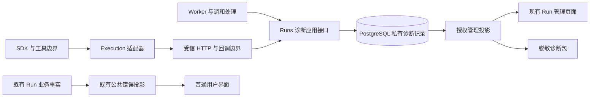

# Run 诊断字段治理技术方案

状态：Issue #1485 的诊断可靠性候选批次；产品需求见 [PRD](run-diagnostics-prd.md)。当前分支在主分支既有 SDK/Sandbox、Runs 私有持久化和管理查询之上，补齐诊断写入隔离、入队/Worker 逃逸/工作区收集失败、标准异常链和逐观察管理投影。稳定父观察身份、runtime GET 只读迁移、真实构建版本和诊断包导出仍待后续批次。本文与本分支都不是已部署证明。

## 1. 设计依据与决策

候选实现核对基线：`b8e6e73a`。下列缺口用于约束 Issue #1485 的分批实现，不代表已复现正式环境故障；提交和验收仍以 PR 的精确 base/head 为准。

主分支已具备 D01-D06 的核心链路；本批只修复诊断自身不能否决合法业务终态，并增加有实际来源的早期失败、异常链和逐观察投影。D07-D09、稳定父观察身份、真实 PostgreSQL/Redis 联调和导出不在本批完成声明中。

### 已定位的缺口

| 编号 | 源码位置与符号 | 事实与影响 |
| --- | --- | --- |
| E01 | `app/sandbox/domain/runtime_diagnostics.py:239`，`normalize_sdk_runtime_diagnostics` | 非对象、schema 不匹配或错误码无效返回 `{}`；管理端无法区分这些情况与从未采集 |
| E02 | 同文件 `:39`，`runtime_diagnostic_text` | 超长字符串只留前缀，没有字符串截断说明；异常尾部的类型/最终原因可能消失。列表和大结构值已有部分截断元数据，应复用 |
| E03 | `app/runtime/sandbox/executor_app.py:557`，`_merge_runtime_diagnostics`；`:3158` | 外层覆盖 stage/source/code；只额外留早先 code/source，新 exception 覆盖原异常；终态归一化可能将 model_wait 改成 sandbox_submission |
| E04 | `app/runtime/sandbox/executor_client.py:118`，`SandboxExecutorHttpError`、`_executor_http_error` | HTTP 异常对象只携带安全 code/detail/message；响应中的私有诊断没有独立载体。正常终态失败归一化已经保留有效诊断，不应误删该能力 |
| E05 | `app/worker.py:2606`，异常终态分支 | `_executor_exception_failure` 得到通用 code/message，随后失败写入未携带该异常的私有诊断 |
| E06 | `app/worker.py:2507`，`ExecutorDispatchAccepted` 分支；`app/executor_reconciler.py:577` | 已接收的 timings 未保存；调和读取 `dispatch_timings`，基线生产源码检索仅发现这一读取。相关测试却可注入此字段 |
| E07 | `app/routes/runtime_callbacks.py:255`；`app/executor_reconciler.py:335` | 终态载荷存入 lease；永久调和失败只给 Run 写通用结果，管理详情不会读取 lease 中的原诊断 |
| E08 | `app/runs/domain/admin_diagnostics.py:6`；`app/routes/admin_runs.py:288`；`frontend/web/src/components/panels/RunMonitorPanel.tsx:408` | 只为 failed Run 从 result_json 恢复诊断，前端主要显示 JSON；非失败状态的已有异常没有这个入口 |
| E09 | `app/runtime/sandbox/executor_app.py:3297` 附近，callback delivery | 终态回调发送错误存于 task_state；Executor 消失后不能依赖此内存恢复。平台侧可以记录已观察的未送达，但不能重建原异常 |
| E10 | `app/routes/admin_runtime.py:637`，`admin_runtime_overview`；`:579`，`admin_runtime_containers` | overview GET 默认 `include_maintenance_cleanup=True`；containers GET 也会触发 orphan/lease 清理。两处均与诊断页面只读需求冲突 |
| E11 | `app/routes/lambchat_compat.py:1457`；`app/trace_audit_export_readiness.py:57` | `/api/version` 固定 POC 文案；export readiness 是有消费者的契约报告，不能作为真实下载能力 |

这些是数据链路缺陷或清理候选，不说明项目缺少管理页面、完全没有日志或所有归一化均有问题。主分支已有的环境变量和假设置清理不再作为本方案待做项。

### 采用的方案

1. Runs 拥有一个有界的私有诊断记录，记录最早捕获的异常与后续处理观察；公共错误分类继续使用现有唯一目录。
2. Execution/SDK 与 Sandbox 各在自己的边界采集并转换，内部通过明确类型传递；包装只增加关联观察，不覆盖已有异常事实。
3. 诊断不再依附 `runs.result_json` 作为新记录的存储权威。新 Run 从独立私有记录读取；旧记录通过一个只读适配器解释。
4. 每批实现同时退役对应的旧覆盖、拼装、占位或兼容路径，更新测试与文档。

[源码架构](../architecture/source-code-architecture.md)、[Run/Attempt](../architecture/execution-spec-and-attempt-lifecycle.md)、[Sandbox Runtime](../architecture/sandbox-runtime-control-layer.md)、[公共投影](../architecture/chat-run-lifecycle-and-public-error-projection.md)和[数据生命周期](../architecture/single-enterprise-data-lifecycle.md)仍是各自详细规则的拥有者。激活方案时更新它们的相关条款。

[ADR 0013](../adr/0013-redis-stream-only-sse.md)继续决定 SSE：Redis Stream 是唯一实时与重放传输。本方案的 PostgreSQL 记录用于私有诊断；不成为浏览器事件队列、发布重试器或新的 Run 状态机。

## 2. 责任与数据流

| 责任方 | 负责内容 | 需要退出的做法 |
| --- | --- | --- |
| Execution | SDK 类型转换、模型/工具异常、HTTP 异常载体和已测耗时 | 私有错误提前缩成公共消息；SDK 类型泄漏到 Runs |
| Sandbox | 可信 lease/Attempt 绑定、回调回执、运行资源处理观察 | 用后续资源/回调错误覆盖执行原异常 |
| Runs | 诊断记录、身份校验、预算与合并、管理查询/导出授权 | Run 结果、管理路由和 Worker 分别维护诊断规则 |
| Streaming | 现有安全事件投影和传输 | 从私有诊断生成普通用户文本 |
| Identity | 现有 principal 与管理权限 | 引入页面本地的诊断权限真相 |
| Bootstrap / Platform | 注入端口、技术日志和版本来源 | 在共享观测模块决定业务归因或保存领域事实 |

当前实现文件为 `app/runs/domain/diagnostics.py`、`app/runs/application/diagnostics.py`、`app/runs/infrastructure/diagnostics_postgres.py` 和 `app/runs/transport/admin_diagnostics.py`。跨域只使用 `app/runs/api.py` 的窄接口。源码迁移遵循已有 frozen-file / bridge 权限；需要调整 authority 时先单独进入可信基线，不能在实现 PR 自我放行。

## 3. 诊断契约

### 3.1 有界记录

建议新契约名 `ai-platform.run-diagnostics.v1`，独立于现有 SDK 诊断 v1 和 callback v2.1。这里的 v1 是新契约的版本，不能按字符串数字推断协议互换。

| 字段组 | 字段与语义 |
| --- | --- |
| 记录身份 | `schema_version`、`diagnostic_id`、`revision`、`tenant_id`、`run_id`；workspace/session/user 从已授权 Run 关联读取 |
| 观察身份 | `observation_id`、`attempt_id`、可用的 `lease_id` / `request_id` / `callback_id`、`parent_observation_id` |
| 故障事实 | `kind`、`source`、`stage`、`error_code`、`exception_type`、脱敏 `message` / `stack`；所有值有类型、单位和预算 |
| 时间与过程 | `occurred_at`、服务端 `received_at`、`source_sequence`（来源提供时）、`duration_ms`、`action`、`outcome` |
| 来源版本 | producer 组件、source commit、SDK/适配契约版本、可用的镜像 digest；注明采集来源 |
| 完整性 | `coverage`、`losses`、`redaction_policy_version`、`budget_policy_version`、已保留/省略计数 |

新观察只记录实际发生的异常或处理：`failure`、`handling`、`timing`、`delivery`。Run status 和 Attempt status 从既有权威读取，不复制成可独立推进的状态字段。时间缺失用 null，耗时缺失用 null；禁止把未知值默认为 0 或当前时刻。

观察里的原始 code 表示来源报告；公共卡片仍由 Runs 的安全目录选文案。对来源未知的 error code，保存有界的私有解释或拒绝说明，不把它注册成新的公共错误。

### 3.2 最早异常与处理链

- 第一次捕获异常时创建稳定 `observation_id`；进入包装、重试或回调后引用它并追加观察。
- 同一观察的 stage/source/exception 不被外层更新。`runner_error_code` / `runner_failure_source` 的双槽补丁退出新写入路径。
- Python cause/context 在捕获处提取为有界链；循环引用和超长链记录省略说明，避免只保留最外层异常。
- “最早异常”是某条因果链最前的已留存观察。时间线优先采用显式父子关系和来源序号，不能仅按不同机器的时间戳猜测因果。
- 晚到的合法观察可以补充链路；既有观察内容不变。不同 Attempt 分组；历史尝试不能覆盖当前尝试的诊断。
- 公共 projection 失败、传输失败、模型失败、终态调和失败分别保留；业务终态仍由既有生命周期决定。

### 3.3 归一化与有损处理

保留各信任边界的验证，但在同一受信进程内传递已验证类型，退出层层重建字典的重复实现。SDK 特有字段只在 SDK 适配器转换；通用合并和预算只有 Runs 一个实现。

当前 SDK v1 归一化结果使用 `failure_observations` 与 `normalization_losses`，不再用 `{}` 同时表示所有失败；未知 schema 和无效字段生成安全拒绝观察，不回显未知载荷。Run 级持久契约将它们封装为不可变 `observations` 与顶层 `losses`，并补齐 `not_collected`、`legacy_record`、`unsupported_schema` 等查询状态。`transport_unavailable`、`redacted` 和保留期限缺失只有在对应采集事实落库后才能展示，当前实现不会凭空生成。

HTTP 错误响应有独立预算。首批保留现有 4 KiB body 解析上限：合法小响应中的私有诊断进入异常对象的独立载体；非法或超限 body 只生成安全的拒绝/loss，不解析或回显原内容。把受信 envelope 扩到 128 KiB 必须与 Executor 响应、Worker 保存和组件发布一起完成，不能由客户端单边放大。结构值的 4 KiB 与 SDK 诊断总量 128 KiB 仍分别生效。

每条 loss 记录安全字段路径、原因、原始/保留字节数（已测时）、数量、发生边界和策略版本。字段名也属于不可信输入，需限制长度并脱敏；秘密值的摘要不进入页面或导出。允许计算摘要时，仅对已脱敏表示计算。

合法记录重复验证保持幂等：观察身份、内容和 loss 计数不发生二次截断漂移。来源 schema 未知时拒绝解释内容，保留有界 envelope 身份和拒绝说明；不保留整个未知对象作为“原始日志”。

### 3.4 大小和保留规则

沿用现有 128 KiB 总预算、8 KiB 异常文本、4 KiB 结构值、128 条轻量事实和最近 8 条详细调用/拒绝的数量级，统一在一个版本化策略中管理。新记录的 **128 KiB 是单 Run 所有 Attempt 诊断合计**，不是每个列表或每次合并都重新获得额度。

1. 合并前先脱敏、验证类型/深度/数量/序列化字节，限制输入解析成本。
2. 保留最早异常的最小摘要、当前尝试最近的失败摘要、关键终态处理与完整性元数据；详细堆栈和过程受剩余额度约束。
3. 堆栈采用有界首尾保留，给出省略说明；其他长文本按字段语义选择策略。禁止只保留前缀却标作完整堆栈。
4. 达到额度后优先省略旧的详细过程，再折叠旧 Attempt 的详情；更新省略计数。保留下来的观察内容不被重新解释或改写。
5. 仍超限时只保存身份、最小异常摘要和预算降级说明。最小记录须有单独的预算测试，不能在失败处理里再产生无限异常链。
6. 同时检查紧凑 UTF-8 JSON 的协议预算和 PostgreSQL 写入表达式的存储上界，预留 JSONB 文本表示开销；不能假设两种字节计算完全一致。

应用合并器对紧凑 JSON 强制 128 KiB 产品预算；数据库 `payload_json::text` 的 144 KiB check 只为 JSONB 文本重排后的空白开销预留 16 KiB，不扩大发布接口或单 Run 的可用额度。Repository 在每次 insert/update 前仍按 128 KiB 检查紧凑表示。

首版诊断随 Run 保留，不新增一个尚无清理实现的 retention 环境变量。新增表不使用隐式级联删除；将来执行既有 Run 物理删除时，由 Runs 在同一授权事务显式处理诊断。单 Run 有界不代表数据库总量有界，发布容量评估须计算 Run 量与保留周期。新增独立 TTL/清除能力需先完善数据生命周期契约与删除审计。

## 4. 持久化与事务

### 4.1 选择独立私有槽位

新建 `run_diagnostics`：每个 `(tenant_id, run_id)` 一行，列包含 `diagnostic_id`、`schema_version`、`revision`、`payload_json`、`created_at`、`updated_at`，复合外键引用现有 `runs(tenant_id,id)`。SQL 属于 Runs；迁移沿用当前 schema runner、版本 ledger 和 readiness。

选择一行有界 JSONB 是为了复用当前诊断规模、方便原子合并和单 Run 查询。首版不建立全量日志行库、额外队列、对象存储导出任务或新的清理服务。`revision` 只标记诊断变更，不授予 Run/Attempt 执行权。

新写入终态结果会递归移除 `runtime_diagnostics` 私有载体，不再复制到 `runs.result_json`；管理列表需要的完整性摘要可通过有界关联读取，不能逐条读取全部诊断。lease 的 `executor_terminal_json` 首次写入后固定协议字段，调和阶段只可追加既有的有界 `diagnostics` 列表，不能替换首个回执字段。顶层和嵌套 `runtime_diagnostics` 都不进入该回执；它与诊断记录分别服务协议恢复和管理查询。

### 4.2 接入点

| 场景 | 原子保存与边界 |
| --- | --- |
| Run 创建后入队失败 | 在现有入队失败终态事务内保存原异常摘要；尚未创建 Attempt 时使用可验证的 Run 绑定，attempt_id 为空并说明原因 |
| Worker 派发异常 | 在已有 Attempt fence 验证和失败终态事务内调用 Runs 诊断端口；取消竞态时可留观察，不能改写取消结果 |
| 异步派发 accepted | 使用已确认 lease/Attempt 绑定，退出 Worker 前持久化已测 timings；调和读取同一来源 |
| terminal callback | 验证 callback/lease/Attempt 后，诊断写入与既有 terminal receipt 同事务；之后沿用既有 Redis 发布与 ACK 顺序 |
| 永久调和失败 | 从独立诊断记录引用已有执行观察，追加调和异常；与既有失败终态同事务；精简 receipt 不作为私密诊断查询源 |
| callback delivery 不确定 | Executor 在既有重试中复用同一消息身份；平台按现有心跳/调和观察记录缺失。不得新建发布扫描循环保证一个无法保证的送达 |

调用者使用同一个 `conn` / Unit of Work。诊断端口不得自行提交、在事务中调用 Redis/HTTP/对象存储，或自行领取 Attempt。

并发写入在现有生命周期校验之后锁定诊断行，原子更新内容、revision 和预算；首次插入用同一唯一键解决竞争。诊断代码不持有该行锁后反向获取 Run/Attempt/lease 锁。各入口现有锁序在 S0 固定并通过并发测试，不借新增诊断改变终态锁序。

### 4.3 去重、晚到与降级

- 已有 callback receipt 是回调重试权威：重复 receipt 不重复合并诊断，不改变 revision；内容冲突沿用既有拒绝语义。
- 已开始发送的 callback 载荷保持不可变，发送失败不能追加进同一重试消息。后续 delivery 观察只能由已支持且仍可用的合法报告入口另行传递，或由平台依据自身观测记录；入口不可用就明示缺口。
- Worker 的观察身份从 Attempt、阶段与该次异常捕获身份生成；同一事务重试复用身份。尚保留的观察去重；已因预算省略的中间详情不承诺永久独立去重账本，外层回执/生命周期 fence 防止重复接受完整业务处理。
- 已终态 Run 可接收经过既有 receipt/fence 证明的晚到处理观察；它不能改变业务结果。无绑定或已被判定陈旧的报告拒绝混入，仅产生安全的边界拒绝计数。
- 私有内容无效，或诊断构建、归一化、预算、持久化失败时，先递归移除私有载体，再把诊断降级为 `not_collected`；合法业务终态仍可提交。PostgreSQL 写入使用同一事务内的 savepoint 和有界本地 lock/statement timeout，成功或降级后恢复原超时。连接、savepoint 或外层业务提交失败仍按既有事务语义失败并重试，不能伪报业务或诊断已保存。
- 诊断写入失败的技术日志只含安全 ID、组件、固定失败类别和版本；避免将“记录失败”递归写入同一诊断通道。应用或 PostgreSQL 整体不可用仍需既有运维监控。

## 5. 管理 API、页面与导出

### 5.1 查询接口

新增 `GET /admin/runs/{run_id}/diagnostics`，复用 `require_principal` / `is_ai_admin` 及 tenant 范围，服务端重新关联 Run 的 workspace/session/user。租约、Attempt 和传入游标不能扩大查询范围。

管理员是否可查看其他用户的 Run 沿用现有管理授权；这里校验的是记录与 Run 的身份一致性，不能误将管理员身份强制等同于 Run 创建者。首版不引入浏览器可选 tenant 或第二套诊断角色表。

响应包括 Run 安全概览、诊断记录 revision、结构化观察、来源版本及完整性；无记录返回 `coverage=not_collected`，历史适配返回 `legacy_record`，不能返回语义含混的空对象。Run 不存在或不在授权范围沿用不可区分的 not-found 行为，非管理员 403。

单 Run 记录有界，首版直接获取一份快照；不引入另一套诊断事件流。前端在现有 RunMonitor 详情按需加载，运行中按现有有界轮询策略刷新；切换或关闭详情时递增请求序列并核对当前 Run，旧响应不会写入新详情。普通用户接口和 SSE 不加入私有观察。

`GET /admin/runs/{run_id}` 内部恢复 `result.runtime_diagnostics` 的代码已删除；历史数据仅由独立诊断查询中的 Runs legacy reader 转换。已部署的外部客户端如仍消费旧字段，需要在发布前按第 8 节另行确认退出或提供只读形状适配。

### 5.2 导出接口

S4 计划新增 `POST /admin/runs/{run_id}/diagnostic-exports`，在请求时校验管理权限。当前候选没有注册该接口，也不把页面查询描述成可下载诊断包。实现时由一个短的 REPEATABLE READ 事务读取 Run/Attempt 摘要及诊断 revision/payload，生成唯一 `export_id` 并写导出请求审计；随后释放事务，在应用内生成 ZIP。此接口不执行任务或资源维护。

同一包内所有数据库事实来自这次快照；manifest 区分执行时版本与导出服务当前版本。HTTP 返回前再次确认请求 principal 仍符合当前可验证的授权契约；遵循现有身份快照有效期，不声称即时上游权限撤销。

审计只记录 export_id、操作者、范围、快照 revision、策略版本、结果类别与字节数。审计失败则不返回诊断包。下载开始后无法保证客户端完整接收；审计的 `response_started` 与 `generation_failed` 等结果不得伪称下载已送达。

包按 PRD 固定文件名，未压缩合计上限 512 KiB。压缩在数据库事务外执行，内存受限；不写长期对象、不建立公开下载链接。响应采用附件下载与 `Cache-Control: no-store`，前端 Blob URL 使用后释放。超限内容按统一预算压缩并声明；最小包仍失败则返回固定安全错误。

### 5.3 脱敏与版本

采集边界先根据已授权的配置/Skill 敏感值集合脱敏，再按诊断字段白名单存储；模式规则作为补充。投影和导出再检查一次。堆栈保留安全模块/函数/行号与有界文本，清理本地目录、URL 凭据和其他主体数据。未能证明安全的未知字段仅保留拒绝说明。

版本信息复用现有构建 source snapshot、OCI label 和 runtime commit 来源，经 bootstrap 注入；不让 API 读取 Docker socket。无法读取 image digest 时记为未知，不用 commit 推导 digest。Run 发生时未记录的 SDK/镜像版本不能从当前服务器版本倒填。

已有 `/api/version` 的固定 POC 值将在 D08 改为统一构建版本投影，保留已识别客户端需要的响应形状。当前管理诊断响应只显示实际记录中已有的契约版本，不从当前服务倒填执行时构建版本，也不增加第二个版本常量。

## 6. 验证方案

现有 `test_admin_run_detail` 注入最终诊断、client 正常失败归一化和 SDK 预算测试继续提供有效覆盖；不能把这些 mock 等同于完整链路。将受影响测试迁移为下表的行为断言，删除只证明旧丢失行为正确的断言。

| 编号 | 输入/故障 | 必须验证 | 层级与需求 |
| --- | --- | --- | --- |
| T01 | 内层模型超时，外层包装，再终态转换 | 最早异常 stage/type/ID 保持，外层形成关联观察，公共错误仍安全 | 纯契约；PRD-03/04/05 |
| T02 | 未知 schema、非法 code、额外字段、Unicode、深层对象 | 有界拒绝说明；不保存未知原对象；合法二次验证不改变内容/计数 | 单元/契约；PRD-08/13 |
| T03 | 超长堆栈和多 Attempt 超预算 | 首尾策略、省略说明、受保护摘要、整条 Run 最终预算均成立 | 单元及真实 PG；PRD-03/08 |
| T04 | HTTP 4xx/5xx，诊断位于合法响应中；非 JSON/超大响应 | 私有载体可到达持久化；拒绝的响应有明确原因；公共消息不泄漏 | HTTP 契约到 Worker；PRD-03/13 |
| T05 | accepted 后 Worker 返回；随后调和 | 派发耗时已写库且被读取，缺失为 null；禁止 fixture 凭空提供字段 | 真实 PG、真实生产适配接缝；PRD-07 |
| T06 | callback 提交后 ACK 丢失并重试 | receipt/诊断原子提交、revision 不重复、既有 Redis 顺序与终态不变 | PG + Redis 集成；PRD-04/11 |
| T07 | receipt 有诊断，调和永久失败 | 原执行异常和新调和错误同时可经管理接口查询 | PG 到管理 HTTP；PRD-03/05 |
| T08 | Worker 失败与取消/Attempt 更替竞态 | 正确终态、原身份 fence 有效、无跨 Attempt 覆盖、无锁倒置 | PG 并发；PRD-05/06 |
| T09 | Run 已有但入队失败；尚无 Attempt | 原异常入库，允许的空 Attempt 有明确阶段；不会伪造身份 | 入队失败集成；PRD-01/03/06 |
| T10 | Executor 丢失，始终无 terminal callback | 仅展示平台已观察的派发/缺失；不捏造 SDK 原因 | 故障集成；PRD-08 |
| T11 | 管理员/普通用户/越界身份 + 敏感值语料 | 管理查询、普通详情/SSE、导出和新增日志的正反权限与脱敏 | API/投影/浏览器；PRD-01/13 |
| T12 | 查询与终态并发，导出中止，审计失败 | 包内同快照；审计语义准确；失败不产生可下载内容 | PG + HTTP；PRD-10 |
| T13 | failed/cancelled/running，无证据/历史格式，快速切 Run | 状态可解释；旧请求不串页；下载可离线读取 | 前端行为/浏览器；PRD-02/08/10/11 |
| T14 | 打开、刷新诊断、runtime overview 与 containers | 不执行清理/停止/重试；维护职责迁移后仍被调度 | 路由/前端集成；PRD-12 |
| T15 | 新旧记录、重复迁移、应用版本不匹配 | 读取矩阵、schema readiness、可用的回滚边界全部成立 | 迁移/打包验收；PRD-09/11 |
| T16 | 删除清单及直接/动态/外部消费者 | 私有废弃符号无残留，必要兼容有实证，测试/配置/当前文档同步 | 架构与引用审计；PRD-14 |

后端按仓库要求使用 `tools/run_test_stage.py` 运行拥有该行为的聚焦测试；前端复用现有测试入口。T06/T08 等并发语义需要真实服务，不能用返回固定字典替代。性能按 PRD 场景记录精确构建、数据量与机器；只有跑过的项目才标为通过。

## 7. 硬编码与旧路径处置

### 7.1 首批清理清单

“删除”可以是删除错误分支、重复写入或虚假成功断言，不以删行比例作为完成标准。表内候选必须在实施的精确基线上复核。

| 编号 | 当前路径/符号 | 目标处置 | 同批清理与删除证据 |
| --- | --- | --- | --- |
| D01 | `_merge_runtime_diagnostics` 覆盖 sdk/stage，`runner_*` 补丁 | 首批已用关联观察替换新写入；旧字段只读迁移 | 旧覆盖断言已换为 T01；新输出无 `runner_*`；后续 Run 历史适配仍按第 8 节处理 |
| D02 | `normalize_sdk_runtime_diagnostics` 静默 `{}`、前缀截断和重复 `truncated` 汇总 | 首批已改为拒绝/loss、堆栈首尾保留及单一 loss 输出 | T02/T03 验证幂等、未知载荷不回显和字节界限；旧 `truncated` 输入只读迁移 |
| D03 | `SandboxExecutorHttpError`、Worker 仅 code/message 分支 | 已接通独立私有载体到 Worker 的 Runs 保存端口 | HTTP 异常同时保留固定公共 code/message 与有界私有结果；Attempt fence 后在既有失败事务写入；新 `runs.result_json` 不保留私有副本；T04 |
| D04 | `context.get("dispatch_timings") or {}` 与注入该字段的 fixture | 已在 accepted 生产端写入调和上下文，继续由既有调和读端消费 | 测试从实际 accepted 值证明写后读，删除凭空注入字段的假设；未测值不造零；T05 |
| D05 | admin failed-only 门槛和向 result 恢复 runtime_diagnostics | 已改为独立、tenant-scoped 诊断查询并按证据状态展示 | 删除 `app/runs/domain/admin_diagnostics.py`、详情路由的 failed-only 拼装和前端整块结果 JSON；历史 result 只由 Runs 查询投影读取；T11/T13 |
| D06 | 调和失败只留通用结果的证据丢失路径 | callback 或 probe 的原观察先进入独立诊断记录，精简 terminal receipt 用于协议调和；永久失败再追加分类观察 | 首次回执与诊断同事务，重复回执不增 revision；调和仍保持固定公共终态码；T06/T07 |
| D07 | GET overview 的 `include_maintenance_cleanup` 与 containers GET 清理 | 两个查询改为只读；复用 `worker_main.py` 中 `sandbox_cleanup` 调度，另核对 orphan 清理是否由该入口覆盖 | 完整盘点前端/脚本/运维调用；缺失的维护职责迁入既有维护流程后再移除 GET 分支/参数，需消费方退出证明；T14 |
| D08 | `/api/version` 固定 `ai-platform-poc` | 复用可信构建来源；缺失为未知 | 消除重复版本文案与固定值断言；保持实际客户端需要的 wire shape |
| D09 | `app/trace_audit_export_readiness.py` 及组合 readiness / CLI | 将仍被调用的契约报告归属工具；实际下载能力从运行接口和测试证明 | 现有 consumers 包括 `app/observability_readiness.py`、工具 CLI 和 `tests/test_observability_readiness.py`；按调用链迁移，不能直接删除，也不能把本功能通过写成 G9 全部验收 |
| D10 | 相关测试、selector、env、部署说明中的旧约束 | 随 D01–D09 所属批次修改/删除 | 每项列出旧断言/配置读取者与新验收；无生产读取的 fixture 字段清掉；已有 env 清理不重复实现 |

### 7.2 当前候选的实际减法

| path / symbol | 原约束与触发 | 当前消费者 | 当前处置 | 新拥有者与证据 |
| --- | --- | --- | --- | --- |
| `app/runs/domain/admin_diagnostics.py` | 仅 failed Run 从 `result_json` 拼回诊断 | 旧 admin detail 路由 | 文件和调用删除 | `RunDiagnosticsService.read_admin`；admin 权限、tenant 隔离、历史/无记录测试 |
| `runs.result_json.runtime_diagnostics` 新写入 | 私有诊断与业务结果重复且会被后续映射覆盖 | Worker 终态、callback、调和 | 保存前拆分，业务结果只留公共字段 | `run_diagnostics` 独立记录；Worker/回调/调和事务测试 |
| `runner_error_code` / `runner_failure_source` / 顶层 `truncated` 新输出 | 两槽覆盖和模糊汇总 | SDK v1 历史载荷 | 新生产者删除，归一化器只读兼容 | `failure_observations` / `normalization_losses`；幂等与未知 schema 测试 |
| `dispatch_timings` 无生产者读取 | 调和测试可注入，真实 accepted 路径没有写入 | Executor 调和 | accepted 时写入不可变调和上下文 | Sandbox runtime 测试从返回的实际 timing 证明 |
| RunMonitor 结果整块 JSON | 字段混杂且依赖 failed-only result | 管理页面 | 删除，改为独立请求和结构化区域 | `RunDiagnosticsSection`；切换 Run 的旧请求隔离测试 |
| `app/worker.py` 冻结热文件 | 新来源采集容易继续堆叠责任 | Worker | 复用既有异常诊断 helper，并删除重复顶层 traceback，保持相对基线不增长 | Sandbox 归一化 + Runs 保存端口；架构治理和 Worker 回归 |
| protocol-only caller transaction/catch | 只有 probe 分支自行隔离，其他诊断失败可否决终态 | Worker 调和 | 删除调用者特例，统一由 Runs 服务和 Repository savepoint 降级 | `RunDiagnosticsService` / `PostgresRunDiagnosticsRepository`；故障注入与真实 PostgreSQL 选择器 |
| 管理详情首条观察汇总 | 后续调和/收集观察不可完整定位 | Run Monitor | 保留旧汇总形状兼容，新增有界 `observations`；同身份 handling 不重复 | Runs 管理投影；多观察后端和挂载组件测试 |
| Sandbox 通用公共错误 | 公共信息安全但丢失原始 typed code | 普通用户与管理员 | 公共 code/message 保持不变，私有观察保留原 code、stage 和有界证据 | Worker 异常映射测试 |

### 7.3 硬编码分类规则

| 分类 | 处置 |
| --- | --- |
| 明确缺陷 | 例如覆盖最初阶段、未测耗时填零、状态门槛隐藏诊断：修改并用反例验证 |
| 重复规则 | 多处字段映射、版本字面量、预算常量：归属一个 owner，迁移调用者，删除重复实现 |
| 失效兼容/占位 | 先查实际消费者；同包内部同步迁移并删除，已部署外部消费者按迁移证据退役 |
| 部署可变值 | 版本来源、实际端点和运维策略从既有配置/构建注入；不把每个常量变成 env |
| 安全/协议不变量 | 权限、租约隔离、公共错误白名单、输入与存储预算保留；集中定义并说明理由 |
| 与本链路无关 | 记录路径、影响、责任域和后续范围，不借诊断改造重写其他业务 |

### 7.4 实施中发现新问题的处理

每触达一个边界，追查该字段的定义、写入、传输、保存、读取、测试、配置和当前文档，记录到该 PR 的处置表：

| path / symbol | 原约束与触发 | 当前消费者 | 删除/修改/保留 | 新拥有者 | 验证及退出证据 |
| --- | --- | --- | --- | --- | --- |
| 实际符号 | 可复现输入 | 具名调用/部署来源 | 明确选择 | 责任域或维护者 | 命令、测试、观测范围和结果 |

发现同一诊断链路内的私有冗余，纳入当前批次；若涉及外部协议、DB 历史数据或改变安全策略，拆出有明确前置条件的迁移。缺少部署消费者观测时，可以完成内部改造，但不能声称旧外部接口安全删除。

引用检索包括 import、注册表、反射/动态加载、序列化字段、前端、测试、Compose/CI/脚本与运维说明。负向文本检索只是证据之一。不得用放宽架构 gate、删除有效负面测试或增加“legacy 默认”让迁移通过。

## 8. 迁移、兼容与回滚

### 8.1 读写矩阵

| 记录/组件 | 写入 | 新管理端读取 | 退出条件 |
| --- | --- | --- | --- |
| 新版本 API/Worker/Executor | 新诊断契约，经 Runs 保存；终态业务结果独立 | `run_diagnostics` | 正常支持 |
| 发布前的 Run result 诊断 | 历史数据只读 | 单一 legacy reader 转换并标记来源与缺口 | 历史记录已按批准保留策略退出；不为删除代码批量重写历史事实 |
| 发布前的 lease terminal 诊断 | 首次回执协议字段保持固定，历史行可能含私密载体 | 验证身份后由只读适配器补充缺口；调和追加字段不改写原协议事实，不得把另一 Attempt 混入 | 对应历史 receipt 与引用按批准生命周期退出 |
| 缺少新诊断的历史 Run | 不伪造 | 显示 not_collected / legacy_record | 无需模拟完整证据 |
| 未知新版本诊断 | 不猜测、不原样透传 | 显示 unsupported_schema 与安全身份 | 实现明确版本适配后支持 |

新记录有 schema/policy 完整性元数据时，以新记录为准；不能因为它较短就回退旧字段并重新合并。legacy reader 对 result 与 lease 的来源标记清晰，以原 receipt 身份去重；无法确定同源则分开展示并标记关系未知。

### 8.2 发布顺序

1. 在 S0 明确受影响契约和冻结文件权限；源码所有权迁移与行为改变按现有架构要求分批。
2. 新 schema 是增加私有表与校验，不删除旧列。通过迁移 ledger、校验和和 readiness，验证重复 apply 与部分失败恢复。
3. 采用同一不可变发布包协调 API、Worker、Executor 与前端；切换前暂停新派发并排空/收敛旧的在途执行，记录旧组件镜像和租约数量。首版不引入长期双写。
4. 新组件开始新契约写入；旧记录只读适配。若实际不能排空，就需要先完成被观测到的混合版本桥接与测试，不能临时容忍任意 payload。
5. 管理端切换后完成内部旧字段/读取/参数删除；外部已部署接口或 env 的删除需预先定义覆盖正常发布/使用周期的观测窗口、消费者范围与退出证据。
6. 验收记录当前发布包、schema、浏览器和测试 Run。无正式环境访问时，正式验收保持待完成。

### 8.3 回滚与数据处理

新诊断表的增加不自动证明旧应用可回滚。候选旧包必须实际通过当前 schema readiness、callback 契约和 Run/Attempt 兼容测试；否则使用包含旧行为的兼容修复包向前恢复。不得绕过 ledger 或把 schema version 改回去。

新增表可以在停止新写入后保留；不执行自动 down migration。回滚期间新诊断可能在旧 UI 不可见，应明确这个能力损失。ADR 0013 已退休的 SSE 组件不能因为本次回滚重新启用。

## 9. 实施批次与交付门槛

| 批次 | 交付与前置 | 必须同步的减法 | 主要验收 |
| --- | --- | --- | --- |
| S0 契约与盘点 | 候选已完成：固定 source、字段血缘、消费者、锁序和拥有者 | 已从清单剔除主分支既有 env 清理，未另建治理平台 | 文档和引用审计；提交前重验 exact base/head |
| S1 异常与规范化 | 候选已完成：采集保真、观察链、预算与损失元数据 | D01/D02 新写路径已删除 | T01/T02/T03 聚焦测试通过 |
| S2 保存与传输 | 主分支已有核心链路；本批增加诊断失败 savepoint/timeout 降级及入队、Worker 逃逸、工作区收集来源 | 删除 protocol-only 调用者事务特例；公共 Sandbox 映射保持兼容 | 聚焦单元测试；真实 PostgreSQL 选择器在配置 DSN 后验收 |
| S3 管理查询与页面 | 主分支已有结构化详情；本批增加逐观察证据且保留旧汇总形状 | 同身份 handling 重复投影退出 | 后端多观察测试；前端依赖可用后运行挂载测试 |
| S4 导出与治理工具 | 待实施：有审计的单 Run 快照包、完整性和性能 | D09 中被取代能力的迁移待实施 | T11/T12、性能目标、工具消费者回归待验 |
| S5 发布与收口 | 待实施：打包迁移、授权环境故障语料、回滚演练 | D10 与达到退出证明的外部兼容项待实施 | T15/T16 和 PRD 全量验收待验 |

主控负责范围、技术取舍、修改、集成与最终验证。只读子代理可并行核对互不重叠的 SDK/HTTP、持久化/身份、前端/测试、部署/兼容消费者，返回精确文件位置与证据；不得以探查结论代替完整实现验收。

每批 PR 说明行为变化、受影响诊断字段、对应 D/T 编号、实际删除、剩余兼容拥有者及退出证明。D 编号只是审查索引，不能替代代码和消费方证据。

## 10. 需随实现协调的当前文档

- 公共投影文档：本候选已将私有诊断改为 Runs 独立记录，并保留公共安全分类与预算要求。
- 数据生命周期文档：本候选已增加私有诊断表、schema/readiness、容量和显式删除规则；Redis 仍只负责实时与重放传输。
- Run/Attempt 与 Sandbox 文档：本候选已补充诊断写入接缝、receipt 原子性和晚到观察限制，不改写状态权威。
- 发布操作继续使用既有迁移、readiness、不可变包和回滚入口；当前没有正式部署记录。
- 观测契约和工具说明：区分真实单 Run 私有诊断下载与原 G9 公共 Trace/Audit 验收范围，保留后者尚未覆盖的要求。

当前批次只有在聚焦测试、架构治理和 exact base/head 校验通过后才可提交。D07-D09、稳定父观察身份、真实 PostgreSQL/Redis、前端实跑、打包和正式环境故障语料仍需在具备对应基础设施与权限的后续批次分别验收。
