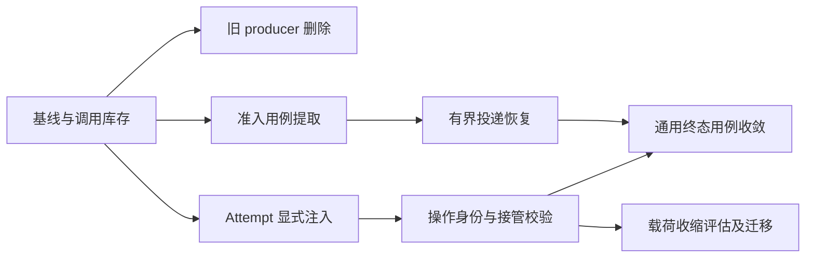

# 状态事实与运行恢复收敛：技术实施方案

状态：**待实施方案**。本文把 Yuxi 对比中发现的具体问题拆成实施批次，供主控组织探索、实现和验收。文中的目标接口、数据字段与新增测试均为设计要求，不能作为已经实现或已经部署的证明。执行进度、提交 SHA、测试结果和阻塞项记录在当前任务或 PR。

## 1. 目标与设计依据

ai-platform 已采用 PostgreSQL 保存持久化事实、Redis 承担队列和实时传输的架构。下一步的重点是完成已有边界的迁移：删除闲置生产入口，把仍在工作的通用逻辑交回业务 owner，并使已持久化的提交在客户端离开后仍能得到有界恢复。

完成本计划后应具备四项可观察结果：

1. 新运行只经过现行队列和 v4 发布入口；旧测试不再维持第二套生产写法。
2. API、Worker、reconciler 使用显式注入的 Runs 用例；终态、事件、审计和发布意图保持原子提交。
3. 已接受但未确认投递的 chat submission 可以由服务端恢复，且不会产生第二个 Run 或重复执行授权。
4. 调度接管、Executor 执行权、Sandbox 资源所有权各自校验；过期操作不能修改后来者的状态。

本文是实施导航。详细规则继续由以下文档唯一拥有：

| 涉及问题 | 详细契约 |
| --- | --- |
| 业务事实、进程与包边界 | [Runtime authorities](../architecture/runtime-authorities.md)、[System architecture](../architecture/system-architecture.md)、[Source architecture](../architecture/source-code-architecture.md) |
| 终态事务、锁序、历史记录 | [Run lifecycle](../architecture/run-lifecycle-boundary.md) |
| ExecutionSpec、Attempt、队列混合版本 | [ExecutionSpec and RunAttempt](../architecture/execution-spec-and-attempt-lifecycle.md) |
| v4 身份、回放、持久化发布 | [SSE wire](../architecture/redis-streams-sse-wire-protocol.md)、[SSE execution control](../architecture/redis-streams-sse-execution-control.md) |
| 资源回收和回调接收 | [Sandbox Runtime](../architecture/sandbox-runtime-control-layer.md) |
| 跨 owner 的迁移顺序与故障验收 | [Runtime convergence](../architecture/runtime-convergence.md)、[System acceptance matrix](../acceptance/system-architecture-matrix.md) |

### 1.1 固定对比样本

以下结论来自固定源码样本，行号链接用于重现分析。实施每批改动前重新获取远端，记录实际 base/head，并复核该批调用闭环；样本不代表未来主分支状态。

- ai-platform：`2ba4e172598df2bae7aa03684da2e39c7b9fbf0a`。
- Yuxi：`caff3208c9db9128aa0b277bc5c669141383ddbd`。
- 比较范围：提交持久化、队列投递、Attempt/租约、终态和 SSE 发布。构建发布与 Sandbox 配置继续由各自契约管理。

## 2. 相同架构下值得借鉴的实现

| 主题 | Yuxi 的具体实现 | ai-platform 的实施选择 |
| --- | --- | --- |
| 未投递任务恢复 | `recover_pending_dispatches` 从数据库找 pending Run 和 queued request，再调用同一派发入口。[源码](https://github.com/xerrors/Yuxi/blob/caff3208c9db9128aa0b277bc5c669141383ddbd/backend/package/yuxi/services/agent_request_queue_service.py#L500) | 为持久化 chat submission 增加有界恢复；API 重试和后台恢复复用同一个准入用例。扫描必须分页、限并发、限时间，不能照搬该实现的全量 `.all()` 和集中 `gather()`。 |
| 队列载荷 | `enqueue_agent_run` 传 `run_id`，以 `run:{run_id}` 作为 job ID。[源码](https://github.com/xerrors/Yuxi/blob/caff3208c9db9128aa0b277bc5c669141383ddbd/backend/package/yuxi/services/agent_run_service.py#L811) | 逐字段证明哪些内容能从已接受事实重建，再收缩载荷；保留调度所需的作用域与配额维度，继续使用现有队列。 |
| 运行所有权 | `mark_running`、`renew_lease`、过期回收以数据库行及 owner token 判定，并维护 attempt 记录。[源码](https://github.com/xerrors/Yuxi/blob/caff3208c9db9128aa0b277bc5c669141383ddbd/backend/package/yuxi/repositories/agent_run_repository.py#L390) | 完成本项目已有 RunAttempt CAS 和跨进程校验。复用当前账本，保留异步 Executor 合法交接与独立 Sandbox 资源租约。 |
| 事件可靠性 | 流事件直接写 Redis；Worker 对发布失败采取 best effort。[Redis 写入](https://github.com/xerrors/Yuxi/blob/caff3208c9db9128aa0b277bc5c669141383ddbd/backend/package/yuxi/services/run_queue_service.py#L150)、[Worker 包装](https://github.com/xerrors/Yuxi/blob/caff3208c9db9128aa0b277bc5c669141383ddbd/backend/package/yuxi/services/run_worker.py#L367) | 保留本项目 PostgreSQL canonical 事件、持久化发布重试和 successor recovery。减少代码量应通过删除闲置写入入口实现。 |

这里可借鉴的是恢复入口和职责组织。Yuxi 的较短路径没有自动证明更强的故障语义；双方都需要按自己的约束验收。

## 3. 已核查的问题与处置

### 3.1 可直接安排删除的入口

| 对象 | 样本证据 | 最小删除闭环 |
| --- | --- | --- |
| `dequeue_run` | [queue.py:2600](https://github.com/demonsxxxxxx/ai-platform/blob/2ba4e172598df2bae7aa03684da2e39c7b9fbf0a/app/queue.py#L2600)：先 lease、再 ack、最后返回 payload；仓内 `app/tests/tools/docs` 仅有定义 | 删除函数；保留 `lease_run`、`ack_run` 和正式 Worker 的处理后确认顺序。删除前补查配置、插件和动态导入。没有证据时不虚构外部兼容承诺。 |
| `RunStreamPublisher` 与 `publish_committed_stream_event` | [redis.py:1197](https://github.com/demonsxxxxxx/ai-platform/blob/2ba4e172598df2bae7aa03684da2e39c7b9fbf0a/app/streaming/redis.py#L1197)、[redis.py:146](https://github.com/demonsxxxxxx/ai-platform/blob/2ba4e172598df2bae7aa03684da2e39c7b9fbf0a/app/streaming/redis.py#L146)：生产调用闭环只在旧 publisher 内；外部实例化来自旧测试 | 成对移除，处理仅由它们使用的导入；旧 producer 专属测试删除，共享安全断言迁至现行 v4 owner。 |
| 旧 `create_or_get_stream_admission`、`publish_terminal_intent`、`canonical_assistant_delta_event` | [旧 admission:683](https://github.com/demonsxxxxxx/ai-platform/blob/2ba4e172598df2bae7aa03684da2e39c7b9fbf0a/app/streaming/redis.py#L683)、[旧 terminal:1117](https://github.com/demonsxxxxxx/ai-platform/blob/2ba4e172598df2bae7aa03684da2e39c7b9fbf0a/app/streaming/redis.py#L1117)、[旧 delta:1176](https://github.com/demonsxxxxxx/ai-platform/blob/2ba4e172598df2bae7aa03684da2e39c7b9fbf0a/app/streaming/redis.py#L1176)；已核查外部调用为旧测试或守卫字符串 | 删除旧 producer；保留 v4 admission、共享意图存储和静态防回退守卫。按测试职责逐项迁移，不能整文件删测试。 |

以上是源码清理机会，不是已经发生线上事故的结论。尤其不能把“旧类没有调用者”扩大成“整个 Redis 模块没有价值”。

### 3.2 必须先迁移的活跃实现

| 问题 | 证据与影响 | 处理方向 |
| --- | --- | --- |
| 通用终态逻辑仍挂在 permission 名下 | [`tool_permission_lifecycle.py:161`](https://github.com/demonsxxxxxx/ai-platform/blob/2ba4e172598df2bae7aa03684da2e39c7b9fbf0a/app/tool_permission_lifecycle.py#L161) 的 complete/fail/cancel/drain 服务于 Worker、取消接口、入队补偿和 reconciler | 迁入 Runs application；SQL 原语交给 Runs persistence。原有返回值、事务、锁序和历史 drain 行为逐项回放。 |
| 终态策略与 SQL 混在通用仓储 | [`repositories.py:4241`](https://github.com/demonsxxxxxx/ai-platform/blob/2ba4e172598df2bae7aa03684da2e39c7b9fbf0a/app/repositories.py#L4241) 同时推进 terminalization、处理历史 permission、写事件/审计/意图 | 沿用 Run lifecycle 的既定拆分，不把整段逻辑复制到另一个 infrastructure 文件。 |
| Attempt service 依赖全局可变注册 | [`attempt_lifecycle.py:265`](https://github.com/demonsxxxxxx/ai-platform/blob/2ba4e172598df2bae7aa03684da2e39c7b9fbf0a/app/runs/application/attempt_lifecycle.py#L265) 通过 `_service` 转发；[`model_services.py:66`](https://github.com/demonsxxxxxx/ai-platform/blob/2ba4e172598df2bae7aa03684da2e39c7b9fbf0a/app/bootstrap/model_services.py#L66) 在模型服务初始化时配置它 | API/Worker 组合根显式构造与注入；缺失依赖在启动时失败。移除 Runs 对模型 bootstrap 的隐含依赖。 |
| 持久化后的未知投递依赖请求重试 | [`chat.py:539`](https://github.com/demonsxxxxxx/ai-platform/blob/2ba4e172598df2bae7aa03684da2e39c7b9fbf0a/app/routes/chat.py#L539) 保留未知状态；[`chat.py:2587`](https://github.com/demonsxxxxxx/ai-platform/blob/2ba4e172598df2bae7aa03684da2e39c7b9fbf0a/app/routes/chat.py#L2587) 提供 retry-admission。样本检索未发现服务端 pending chat submission 补投扫描器 | 增加有界、可重复的服务端恢复。客户端离开后的实际恢复结果仍需故障注入验证。 |
| 现有 stale-run 恢复以终态化为主 | [`worker_main.py:481`](https://github.com/demonsxxxxxx/ai-platform/blob/2ba4e172598df2bae7aa03684da2e39c7b9fbf0a/app/worker_main.py#L481) 用队列 fence 排除活跃 owner，再将中断 Run 失败/取消 | 明确从未开始执行的 pending admission 与已中断执行的处理分工，消除与新补投器的竞态。 |
| 队列中复制了较多执行事实 | [`QueueRunPayload:911`](https://github.com/demonsxxxxxx/ai-platform/blob/2ba4e172598df2bae7aa03684da2e39c7b9fbf0a/app/models.py#L911) 包含输入、Skill、context、model/Profile 等字段 | 先建立字段来源和版本矩阵，再收缩。ExecutionSpec 在重新授权和 context 准备后、dispatch 前生成，不能假定首次入队时已经存在。 |

### 3.3 保留项及退出条件

| 保留对象 | 当前用途 | 退出或变更条件 |
| --- | --- | --- |
| `RedisStreamBridge`、v4 candidate 操作、client 生命周期 | [`V4RedisStreamBridge`](https://github.com/demonsxxxxxx/ai-platform/blob/2ba4e172598df2bae7aa03684da2e39c7b9fbf0a/app/streaming/infrastructure/v4.py#L589) 和 rebuild 共用 | 只有完成所有 v4 调用方迁移及等价测试后，才可拆共享设施。 |
| `create_or_get_stream_admission_v4`、confirmation、terminal intent persistence | 现行 v4 准入、冻结语义身份、重试与终态恢复 | 作为现行机制保留；删除旧封装不改变其语义。 |
| Redis 物理命名空间与队列 v1/v2 lease 读取 | 现存数据及混合版本消费者 | 按队列契约完成 fleet/租约排空证明后再退出。名称含旧版本不等于闲置。 |
| 历史 permission/child-parent drain | 旧持久化记录可能尚待收敛 | 用有界查询确认剩余状态并完成迁移；保留历史读取不授予旧 producer 写入权。数据库列更名另做 schema 批次。 |
| `lambchat_compat` 的现行路由、历史投影与同名常量 | 当前 HTTP/历史读取消费者 | 逐个接口证明替代消费者和数据处理完成；不能按 `compat` 文件名整删。 |
| 旧 producer 的守卫字符串、历史 ADR | 防止重新引入退役写入入口；保留决策历史 | 保留守卫及其合成输入测试。ADR 的历史定位由文档索引说明，不改写成当前实现。 |
| Profile 准入中的 Run/Profile 锁；Sandbox stop-under-lock | 分别保护授权与投递顺序、资源停止操作 | 每项分别提供 claim、外部操作身份、receipt、并发接管与混合版本证据后才能缩短锁区间。 |

## 4. 批次与依赖顺序

优先级：P1 为影响恢复或执行安全的闭环；P2 为删除冗余和职责迁移；P3 为通过成本收益评估后实施的优化。无调用者删除可以先交付，不能占用恢复修复的全部工作预算。

| 批次 | 优先级 | 独立交付物 | 前置条件 |
| --- | --- | --- | --- |
| S0 基线与调用库存 | 必需 | 固定来源、调用图、兼容处置与测试选择 | 每批启动时更新 |
| S1 旧 producer 删除 | P2 | 删除第 3.1 节闭环，迁移对应测试，保留共享 v4 | S0 |
| S2a Attempt 显式注入 | P2 | 组合根构造、调用方注入、全局注册退出 | S0；与 S1 可分别探索 |
| S2b Chat admission 用例提取 | P1 前置 | HTTP retry 与后台可复用的完整准入用例，行为等价 | S0；保持原事务/锁序 |
| S3 有界 pending admission 恢复 | P1 | 数据选择、claim、重试、可观测性与 stale-run 协调 | S2b；第 6 节竞态和真实依赖验收 |
| S4 Attempt 与资源操作校验闭环 | P1 | callback/reclaim 等操作各自的身份校验和恢复 | S2a；逐操作交付，先校验后提高恢复并发 |
| S5 通用终态用例收敛 | P2 | Runs 用例、SQL 原语、全部调用方迁移、旧出口删除 | 先处理影响本批的 S3/S4 问题；遵守既有 lifecycle 分片顺序 |
| S6 Queue payload 收缩 | P3 | 字段来源矩阵、混合版本读取与旧字段退出 | S4 对受影响路径已闭环；收益足够且兼容窗口明确 |



图中的并行表示独立分析或独立提交的依赖关系。涉及相同文件的实现由主控顺序整合。任何批次都以一个可证伪行为和完整调用闭环为单位，不以拆文件数量作为完成标准。

## 5. S1、S2：清理和用例边界

### 5.1 S1 删除闭环

主控逐段阅读待删除的函数及直接依赖，先输出删除清单，再执行修改：

- `app/queue.py`：只移除无调用者的 `dequeue_run`。
- `app/streaming/redis.py`：删除第 3.1 节列出的旧写入函数/类，按实际引用清理私有辅助项与导入。
- `tests/test_streaming_redis.py`、`tests/test_streaming_control.py`：移除旧 writer 专属行为；对冻结身份、未知发布、确认和持久化等共享要求，保留原测试或在 v4 测试中建立等价断言。
- `tools/check_sse_runtime_cutover.py`、`tests/test_sse_runtime_cutover.py`：保留防回退语义；必要调整必须继续能检出旧 producer 被重新引入。

本批不改变公开事件名称、序列、canonical bytes、Redis key 或数据库 schema。验收需要证明现行 v4 发布、重建和终态恢复仍可到达。不能以删除大量失败测试替代验证。

### 5.2 S2a 显式依赖注入

使用已有 `RunAttemptLifecycleService`，在 API/Worker 组合根构造一次，通过明确的服务参数或能力端口传入调用者。框架依赖提供器只能读取组合根安装的实例；不能另设全局容器取代 `_service`。

迁移闭环包含 `app/runs/api.py` 的导出、Worker 主循环与维护、Executor reconciler、调用 Attempt 的 Runs/Sandbox 路径，以及直接 monkeypatch `_service` 的测试。测试改为注入端口替身。实例生命周期必须由组合根负责关闭。

`configure_model_services()` 保留它拥有的模型装配职责；Attempt 配置移出。生产入口未注入完整依赖时启动失败，不能靠首次 heartbeat 才发现未配置。完成标准是删除 `configure_run_attempt_lifecycle`、`_configured_service` 及全局转发闭环，而非保留一个永久 re-export。

### 5.3 S2b 提取完整 chat 准入用例

目标位置沿用 `app.runs.application` 和既有 Runs 公共 API。提取 `_admit_chat_submission` 的完整业务闭环；HTTP 层负责认证、输入和响应映射，后台恢复层负责选择和调度。两者调用同一个准入用例。

输入绑定 tenant、user、submission 身份，Run 和已接受快照从持久层读取。输出是已有 accepted/pending/rejected/queued 语义对应的类型化结果，HTTP 映射保持现有契约。后台调用不能构造虚假的浏览器登录状态来满足函数签名。

本批保持以下已存在行为：

1. submission 与 Run 的 scoped lock、唯一幂等键和原有锁序。
2. 创建事务已经提交后才开始投递；Profile 分支再次验证固定版本授权，并在当前锁保护范围内完成 Redis admission。
3. `check_existing=True` 和原 queue identity；未知投递保留可恢复状态，确定拒绝才走原补偿路径。
4. 并发成功不能被本次错误覆盖；非 queued Run 的 resolution 仍按现行规则处理。
5. 仅重试投递，不能重新创建消息、Run、context 或文件绑定。

提取完成即删除路由里的原业务实现。锁区间优化、错误分类改变和新增恢复调度分别在后续批次证明。

## 6. S3：服务端 pending admission 恢复

### 6.1 权威与选择范围

权威继续是 `chat_submissions` 与所属 Run。SSE 的 `admission_pending` 是流发布恢复，不能用于推断队列是否已经投递。

候选查询从 `accepted_pending_enqueue` 且存在持久化 Run 的记录开始，使用有索引的到期条件、稳定排序和显式 LIMIT。读取候选仅是调度提示；获得 scoped claim 后重新核验 submission、Run、当前权限和执行状态。

- 已有相同队列记录：尝试对账并保存确认结果。
- 尚未执行且仍可准入：通过 S2b 用例投递同一 Run。
- 已进入执行、已有待处置 Attempt/Sandbox、已 terminal 或 cancel requested：交给对应现行 owner 对账/收敛；扫描器不授予再执行权。
- 所有权或外部结果未知：保留可恢复事实并退避，不能仅按 elapsed time 宣告可安全重跑。

恢复根据原提交身份通过既有身份、Profile/Skill 授权服务验证当前权限，不保存或重放浏览器 token。实施前确认所需身份和准入依据能够从持久化事实及当前授权 owner 完整取得；无法证明时不得投递，应记录安全的失败原因供处理。

### 6.2 数据与算法

优先扩展现有 submission 记录，不另建 Run 状态账本。S0 先核查已有字段是否足够；不足时采用 additive migration。以下是建议的最小职责，物理字段名在 schema 批次确定：

| 数据职责 | 用途 |
| --- | --- |
| `recovery_next_retry_at` | 有界到期索引、退避与公平调度 |
| `recovery_claim_token`、`recovery_claim_until` | 本次恢复操作身份和领取期限；旧 claim 不能写入新 claim 的回执 |
| `recovery_attempts` | 重试预算和故障聚合；不是 RunAttempt ordinal |
| `recovery_error_code` | 有界、脱敏错误分类；不保存原始异常或请求内容 |

同一事务内以 `FOR UPDATE SKIP LOCKED` 领取有界批次；旧 claim 到期的重领必须比较旧身份和记录状态。每个候选调用 S2b 用例前验证当前 claim。回执比较 tenant/user/submission、原 Run、expected state 和 claim token；失败回执不能覆盖 queued/终态或后来的 claim。

领取操作可以是短事务，但领取成功本身不允许移除准入原有锁。Redis 命令即使超时也可能已执行，claim 过期也不会撤回已发出的命令。因此启用前必须证明：同一身份重复投递被现有 Redis 原子幂等机制约束，Worker 仍验证当前 Run/Attempt/权限，旧回执无法篡改新结果。数据库 CAS 单独不能提供外部 exactly-once 保证。

建议处理循环：

```text
到期扫描 -> scoped claim -> 重新核验当前事实
    -> 准入用例(check_existing=True, 原 Run / submission 身份)
    -> 确认成功：条件回写既有 queued resolution
    -> 确定拒绝：调用既有 Runs 补偿用例
    -> 外部未知：条件记录 next_retry_at，保留 pending
    -> 身份过期或状态变化：停止本 claim，交由当前 owner
```

达到单次尝试/时间预算后退出本轮，持久化下次重试时间。达到持续故障阈值时暴露可操作告警；不能把未知外部结果直接转换成失败并建立新 Run。

### 6.3 与 stale-run 和维护调度协作

S3 同批必须处理补投与 `reconcile_stale_runs_for_worker` 的竞争：明确哪些“从未开始执行、仍在有效准入恢复窗口内”的记录由补投器拥有，stale selector 和最终 CAS 都使用同一判定，防止扫描后状态变化。窗口外也必须先对账队列和执行权，不能无限豁免 pending Run 的收敛。

补投器保留 Redis reconciliation fence 检查；领取失败、所有权未知或其他 owner 正在收敛时退避。若当前 queue 原语不能原子覆盖所需竞争条件，先补齐该原语和对应真实依赖测试，再启用扫描器。

最初复用 Worker 的受监督生命周期，设置批量、并发、单次 deadline、退避上限及公平调度预算。关键发布/恢复有独立调度预算，bulk cleanup 卡住不能阻断它们。终止超时任务时必须继续核算仍未结束的 I/O，不能不断启动替代任务。预算应按 owning settings 定义并测试边界，不为同一含义再添加多套 env 别名。

至少暴露 pending 数量和最老年龄、最近成功进展、成功/未知/拒绝/CAS 丢失计数、重试次数、扫描耗时及超预算次数。指标维度不携带 user/run ID；脱敏日志通过受控 trace 关联。进程 heartbeat 不能替代恢复进展指标。

## 7. S4：按操作收敛执行权

沿用 `run_attempts` 和 immutable ExecutionSpec。普通 Worker 目前把 Redis-fenced heartbeat 的精确时间写入 PostgreSQL，写入或提交失败会停止本地执行；这条安全路径需要保留，直到替代协议有等价证据。

先逐操作补齐身份矩阵，再修改实现：

| 操作 | 需要证明的权威 |
| --- | --- |
| Worker heartbeat、ack/fail | 原 queue message/lease、Worker owner、durable Attempt 及适用的 generation |
| Redis reclaim 和新 dispatch | 旧队列租约已失效、旧 Attempt 已依法收敛、新 ordinal 已持久化，才能执行 |
| Executor callback receipt | tenant/Run/Attempt、当前执行授权、Sandbox runtime 身份；普通调度交接不能误拒仍合法的 Executor |
| collection、terminalization | 对应 Attempt 和接收事实、预期状态；旧执行结果不能覆盖新 authority |
| cancel、provider stop/release | Run 取消事实与 Sandbox 资源操作 claim 分开；停止失败仍是 cleanup pending/failed |

每个操作记录四项：检查哪些 generation、谁能够提升它、外部调用如何幂等或校验身份、未知 receipt 如何恢复。只对拥有该操作的 authority 做 CAS，不用一个万能 generation 代替所有生命周期。

先关闭过期写入和不安全接管窗口，再提高 recovery 并发。队列 v1/v2、callback、SSE 版本分别按对应契约处理。回滚到 v1-only Worker 前必须由当前能力排空或恢复 protocol-v2 processing leases；保留已写入的 specification/attempt 数据。

## 8. S5、S6：终态职责与载荷收缩

### 8.1 S5 通用终态服务

扩展已有 `RunCancellationUseCase` 和 [`build_run_cancellation_use_case`](https://github.com/demonsxxxxxx/ai-platform/blob/2ba4e172598df2bae7aa03684da2e39c7b9fbf0a/app/bootstrap/run_lifecycle.py#L21) 的职责边界，按 Run lifecycle 契约组织 `RunLifecycleService`；不并行保留两套 cancellation 策略。

按纯策略、SQL 原语、application orchestration、API/Worker 注入、旧出口删除逐片交付。每片回放同样的成功、失败、取消、入队补偿、stale-owner、历史 child/parent 收敛输入。保持状态、事件、审计、terminal intent 的同连接同事务及提交后发布。

调用闭环至少覆盖 `app/worker.py`、`app/worker_main.py`、`app/executor_reconciler.py`、`app/routes/runs.py`、`app/routes/admin_runs.py`、`app/run_admission_terminalization.py`、`app/bootstrap/run_lifecycle.py`。不能只修改 import 后继续把整个 repositories 对象作为 service 注入。

历史 drain 保留每批事务、最大批次数、attempt terminalization、child identity fence 和 parent exactly-once durable facts。`tool_permission_lifecycle.py` 还承载其他 permission budget 职责，移走通用终态逻辑并不自动证明可整文件删除。数据库 `permission_terminalization_*` 的重命名必须独立评估 schema 与旧镜像读取，不随 Python 搬迁同时修改。

### 8.2 S6 Queue payload 收缩

先提交字段矩阵：当前 producer、consumer、持久化来源、重新授权来源、调度必要性、旧消息格式、失败处理。仅删除已经能从相同 admitted identity 确定重建的字段，拒绝通过最新 Profile/Skill 版本补齐旧消息。

先部署接受现有和目标格式的读取能力，再切换写入，最后在队列/DLQ/processing 租约库存及 fleet 证明旧格式退出后删除旧读取。不能向 `extra="forbid"` 的旧消费者直接添加字段。目标消息保留版本、作用域、Run 身份和必要调度信息；具体最小集由矩阵决定。

该优化不改变首次入队早于 ExecutionSpec 编译的顺序。历史回放与滚动升级证据不足时保留当前格式，不能仅为减少字段制造另一套事实来源。

## 9. 多 Agent 执行与主控职责

本计划采用主控单一写入、子 Agent 独立探索/核验的组织方式。每个探查任务一次性、`fork_turns="none"`，不继承主控历史。具体 Agent 名称和进展只放当前任务，不进入长期状态表。

| 探查任务 | 可读范围与问题 | 必须交付 |
| --- | --- | --- |
| A：删除闭环 | queue、streaming 旧符号及 app/tests/tools/docs 消费者 | file:line、真实调用与守卫/历史引用区分、保留设施、删除条件 |
| B：准入恢复 | chat submission、queue admission、Worker maintenance；固定 Yuxi 恢复实现 | 提交到投递的故障窗口、锁序、幂等/权限条件、新旧恢复竞争、测试位置 |
| C：生命周期依赖 | Runs、bootstrap、permission terminalization 与直接调用者 | 显式注入迁移闭环、历史记录处理、同事务要求、现有 owning tests |
| D：改后独立核验 | 主控已完成批次的 diff、该批 owning contract 和直接测试 | 按严重性给出可复现 finding、file:line、触发/影响/最小修复；未核实项明确说明 |

主控在派发前固定范围和完成条件；多个独立探查并发，相关子 Agent 在途时冻结其检索范围内的修改。派发后等待终态结果，过程消息不算完成。超时先催收已核实的 partial，再中断并缩小下一次任务，避免无限扩展探索。

主控亲自读取架构/设计文档和即将修改的代码，依据探查出处抽查关键结论，决定方案、实施修改、更新调用方和测试，然后运行最终验证。子 Agent 的意见不能自动成为保留 facade、扩大清理范围或降低验收要求的依据。

每个实施批次交付同一组材料：具体 before/after、改动及删除列表、保留消费者与退出证明、可证伪测试、实际结果与限制。一个批次闭环后再进入有依赖的下一批；未通过真实依赖门槛的行为变更不能标为运行验收完成。

## 10. 验证与故障验收

### 10.1 现有测试入口

在目标 worktree 根目录使用已准备依赖的 Python，遵守 [local test execution](../agent-rules/local-test-execution.md)。以下是可选的分批入口，不表示测试已经执行：

```bash
python tools/run_test_stage.py \
  --stage state-authority-docs --timeout-seconds 300 \
  -- tests/test_source_authority_docs.py

python tools/run_test_stage.py \
  --stage retired-producers --timeout-seconds 300 \
  -- tests/test_queue.py tests/test_streaming_redis.py \
  tests/test_streaming_control.py tests/test_streaming_v4_transport.py \
  tests/test_streaming_v4_durable.py tests/test_sse_runtime_cutover.py

python tools/run_test_stage.py \
  --stage run-owner-wiring --timeout-seconds 300 \
  -- tests/test_run_attempt_application.py tests/test_worker_attempt_lifecycle.py \
  tests/test_run_cancellation_use_case.py tests/test_tool_permission_lifecycle.py \
  tests/test_production_bootstrap.py
```

S2b/S3 复用 `tests/test_chat_routes.py`，尤其以下已存在回归入口：

- `test_new_profile_submit_commits_after_user_and_profile_admission_before_enqueue`
- `test_profile_postcommit_lost_ack_is_recoverable_and_duplicate_retry_does_not_reenqueue`
- `test_retry_admission_keeps_unknown_enqueue_outcome_recoverable_without_failure_transition`
- `test_retry_admission_reconciles_concurrent_redis_success_without_terminalizing`
- `test_retry_admission_commits_enqueue_compensation_before_503_escapes`

新 scanner 需要新增独立调度和真实事务测试；上述请求路径测试不能替代后台恢复测试。S3/S4 同时保留 `tests/test_worker_main.py` 的 stale-run fence/owner-race 与 heartbeat PostgreSQL 失败回归。

现有真实依赖入口包括 `tests/test_worker_heartbeat_postgres_redis_integration.py`、`tests/test_streaming_v4_postgres_integration.py` 和 `tests/test_streaming_v4_redis_integration.py`。涉及的必要依赖必须在隔离环境中提供，并使用 `--require-zero-skips`；新增补投并发场景仍需补充覆盖。测试只使用合成数据，连接凭据不进入日志或文档。

### 10.2 必须新增或补齐的场景

下表是本计划的验收用例名；对应架构编号引用既有 [acceptance matrix](../acceptance/system-architecture-matrix.md)，不新增第二套协议。

| 场景 | 注入方式 | 必须观察到的结果 | 适用批次/架构编号 |
| --- | --- | --- | --- |
| 持久化后、投递前崩溃 | 提交成功后杀死 API，客户端不再重试 | Worker 恢复同一 submission/Run，只有一个逻辑 admission；用户事实不重复 | S3；RUN-01 |
| Redis 接受后回执丢失 | 在 enqueue 成功与确认之间断开连接 | 重试同一身份并对账；未知不被当成确定拒绝 | S2b/S3；RUN-01 |
| 后台与客户端并发 | 两个 scanner、HTTP retry 同时处理同一记录 | claim/行锁/幂等按预期工作，旧回执不能覆盖成功 | S3；RUN-01 |
| claim 到期仍有 I/O 在途 | 延迟旧请求，领取新 claim，再释放旧回执 | 旧回执 CAS 失败；即使传输重放，执行权仍只授予合法 owner | S3；RUN-01/RUN-03 |
| 撤权、取消、终态竞态 | 在候选读取后改变权威记录 | 无越权执行、无取消后新授权；按既有 resolution 收敛 | S2b/S3；AUTH-02/RUN-01 |
| 补投与 stale 回收竞争 | 在查询、queue fence、PG commit 边界交错运行 | 结果由同一权威条件决定；无一边重投、一边错误终态化 | S3；RUN-01/RUN-03 |
| 恢复积压和依赖卡顿 | 多批 eligible 记录、丢通知、延迟 Redis、阻塞 cleanup | 在声明预算内持续前进；关键恢复可见、无无限任务/重试增长 | S3；RCV-03/RCV-04 |
| 旧执行者迟到 | 接管后送旧 heartbeat/callback/collection/terminal | 拒绝过期写入；合法异步 Executor 交接仍可接收 | S4；RUN-03 |
| 终态事务回滚及发布未知 | PG commit 前失败；commit 后 Redis 失败 | 前者无部分终态事实；后者沿用冻结身份/bytes 恢复，同一 incarnation 保持 terminal/end 顺序 | S1/S5；RUN-02/SSE-05 |
| 历史 drain 与重复取消 | 无 Attempt 历史行、分批 drain、重复 child receipt | 原有 no-op、批次、事务和父子身份校验保持；历史事件/审计不重复创建 | S5；RUN-02/OWN-01 |
| 两套服务实例同进程 | 不同端口替身构造两套 API/Worker 能力 | 不互相覆盖注册；缺失依赖在 bootstrap 报错 | S2a；OWN-01 |
| 旧队列与回滚 | 旧生产者/新消费者、新 lease/旧 reclaimer、DLQ 重放 | 版本拒绝/读取符合契约，旧 owner 不能修改新租约；保留持久化事实 | S4/S6；RUN-03/REL-01 |

真实验收对齐 Run、Attempt、submission、queue lease、canonical event 和 Sandbox receipt。网络重复传输不应被误报成重复业务执行；也不能用单个队列消息数证明工具外部副作用 exactly once。

### 10.3 删除证明

每批修改后运行独立库存检查，并按引用类型解释剩余命中。例如：

```bash
rg -n '\b(dequeue_run|RunStreamPublisher|publish_committed_stream_event|canonical_assistant_delta_event)\b' app
rg -n '\b(create_or_get_stream_admission|publish_terminal_intent)\b' app tests
rg -n '\b(RunStreamPublisher|canonical_assistant_delta_event)\b' tools tests docs
rg -n 'configure_run_attempt_lifecycle|_configured_service' app tests
```

S1 后生产旧入口应无命中，S2a 后全局注册路径应无命中；不同批次不能套用同一个清零预期。工具守卫、合成源码和本文/历史 ADR 的命中属于预期保留。实现前还需检查上述范围外的配置、入口、动态加载和包导出；单次搜索无结果不能替代这些消费者的确认。

PR 的 retirement disposition 必须覆盖 production paths、tests/selectors、docs/config、保留消费者与 removal proof，并附实际库存结果。不要添加仅断言某段文案或文件行数的永久测试。

## 11. 启用、回滚与完成判定

S1 和行为等价的 S2 可以独立审查。S3 的 schema 先 additive 展开，再上线能够读取新旧状态的代码；真实竞态证据满足后才启用新恢复行为。S4/S6 的队列和执行权变化按各自混合版本契约交付。每批只修改自己拥有的详细契约及索引。

回滚先停止该批新增调度/写入，等待或对账在途操作，再恢复兼容窗口内的已审核镜像。保留新增持久化事实、未知 receipt 和待恢复记录，不做破坏性 down migration；不能因为关闭 scanner 就宣告 Redis 在途操作已经取消。

整个计划完成需要同时满足：旧生产闭环已经退出，已知消费者全部迁移；用例通过显式依赖连接；后台恢复在真实 PostgreSQL/Redis 故障中推进且不扩大执行权；操作校验、历史记录和版本退出有对应证据。源代码、单元测试、集成测试、镜像与部署验收分别记录。

发布继续执行 [release runbook](../operations/release-operations-runbook.md)。技术方案完成不表示运行代码已改变，测试通过不表示服务器已部署，文档不会替代发布授权或真实环境验收。
