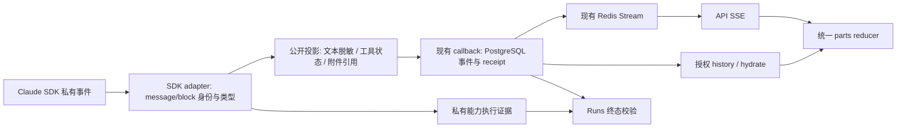

# Agent 流式消息与最终交付架构整改方案

状态：待实现的产品与技术方案。本文不宣称协议已经升级、代码已经整改或运行时已经验收。
现行 SSE v4 仍由 [wire contract](../architecture/redis-streams-sse-wire-protocol.md)
定义；传输、授权和终态继续由 [execution control](../architecture/redis-streams-sse-execution-control.md)
及 [ADR 0013](../adr/0013-redis-stream-only-sse.md) 负责。
本文拥有下一版消息片段模型、迁移顺序和验收要求；实施时同步更新详细合同，避免两套规范并行生效。

## 1. 产品决定

公开的 Assistant 文字应边生成边显示，包括计划、过程说明、阶段发现和最终回答。
某段文字后面出现工具调用，不构成隐藏该文字的理由。
“可以展示”“属于最终答复”“工具确实执行成功”“Run 成功”是四个不同判断。

| 内容 | 普通用户看到什么 | 发布依据 |
| --- | --- | --- |
| Assistant 的公开文字 | 有序追加的文字，生成中即可阅读；结束后仍保留 | 已识别的公开文本来源，通过增量脱敏和持久化 |
| 工具、Skill、MCP、子任务活动 | 类别、获准公开的名称、执行状态、进度、耗时；完成后可以折叠 | 平台验证的生命周期事件 |
| 最终答复 | 保留在正文中，支持单独复制；不把前面所有文字都算入最终答复 | 经平台验证的最终片段选择 |
| 文件 | 消息末尾的附件卡片，零个或多个 | Agent 显式 `attach_file`，平台验证、保存并授权 |
| 执行脚本、命令参数、stdout/stderr、原始工具结果 | 不进入普通用户事件；必要结果由 Assistant 解释或显式文件交付 | 私有执行证据边界 |
| 用户要求的代码、示例路径、JSON 示例 | 作为正常回答展示；不按代码围栏、后缀或关键词整体屏蔽 | 内容来源与具体敏感值判断 |
| 隐藏模型推理、系统提示词、凭据、其他主体数据 | 不展示 | 既有权限和披露边界 |

执行中工具详情展开，结束后可折叠工具活动。公开过程文字默认保留在对话正文中，
不因完成、失败、取消或最终答复确定而消失。`ThinkingBlock` 不作为“过程说明”的来源。
具体内网路径、私有 Skill 标识和密钥继续替换；不能用“出现斜杠就是泄漏”删除正常技术回答。
拒绝原始工具事件是后端职责，不能只把这些字段放在前端折叠面板里。

## 2. 开源项目证据与采用边界

以下为 2026-09-21 核验的一手文档及固定源码，不构成产品排名或本项目运行时证据。

| 项目 | 已核实机制 | 本项目采用什么 |
| --- | --- | --- |
| Vercel AI SDK | `text-start/delta/end` 共用文本 ID，step 和整条流完成分离，UIMessage 使用 parts | 稳定片段身份、增量文本、明确关闭边界 |
| LangGraph | messages 流提供 token 与调用元数据；状态更新、工具/custom 事件分开；checkpointer 负责状态恢复 | 区分来源、文字和执行状态；不把 token 流当持久化保证 |
| LibreChat | SSE 的 delta/content handler 在 final handler 前更新 message content；工具作为独立内容部分 | 中间文字先显示、结束后封存，实时与历史使用相同内容模型 |
| OpenCode | 消息由 Text/Tool/File 等 part 组成，delta 按 messageID/partID 更新；step finish 独立 | 按身份追加与更新，附件独立，结束不重新拼整段正文 |
| Claude Agent SDK | partial StreamEvent 提供文本增量；一个 AssistantMessage 可能只覆盖一个完成的 block；结构化结果在终态返回 | 适配真实 block 顺序，不把一个 typed fragment 当成完整 turn |

主要出处：

- AI SDK：[流协议](https://ai-sdk.dev/docs/ai-sdk-ui/stream-protocol)、
  [UIMessage](https://ai-sdk.dev/docs/reference/ai-sdk-core/ui-message)、
  [TextStreamPart 固定源码](https://github.com/vercel/ai/blob/c391be3192fd5cb74db4bc8225e50ff56925bd19/packages/ai/src/generate-text/stream-text-result.ts#L2129-L2337)。
- LangGraph：[流模式与来源过滤](https://docs.langchain.com/oss/python/langgraph/streaming)、
  [持久化](https://docs.langchain.com/oss/python/langgraph/persistence)、
  [StreamPart 固定源码](https://github.com/langchain-ai/langgraph/blob/448a76377956534a85a56b7c2d8aed0e55d9ee44/libs/langgraph/langgraph/types.py#L2646-L2704)。
- LibreChat：[useSSE](https://github.com/danny-avila/LibreChat/blob/86c5884c0f6c7ee50409d6b7abb27c569a275621/client/src/hooks/SSE/useSSE.ts#L122-L214)、
  [content handler](https://github.com/danny-avila/LibreChat/blob/86c5884c0f6c7ee50409d6b7abb27c569a275621/client/src/hooks/SSE/useContentHandler.ts#L31-L98)、
  [工具展示](https://github.com/danny-avila/LibreChat/blob/86c5884c0f6c7ee50409d6b7abb27c569a275621/client/src/components/Chat/Messages/Content/ToolCall.tsx#L286-L395)。
- OpenCode：[消息片段事件](https://github.com/anomalyco/opencode/blob/70a24697ea0028e19f22712fd63059538cb4bee7/packages/schema/src/v1/session.ts#L596-L641)、
  [UI reducer](https://github.com/anomalyco/opencode/blob/70a24697ea0028e19f22712fd63059538cb4bee7/packages/app/src/context/global-sync/event-reducer.ts#L272-L388)。
- Claude SDK：[官方消息时序及 streaming 限制](https://code.claude.com/docs/en/agent-sdk/streaming-output)。

借鉴事件和内容模型，不复制它们的权限策略：某项目可展开原始工具结果或 reasoning，
不意味着本项目普通用户应收到这些字段。LangGraph checkpoint 不是本项目的 SSE replay log；
OpenCode 的 live-only delta 也不能替换本项目已提交公共事件的持久化约定。
不新增 Agent 框架，不更换 Claude SDK，不为这次整改增加消息中间件。

## 3. 当前问题与整改结论

代码锚点以下列符号为准；具体审核 SHA 和验证结果保留在任务或 PR 中。

| 位置 | 当前问题 | 整改 |
| --- | --- | --- |
| `claude_agent_sdk_runner.py` 的 StreamEvent/AssistantMessage 分支 | 主线先把 partial 送入 answer，后来才知道该 turn 含工具；可能双投为 answer/commentary | 先作为有身份的公开 text part 发布，最终角色单独确定 |
| `claude_stream_projection.py::AssistantAnswerTimeline` | 把多个来源拼接，再用前缀关系补全；内容相等不能证明同一来源 | source message/block 身份对账，Result 不重新拼整场对话 |
| PR #1562 的 `queue_stream_turn` | 等 typed fragment，甚至等下一 message 或 Result 才 flush；修分类时牺牲了增量可见性 | 保留 block/turn 关联校验，移除“必须确定 final 才能公开 text”的前提 |
| `ClaudeSdkAgentEventAdapter` 与 `v4.py` 的 answer receipt | 固定单一 message 的 `message.*` 被重建为答案；没有独立的最终片段引用 | 增加最终选择与对应 receipt，公开文字不自动成为最终答案 |
| `protocol_v4.py`、schema、`TextPart` | 缺少独立 text part ID、关闭状态、最终选择 | 用有版本的 parts 协议协调升级 |
| `eventProcessor.ts`、`SummaryItem.tsx`、`MessagePartRenderer.tsx` | commentary 进 summary，最终被收起；与持续可见的过程文字要求不同 | 文字留正文；折叠只作用于工具/执行活动 |
| `historyLoader.ts` 与终态 hydrate | 依赖当前 message/summary 映射 | live/replay/history 共用 part reducer；按身份和水位对账 |
| SSE execution-control、SDK upgrade 文档 | 整改前仍声明 structured_output 为答复和附件唯一来源 | 本次文档修正为普通文本 Result 与显式 attach_file，并标明迁移目标 |

早前合成测试里的同 ID 冲突 stop reason、重复 block index、raw/typed ID 不一致，
属于必须补齐的防御性校验；未取得真实 provider trace 时，不宣称其正常生产可达。
PR #1562 的累计私有文本缓冲确实缺少局部上限；新方案采用有界增量投影，
避免只给整轮缓冲再添加一个更大的上限。

## 4. 目标边界与数据流

- Execution owns SDK 适配、公开来源归属、脱敏、最终片段选择候选。
- Streaming owns schema、公共事件顺序、现有投递和重放；不判断模型文字是不是结论。
- Conversations owns 对话内容与最终答复的持久化引用；Runs 仍唯一拥有业务成功/失败。
- Artifacts owns 显式选中文件的验证、存储和授权下载。
- 前端仅按已验证身份归并、展示；不根据“总结如下”等文字或文件后缀猜 final。

保留 PostgreSQL 提交后 Redis 发布、精确 callback retry、Run/Attempt/lease fence、
语义 event_id 去重、incarnation 与 Last-Event-ID 校验、gap/hydrate、授权撤销和
terminal/end 顺序。没有第二条临时文本 SSE、浏览器私有 SDK 通道或后台发布队列。

## 5. 消息片段协议与最终选择

目标使用新版本公共协议（实施时定义 v5 schema）；SSE 传输方式不变。
v4 是闭合 schema，不能把新字段塞进旧 envelope 后仍声称兼容。
以下是待实现的语义，不是已经可发出的事件或手写 schema 的替代品。

| 目标事件 | 核心字段与作用 |
| --- | --- |
| `message.started` | 一个 Run 的逻辑 Assistant 回复；与数据库消息 ID 的映射由平台持久化 |
| `text.started` | `part_id`、公开 `turn_id`；默认未选为最终答复 |
| `text.delta` | `part_id`、单调 chunk index、增量；仅追加到该 part |
| `text.completed` | `part_id`、chunk 数、公开文本长度、内容摘要；不携带重复全文 |
| `text.interrupted` | `part_id`、固定原因码；保留已接收内容，禁止后续追加 |
| `answer.selected` | 同一回复内有序且已完成的 `part_ids`；不重复正文 |
| `message.completed` | 关闭整个回复的内容生命周期；不是 Run 成功 |
| 既有 tool/subagent/policy/artifact 语义 | 携带受控公开字段，独立于文本片段 |
| `run.*`、`stream.end` | 继续由平台业务终态和传输终态分别负责 |

一个 part 状态只能 `open → completed` 或 `open → interrupted`，不能重开。
`answer.selected` 只可一次有效选择；同身份同内容可幂等重放，冲突选择拒绝。
运行途中保持角色未决不会阻塞显示。工具出现只表示相关 turn 不能被选为最终答复，
不会撤回其已经公开的文字。

内部 key 区分 tenant、Run、Attempt、incarnation、主/子调用命名空间、SDK message ID
和 block index。公开 `part_id`/`turn_id` 使用平台持有密钥的确定性不透明映射；
event ID 再绑定事件种类及 chunk index，不暴露内部字段或无密钥哈希。
首个 part 事件与有界来源映射同事务提交；callback 重试复用原 ID、序号与原字节。
恢复已有来源时读取已提交映射和水位，不能重新生成一个 part 冒充同一次输出。

SDK 缺少可用身份时，只为已验证的串行调用分配单调 source ordinal，分配事实随
首个 part 提交。进程重启后仅当 SDK 恢复游标能够精确重建来源时才继续同一 part；
仅有文本相同或本地计数从零开始不满足恢复条件。不能证明连续性时按现有 Attempt
恢复规则中断旧来源，必要的重执行进入新 Attempt，保留既有公开内容并明确重试归属。
无法判定归属时只停止该来源的后续文字，不把它绑到上一条或别的主体。

### Claude adapter 的处理

1. 开启 `include_partial_messages`，按 `message_start`、block start/delta/stop、
   message delta/stop 跟踪来源；text delta 经有状态脱敏后尽快提交。
2. typed `AssistantMessage` 是 block 校验/补充，不一定是 turn 结束。
   官方文档的顺序允许 typed block 在对应 `content_block_stop` 前到达；
   因此不能收到 typed fragment 就清空整轮或封闭所有 block。
3. 工具参数的 JSON delta、工具结果、Thinking 均不得进入 text 通道。
   工具开始/结束必须来自平台 hook 与验证后的 receipt，
   `tool_use` block 生成完不等于工具执行完。
4. typed 完整 block 与 partial 使用同一来源对账，重复观察不再次发全文。
   用增量计数/摘要核验；若需要补全差异，只在同源且确认前缀连续时追加后缀。
   冲突不得重绑身份或重放已经拒绝的内容；公开流保留已确认前缀，关闭异常 part。
5. 平台 adapter 将正确的根调用成功 `ResultMessage` 归一为 completion 候选。
   子任务通知、message_stop、finish-step 都不等于 Run 结束；SDK 升级时用真实类型与
   可复核时序 fixture 明确根调用边界，不能仅凭后台任务源码推断有多个根结果。

现行 v4 的全局 capability-active 文本闸门在迁移时替换为“来源归属 + block 类型 +
披露规则”。工具的私有来源始终不发布；若并发消息无法证明属于公开 Assistant，
停止该来源而不全局阻塞其他合法文字。工具授权、执行证据、外部副作用的成功判定保持原约束。

### 最终答复与 receipt

`ResultMessage.result` 是普通对话的终态文本观察，不直接覆盖已提交正文，
也不能单独宣布 Run 成功。adapter 先核验根调用与最后一个可选公开 turn 的身份关系，
再用同一脱敏规则校验 Result 和已完成 parts 的内容；一致时提交 part 引用选择。
同样的文本出现在两个不同 turn，仍是两个来源，不做全局字符串去重。

若 Result 提供独立最终文本，创建独立来源的 text part，按正常事件发布并关闭后再选择。
先前文字仍留在原位置；不得把全部 narration 拼成答案或用 Result 替换整个消息。
若身份/内容对不上，不猜测地提升旧 part 为 final：保留公开过程，明确报告最终内容不可用。
SDK 只有完整 block/Result 时可以降级为 block 级交付，并标记能力限制，不能声称 token streaming。

最终提交采用现有串行 callback 的 barrier：先确认所选 parts 的关闭事件已提交，
再在同一当前 Attempt/lease 下，以一个有界 callback batch 原子提交
`answer.selected`、`message.completed` 和该 batch 的 callback receipt。
平台在事务内校验同源 completed parts、选择唯一性与最终计数；重复批次幂等，冲突 CAS 拒绝。
该事务还保存可验证最终答复的引用清单，不能先发布选择再异步补完成记录。
Redis 发布仍在事务后，ACK 仍遵循现行提交/投递约定；它不与数据库组成分布式事务。

新 receipt 引用公共消息、选择事件、parts 的顺序、各 part 的计数/长度/摘要及最终事件边界。
Worker 从同 Attempt 的已提交公共事实验证，排除 interrupted part、私有来源与未验证选择。
一条长答复的持久化继续使用有界事件引用；不能为了 receipt 在多个进程保留全文副本。
`message.completed`、SDK completion、内容选择、callback ACK 和 Run terminal 各自保留独立含义。
Worker/Runs 在现有终态事务与当前 Attempt CAS 下，验证该 receipt 和必需执行证据后，
才持久化最终消息关联并提交 Run 成功。公共内容已封存但终态未提交的崩溃窗口，
由既有 executor terminal/reconciliation 所有者恢复；数据库已有完整选择不代表 SDK
或工具成功，也不能绕过恢复授权。Redis 发布失败或进程中断仍可读取已提交正文，
不能凭浏览器收到选择就伪造成功或启动另一个发布调度器。
失败/取消不产生成功 receipt，但此前合法内容仍可回放；不能把显示过文字当作执行成功。

普通对话不要求 `output_format` 或 `structured_output`。机器接口确需结构化结果时，
由明确任务模式独立消费，不把 partial JSON 当默认聊天正文或附件清单。
普通成功任务可以只有文本；显式文件交付也应支持附件为主、文字为空的成功结果，
但必须有已验证完成且可访问的 artifact，不能把空 Result 当作任意成功。

## 6. 前端、历史与资源边界

前端保存逻辑回复的有序 parts；正文文字、工具活动和附件分别渲染。
text.delta 按 part 身份和 chunk index 追加，completed 只封存，answer.selected 只更新
最终答复引用和复制范围。最终答复已有正文不再次创建一个气泡。附件在同一回复末尾排序。
Markdown/code/link 使用现有受控渲染，不执行 HTML 或把本地路径变成未经授权的下载链接。

实时、Redis 重放、PostgreSQL history 和 terminal hydrate 共用语义 reducer。
hydrate 携带同一数据快照下的 parts 与水位；应用时保留快照之后已接受的事件，
不能因晚到的旧快照覆盖新 delta、取消状态或附件。恢复游标仍只取服务器验证的 Redis anchor，
不能由数据库 seq 推算。浏览器断线不触发重新执行任务，缺失 Stream 仍走现有 gap/hydrate。

实现时将下列预算集中定义、验证并压测；数值是待验证的初始配置，不是当前 SLA：

| 资源 | 初始目标及超限行为 |
| --- | --- |
| 单条公开 delta | 保持现行最多 8,192 code points；字节队列限制另算 |
| 脱敏未决后缀 | 按最大获准敏感 token 长度推导；设显式字节上限，超限关闭该来源并清理 |
| projector 等待验证的数据 | 每 Run 最多 256 KiB；只存必要尾部、计数和摘要，不累计整轮 |
| 活跃 part 状态 | 每 Run 最多 64 个；已关闭状态提交后可逐出，异常并发拒绝并记录固定码 |
| callback backlog | 继承现行事件数/字节/时长界限；新 text.delta 纳入相同 batching 和背压 |
| UI 额外待绘制队列 | 按帧合并同一 part 的相邻 delta；有界积压时恢复快照，不无限囤积或丢字 |

不能静默截断大答案。完成块的对账如不能在预算内完成，应使用已提交增量摘要与
有界校验策略；暂存仅在私有、有上限且受生命周期清理的位置，不进入 artifact 收集。
取消、异常、封闭 part 必须释放私有待定数据。
测量 SDK 首个安全 delta、callback commit/ACK、SSE write、reducer apply 与浏览器 paint
的独立时刻。确定性测试证明可见性不等待 typed/Result，真实 p95/p99 由压测建立。

## 7. 整改切片与退休清单

各切片可分 PR 开发；涉及新 producer 的激活必须在配套 reader 和持久化可用后协调进行。

| 顺序 | 责任及改动面 | 完成判据 |
| --- | --- | --- |
| A：事实与合同 | 修正旧 structured-output 描述；记录真实 SDK block 时序 fixture；冻结 v5 schema/receipt | 全链路接受同一来源身份和结束语义 |
| B：消息片段基础 | schema generator、Streaming validation、Conversations history、Worker receipt、前端 reducer | 新协议回放/快照/选择测试通过；此时不切 live producer |
| C：SDK 增量投影 | runner 旁按责任拆 adapter；复用脱敏、公开 tool evidence、callback；退役 AnswerTimeline 全局拼接与整轮等待 | 工具之前和之后文字均在根 Result 前可见且只出现一次 |
| D：展示与附件 | text 留正文、tool 折叠、final copy、按消息绑定附件；一致 hydrate | 断线、刷新、失败后内容和附件顺序不变 |
| E：真实链路验收与切换 | pinned SDK、真实 PG/Redis、代理层、浏览器、多实例及取消故障注入 | 不同证据层分开报告，按既有发布 runbook 切换 |

不要只把 #1562 的 `accept()` 返回值重新接回 answer 通道；那会恢复主线的分类污染。
也不要把所有 partial 当 commentary，然后在终态把相同文字再追加到 answer；
它会制造重复正文与不同步的历史。#1562 应围绕 parts 方案调整，不能把整轮等待作为最终产品设计。

| 将退休的面 | 保留消费者及退出方式 |
| --- | --- |
| partial 直接成为最终答案、typed 再产生 commentary | 新 live producer 只写 text parts；保存旧 v4 只读解码供历史 |
| 全局 AnswerTimeline 按文本前缀合并不同来源 | 新来源映射及 part 对账接管；旧行为测试换成身份/边界测试 |
| 为分类长期保存整轮原文 | 有界 sanitizer/part state；超限、取消、异常清理测试 |
| 新对话继续写 commentary.delta/summary | 新 live 只写 text parts；旧 summary 只读且不能凭文本猜成 final |
| 固定 message_id 的旧 answer receipt | 按 protocol version 验证历史 v4；新版本只接受选择事件与 parts receipt |
| 普通聊天强制 structured_output 的文档和遗留命名 | 当前普通文本/attach_file 合同；跨版本字段改名必须列出消费者后迁移 |

### 升级与回退

这是公共内容协议升级，不是替换 Redis 或重新设计 Run。新版本使用生成 schema，
在现有 stream admission authority 固定不可变协议版本，并绑定 admitted Attempt、
projection version 和规范 `stream.open`；优先扩展已有 design ID/projection 字段，
不另建一个独立版本权威。API/Worker/Executor/frontend 从该绑定选择版本，
不能从当前进程默认配置推断旧 Run 的协议。
callback candidate、最终 receipt、Redis envelope/读取器、历史 decoder 均校验同一绑定；
物理 key 的历史 `v3` 前缀不是版本选择器，同一 Run/incarnation 不混写或重新解释 v4/v5。
未知版本在 producer admission 或 client handshake 阶段拒绝，不能消费一半再忽略新字段。
历史 v4 decoder 仅用于旧记录和授权 hydrate，不成为第二个 live producer。

切换前停止新 admission 并排空旧 active runs，或由既有 Run authority 明确终止；
不把旧 cursor 挪到新协议流。数据库变更应可向前兼容并保留旧业务事实；新记录只能由
认识新版本的 reader 读取。前端旧缓存检测版本不符时刷新客户端，不能静默忽略新事件。
回退需保留能读新历史的兼容版本；一旦写入新事件，不得直接回到只识别 v4 的旧镜像。
部署与数据恢复仍服从唯一 release runbook，本方案不新增发布控制器或审批流程。

## 8. 可证伪验收

| 场景 | 必须观察到的结果 |
| --- | --- |
| 慢速纯文本 | 首个安全 delta 后 UI 开始追加；typed block/Result 尚未到达 |
| 文字 → Bash/Read → 文字 | 两段文字各出现一次；工具只显示获准公开状态，命令和结果不进公共帧 |
| 同 message ID 多个 typed fragments | 真实顺序包含 AssistantMessage 先于 block stop；不错误关闭、错绑或重复发全文 |
| 普通回答含代码/JSON/路径 | 合法示例保持完整；跨 chunk 凭据与私有配置标记仍被替换 |
| 冲突 identity、index、stop metadata | 不跨来源归并；已有合法前缀保留，异常来源无法成为成功答案 |
| 多个相同文本来源 | 不因字符串相等去重；只有同事件身份重试去重 |
| Result 与当前公开 part 相同/不同/缺失 | 同源相同仅选择；独立最终文本单独交付；缺失不猜 final |
| 无附件、一个附件、多个附件、附件为主 | 普通文字不要求附件；显式选择且存储成功才出现卡片；顺序稳定 |
| 工具失败、Run 失败、取消 | 保留已确认文字与真实状态，未完成 part 标记 interrupted，不伪造成功 |
| callback 回应丢失、慢 Redis、背压 | 相同事件/字节重试，无乱序、重复、无界内存或新 publication owner |
| 首字后/工具中/终态前断线刷新 | 重放和 history 内容一致，旧 hydrate 不覆盖新 delta，不重新执行 |
| Redis trim/过期、权限撤销 | 现有 gap/hydrate 或关闭语义，无伪造 cursor、越权或重建 Stream |
| 超长生成、缺失 stop、取消 | 内存有界，队列施加背压，安全释放；无静默正文截断 |

本地 fixture、生成 schema、reducer 测试验证协议逻辑；真实依赖验收记录原始公共 SSE 帧、
PG/Redis 顺序与 receipt、浏览器录屏/paint 时刻、故障注入与资源清理。
缺少实际运行证据时明确保留验收缺口，不能用 CI 全绿代替“用户确实看到流式输出”。
