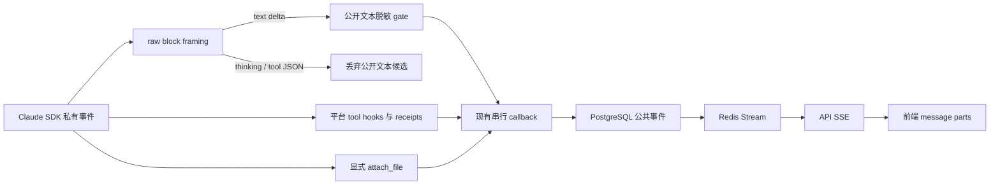

# Agent 流式消息与最终交付架构

状态：PR #1562 的实现合同。本文描述代码应实现的 v4 行为，不代表该行为已经部署或经过真实浏览器验收。
SSE envelope、授权、重放和终态分别继续由
[wire contract](../architecture/redis-streams-sse-wire-protocol.md)、
[execution control](../architecture/redis-streams-sse-execution-control.md) 和
[ADR 0013](../adr/0013-redis-stream-only-sse.md) 负责。

## 1. 产品合同

公开的 Assistant 文字应边生成边显示，包括计划、过程说明、阶段发现和最终回答。
后续出现工具调用不改变已经公开文字的归属，也不构成延迟或隐藏该文字的理由。

| 内容 | 普通用户看到什么 | 发布依据 |
| --- | --- | --- |
| Assistant 的公开文字 | 生成中有序追加，结束后保留在正文 | SDK text block，经增量脱敏和公共事件持久化 |
| 平台生成的公开过程摘要 | 在正文中直接可见，不要求再点开面板 | 明确的 `commentary.delta` 生产者，经相同公开边界校验 |
| 工具、Skill、MCP、子任务活动 | 获准公开的类别、名称、状态、进度和耗时；完成后可折叠 | 平台验证的生命周期事件 |
| 文件 | 回复末尾零个或多个附件卡片 | Agent 显式 `attach_file`，平台验证、保存并授权 |
| 脚本、命令参数、stdout/stderr、工具输入和原始结果 | 不进入普通用户文本事件 | 私有执行证据边界 |
| 用户要求的代码、JSON 示例和非敏感路径 | 作为正常 Assistant 回答显示 | 内容来源与具体敏感值判断 |
| Thinking、系统提示词、凭据和其他主体数据 | 不展示 | 既有权限和披露边界 |

“用户可以看到文字”“工具执行成功”“Run 成功”“存在可下载文件”是不同事实。
公开文字在失败或取消后仍可保留；工具和 Run 的真实状态单独展示。
`ThinkingBlock` 不是公开过程说明来源。后端必须拒绝原始工具事件，不能把敏感字段送到前端后再依靠折叠隐藏。

普通聊天不要求 `structured_output`。结构化输出适合机器消费的任务模式，不能作为普通文字流或附件清单的唯一来源。
文件交付仍是按需能力：没有文件时不附带；有最终产物时由 Agent 显式调用 `attach_file`；工作目录扫描、Skill `output/` 目录和 JSON 临时文件都不能自动成为交付物。

## 2. 开源项目证据与采用边界

以下机制于 2026-09-21 从官方文档和固定源码核验。它们说明成熟 Agent 产品普遍把文字增量、工具生命周期和最终完成分开建模；它们不构成本项目的运行时验收。

| 项目 | 已核实机制 | 本项目采用的原则 |
| --- | --- | --- |
| Vercel AI SDK | `text-start/delta/end` 使用同一文本 ID；step 和整条流完成分开 | 文本增量立即可见，结束事件只封存 |
| LangGraph | messages 流提供 token；状态更新、工具和 custom 事件分开；checkpointer 负责恢复 | 文字、执行状态和持久化职责分离 |
| LibreChat | delta/content handler 在 final handler 前更新消息；工具是独立内容部分 | 中间文字先显示，终态不重新覆盖整段正文 |
| OpenCode | Text/Tool/File 等 part 分开；delta 按 message/part 身份更新 | 工具和附件不混入文本正文 |
| Claude Agent SDK | partial StreamEvent 提供文本增量；typed AssistantMessage 可能在对应 block stop 前出现 | raw block 事件拥有 framing；typed 消息只用于补全和对账 |

主要出处：

- AI SDK：[流协议](https://ai-sdk.dev/docs/ai-sdk-ui/stream-protocol)、
  [UIMessage](https://ai-sdk.dev/docs/reference/ai-sdk-core/ui-message)、
  [TextStreamPart 固定源码](https://github.com/vercel/ai/blob/c391be3192fd5cb74db4bc8225e50ff56925bd19/packages/ai/src/generate-text/stream-text-result.ts#L2129-L2337)。
- LangGraph：[流模式](https://docs.langchain.com/oss/python/langgraph/streaming)、
  [持久化](https://docs.langchain.com/oss/python/langgraph/persistence)、
  [StreamPart 固定源码](https://github.com/langchain-ai/langgraph/blob/448a76377956534a85a56b7c2d8aed0e55d9ee44/libs/langgraph/langgraph/types.py#L2646-L2704)。
- LibreChat：[useSSE](https://github.com/danny-avila/LibreChat/blob/86c5884c0f6c7ee50409d6b7abb27c569a275621/client/src/hooks/SSE/useSSE.ts#L122-L214)、
  [content handler](https://github.com/danny-avila/LibreChat/blob/86c5884c0f6c7ee50409d6b7abb27c569a275621/client/src/hooks/SSE/useContentHandler.ts#L31-L98)、
  [工具展示](https://github.com/danny-avila/LibreChat/blob/86c5884c0f6c7ee50409d6b7abb27c569a275621/client/src/components/Chat/Messages/Content/ToolCall.tsx#L286-L395)。
- OpenCode：[消息片段事件](https://github.com/anomalyco/opencode/blob/70a24697ea0028e19f22712fd63059538cb4bee7/packages/schema/src/v1/session.ts#L596-L641)、
  [UI reducer](https://github.com/anomalyco/opencode/blob/70a24697ea0028e19f22712fd63059538cb4bee7/packages/app/src/context/global-sync/event-reducer.ts#L272-L388)。
- Claude SDK：[官方消息时序及 streaming 限制](https://code.claude.com/docs/en/agent-sdk/streaming-output)。

本项目只借鉴内容与事件分离原则。外部项目展示原始工具结果或 reasoning，不改变本项目的权限边界；LangGraph checkpoint 也不能替代本项目 PostgreSQL 公共账本和 Redis SSE replay。

## 3. 当前 v4 方案

这次整改继续使用闭合的公共协议 v4，不增加事件版本、数据库迁移或第二条流。
现有 `message.started`、`message.delta`、`message.completed` 已能表达一个持续追加的公开 Assistant 正文；工具、公开摘要和附件已有独立事件。

### 3.1 Claude SDK 适配

1. `include_partial_messages=True` 时，`ClaudeStreamProjector` 只验证 raw message/block framing。
   它在精确的 text block 内立即返回 `text_delta`，不保存整轮原文，也不判断“过程”或“最终”。
2. Thinking、tool input JSON、server tool input 和其他非 text block 只用于排除错误来源，其 delta 不进入公开正文。
3. raw `message_start`、block index、block stop 和 `message_stop` 执行防御性校验。
   显式 message 内不能重复使用已关闭的 block index；缺失 envelope 的旧测试/兼容序列仍按串行 block 校验。
4. typed `AssistantMessage` 不是 raw framing 边界。官方顺序允许它先于对应 `content_block_stop` 到达，因此不能在 typed 消息到达时清空 projector。
5. typed TextBlock 用于补足未观察到的安全后缀，并和已流出的前缀对账；ToolUseBlock 只登记工具身份和公开生命周期。
6. `ResultMessage.result` 是终态补充观察。它只补充尚未公开的内容；如果它与已公开前缀不同，已显示文字不能回滚，Result 作为后续正文保留。
7. 同一文本先由 raw delta、后由 typed TextBlock 或 Result 观察时，只发布一次。不同来源即使文字相同也不做全局字符串去重。

所有 Assistant 公开文字统一进入 `message.delta`。后续出现 ToolUseBlock 不把早先正文改写成 `commentary.delta`。
`commentary.delta` 继续保留给明确的、已经脱敏的公共摘要生产者和历史 v4 记录，不由 Claude turn 的工具分类推断产生。

### 3.2 脱敏、失败和终态

`PublicAnswerStreamGate` 仍负责跨 chunk 私有 token、SDK call ID 和敏感后缀的有界处理。
工具参数和原始结果从未成为输入候选；对普通技术回答不能按代码围栏、JSON 或路径形式整体删除。

一旦安全前缀已经提交到公共事件，就不能在工具失败、Run 失败或 Result 不一致时撤回。
后续终态仍可因工具 receipt、callback ACK、权限或 Run 校验失败而 fail-close；这影响成功判定和附件交付，不伪造已经显示文字从未存在。
未稳定的短后缀可以留到下一 delta 或终态释放，避免跨 chunk 泄漏，这不等同于整轮缓冲。

`message.completed` 关闭公开正文，不代表工具或 Run 成功。Worker 继续校验当前 Attempt 的 `AssistantAnswerReceipt`、工具证据和 terminal fence 后才能持久化成功结果。
answer receipt 覆盖本次 v4 回复中实际提交的完整 Assistant 正文，包括公开过程说明和最终回答。

## 4. 前端展示

前端继续使用现有 v4 reducer：

- `message.delta` 追加为持续可见的 Markdown 正文；
- `commentary.delta` 形成的 summary 直接在正文中显示，不再放入“工作详情”折叠面板；
- tool、subagent、execution step/process 和 todo 属于工作活动，可在完成后折叠；
- Thinking 和未授权的原始工具字段不渲染；
- artifact 卡片按消息顺序显示在回复末尾，下载仍走授权接口。

实时、Redis 重放、PostgreSQL history 和 terminal hydrate 使用同一 v4 语义 reducer。
浏览器断线只恢复公共事件和水位，不重新执行 Agent；旧 hydrate 不得覆盖更高水位的 text、tool 状态或附件。

当前产品不要求在一条回复中另建“仅复制最后一段”的最终片段选择协议。
如果以后确实需要独立选择多个 final parts、局部复制或跨来源编辑，再以新协议版本协调升级 producer、账本、receipt、history decoder 和前端 reducer；不能把新字段偷偷加入 v4。

## 5. 文件交付

文本完成和文件交付互不依赖。普通成功回答可以没有附件；文件型任务可以有一个或多个显式附件。

`attach_file` 接收工作区内受允许的路径及可选展示名、角色和描述。平台验证路径、Skill 边界、数量和传输预算后记录有序 descriptor。
只有该清单中的文件进入 artifact 存储和前端卡片。下列内容不会自动交付：

- Skill 约定目录中未显式选择的文件；
- 临时 JSON、缓存、日志、脚本和中间转换产物；
- 因工作目录扫描发现的文件；
- 终态校验失败后尚未完成授权发布的文件。

`structured_output` 可以用于其他机器接口，但不替代 `attach_file`，也不把文件路径自动提升为用户产物。

## 6. 被替换的设计与兼容性

PR #1562 早期实现曾缓存整个 SDK turn，等 typed fragment、下一 message 或 Result 后，再根据 tool use 把文本分类为 answer/commentary。该方案被替换，原因是：

- 首字必须等待整段边界，产品上不是真正流式；
- 同一 provider message 可产生多个 typed fragment，typed fragment 也可能先于 raw block stop；
- 一个后续 ToolUseBlock 会改变先前普通文字的展示位置；
- `_text_parts` 按整轮累计原文，缺少自然的局部内存上限；
- Result 前才 flush 会把 transport streaming 退化成终态批量显示。

保留的兼容面：

- v4 envelope、PostgreSQL/Redis 顺序、Last-Event-ID、gap/hydrate 和 answer receipt；
- 旧 `commentary.delta` history 的读取与公开 summary 展示；
- typed-only SDK 模式的完整 TextBlock/Result 补全；
- 现有 tool/subagent/artifact 事件和显式文件交付。

删除的 live 行为：

- `ClaudeStreamTurn`、`queue_stream_turn` 和整轮文本缓冲；
- 因 stop reason 或 ToolUseBlock 把 Claude Assistant 文字重新分类成 commentary；
- 等 Result 才公开已经通过 raw framing 和脱敏 gate 的文字。

## 7. 验收边界

确定性测试至少覆盖：

| 场景 | 必须观察到的结果 |
| --- | --- |
| 慢速纯文本 | 首个稳定安全 delta 在 typed TextBlock/Result 前进入公开消息 |
| Thinking → text → tool | Thinking 和工具 JSON 不出现；text 在工具前可见且只出现一次 |
| AssistantMessage 先于 block stop | projector 不被 typed 边界错误关闭，后续 raw 事件仍可校验 |
| 文字 → 已验证工具 → 文字 | 两段文字在 Result 前有可见前缀；工具状态独立 |
| private token 跨两个 delta | 前缀有界保留，最终替换后无原 token |
| Result 相同、扩展或冲突 | 相同不重放；扩展只补后缀；冲突保留已公开前缀并追加终态观察 |
| 工具失败、Run 失败、取消 | 已提交安全文字保留，终态和附件不伪造成功 |
| 无附件、多个附件、Skill output 临时文件 | 只有显式 `attach_file` 清单成为附件，顺序稳定 |
| SSE 断线、重放、hydrate | 正文、公开摘要、工具和附件顺序一致，不重新执行 |

本地单元测试和生成 schema 验证代码合同。真实 PostgreSQL、Redis、Claude provider、代理层和浏览器 paint 时序必须另做 External Acceptance；CI 通过不能写成已部署或用户端实测完成。
