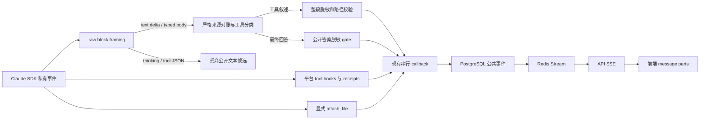

# Agent 流式消息与最终交付架构

状态：PR #1562 的实现合同。本文描述代码应实现的 v4 行为，不代表该行为已经部署或经过真实浏览器验收。
SSE envelope、授权、重放和终态分别继续由
[wire contract](../architecture/redis-streams-sse-wire-protocol.md)、
[execution control](../architecture/redis-streams-sse-execution-control.md) 和
[ADR 0013](../adr/0013-redis-stream-only-sse.md) 负责。

## 1. 产品合同

公开的最终回答由 Assistant 来源完成校验后追加；工具回合的原文过程说明经完整脱敏校验进入可折叠工作记录。
首字可能等待该 Assistant 来源的工具/终止标记；已经提交的正文不会在后续工具调用时被改写。

| 内容 | 普通用户看到什么 | 发布依据 |
| --- | --- | --- |
| Assistant 的最终回答 | 来源确认后有序追加，结束后保留在正文 | SDK text block，经增量脱敏和公共事件持久化 |
| 工具回合的原文过程说明 | 在工作记录中可见，结束后可折叠，不混入最终回答 | SDK 来源和 Tool/stop 标记，经全文脱敏校验及 `commentary.delta` 发布 |
| 平台生成的公开过程摘要 | 在正文中直接可见 | 明确的 `commentary.delta` 生产者，经相同公开边界校验 |
| 工具、Skill、MCP、子任务活动 | 获准公开的类别、名称、状态、进度和耗时；完成后可折叠 | 平台验证的生命周期事件 |
| 文件 | 回复末尾零个或多个附件卡片 | Agent 显式 `attach_file`，平台验证、保存并授权 |
| 脚本、命令参数、stdout/stderr、工具输入和原始结果 | 不进入普通用户文本事件 | 私有执行证据边界 |
| 用户要求的代码、JSON 示例和非敏感路径 | 作为正常 Assistant 回答显示 | 内容来源与具体敏感值判断 |
| Thinking、系统提示词、凭据和其他主体数据 | 不展示 | 既有权限和披露边界 |

“用户可以看到文字”“工具执行成功”“Run 成功”“存在可下载文件”是不同事实。
公开文字在失败或取消后仍可保留；工具和 Run 的真实状态单独展示。
`ThinkingBlock` 不是公开过程说明来源。后端必须拒绝原始工具事件，不能把敏感字段送到前端后再依靠折叠隐藏。

普通聊天不要求 `structured_output`。结构化输出适合机器消费的任务模式，不能作为普通文字流或附件清单的唯一来源。
文件交付仍是按需能力：没有文件时不附带；有最终产物时由 Agent 显式调用 `attach_file`；工作目录扫描、Skill `output/` 目录和 JSON 临时文件都不能自动成为交付物。

## 2. 开源项目证据与采用边界

以下机制于 2026-09-21 从官方文档和固定源码核验。它们说明成熟 Agent 产品普遍把文字增量、工具生命周期和最终完成分开建模；它们不构成本项目的运行时验收。

| 项目 | 已核实机制 | 本项目采用的原则 |
| --- | --- | --- |
| Vercel AI SDK | `text-start/delta/end` 使用同一文本 ID；step 和整条流完成分开 | 文本增量立即可见，结束事件只封存 |
| LangGraph | messages 流提供 token；状态更新、工具和 custom 事件分开；checkpointer 负责恢复 | 文字、执行状态和持久化职责分离 |
| LibreChat | delta/content handler 在 final handler 前更新消息；工具是独立内容部分 | 中间文字先显示，终态不重新覆盖整段正文 |
| OpenCode | Text/Tool/File 等 part 分开；delta 按 message/part 身份更新 | 工具和附件不混入文本正文 |
| Claude Agent SDK | partial StreamEvent 提供文本增量；typed AssistantMessage 可能在对应 block stop 前出现 | raw block 事件拥有 framing；typed 消息只用于补全和对账 |

主要出处：

- AI SDK：[流协议](https://ai-sdk.dev/docs/ai-sdk-ui/stream-protocol)、
  [UIMessage](https://ai-sdk.dev/docs/reference/ai-sdk-core/ui-message)、
  [TextStreamPart 固定源码](https://github.com/vercel/ai/blob/c391be3192fd5cb74db4bc8225e50ff56925bd19/packages/ai/src/generate-text/stream-text-result.ts#L2129-L2337)。
- LangGraph：[流模式](https://docs.langchain.com/oss/python/langgraph/streaming)、
  [持久化](https://docs.langchain.com/oss/python/langgraph/persistence)、
  [StreamPart 固定源码](https://github.com/langchain-ai/langgraph/blob/448a76377956534a85a56b7c2d8aed0e55d9ee44/libs/langgraph/langgraph/types.py#L2646-L2704)。
- LibreChat：[useSSE](https://github.com/danny-avila/LibreChat/blob/86c5884c0f6c7ee50409d6b7abb27c569a275621/client/src/hooks/SSE/useSSE.ts#L122-L214)、
  [content handler](https://github.com/danny-avila/LibreChat/blob/86c5884c0f6c7ee50409d6b7abb27c569a275621/client/src/hooks/SSE/useContentHandler.ts#L31-L98)、
  [工具展示](https://github.com/danny-avila/LibreChat/blob/86c5884c0f6c7ee50409d6b7abb27c569a275621/client/src/components/Chat/Messages/Content/ToolCall.tsx#L286-L395)。
- OpenCode：[消息片段事件](https://github.com/anomalyco/opencode/blob/70a24697ea0028e19f22712fd63059538cb4bee7/packages/schema/src/v1/session.ts#L596-L641)、
  [UI reducer](https://github.com/anomalyco/opencode/blob/70a24697ea0028e19f22712fd63059538cb4bee7/packages/app/src/context/global-sync/event-reducer.ts#L272-L388)。
- Claude SDK：[官方消息时序及 streaming 限制](https://code.claude.com/docs/en/agent-sdk/streaming-output)。

本项目只借鉴内容与事件分离原则。外部项目展示原始工具结果或 reasoning，不改变本项目的权限边界；LangGraph checkpoint 也不能替代本项目 PostgreSQL 公共账本和 Redis SSE replay。

## 3. 当前 v4 方案

这次整改继续使用闭合的公共协议 v4，不增加事件版本、数据库迁移或第二条流。
现有 `message.started`、`message.delta`、`message.completed` 已能表达一个持续追加的公开 Assistant 正文；工具、公开摘要和附件已有独立事件。

```mermaid
flowchart LR
  SDK[Claude SDK 私有事件] --> F[raw block framing]
  F -->|text delta / typed body| V[严格来源对账与工具分类]
  F -->|thinking / tool JSON| X[丢弃公开文本候选]
  V -->|最终回答| G[公开答案脱敏 gate]
  V -->|工具叙述| W[整段脱敏和路径校验]
  W --> C[现有串行 callback]
  G --> C
  C --> P[PostgreSQL 公共事件]
  P --> R[Redis Stream]
  R --> S[API SSE]
  S --> UI[前端 message parts]
  SDK --> T[平台 tool hooks 与 receipts]
  T --> C
  SDK --> A[显式 attach_file]
  A --> C
```

### 3.1 Claude SDK 适配

1. `include_partial_messages=True` 时，`ClaudeStreamProjector` 验证 raw message/block framing。
   `text_delta` 首先进入严格身份和覆盖率时间线，等待 Assistant 来源的 Tool/stop 标记再分配公开事件；它不能预先提交不可撤销的答案 delta。
2. Thinking、tool input JSON、server tool input 和其他非 text block 只用于排除错误来源，其 delta 不进入公开正文。
3. raw `message_start`、block index、block stop 和 `message_stop` 执行防御性校验。
   显式 message 内不能重复使用已关闭的 block index；未携带完整 envelope 或生命周期不完整的旧兼容序列已经退出并拒绝。
4. typed `AssistantMessage` 不是 raw framing 边界。官方顺序允许它先于对应 `content_block_stop` 到达，因此不能在 typed 消息到达时清空 projector。
5. typed TextBlock 用于同一来源的补全和对账，不能单凭这次观察把待分类文本提交为最终回答；若它先于同一 open indexed text source 的 raw delta 到达，后续匹配的 raw body 只作 replay no-op。
   ToolUseBlock 只登记工具身份和公开生命周期；整个 Assistant 来源在 stop/tool 标记确认后才分类。
6. `ResultMessage.result` 是终态补充观察。它不能覆盖已确认的答案或把工具叙述再次发布为答案；同一来源继续由严格时间线校验。
   非流式兼容模式下，只有已观察工具回合且尚无答案时，允许独立的 Result 答案；仅删除开头完整重复的工具叙述，不能按任意子串裁剪真实答案。
   identity、framing 或已观察正文冲突时保留已显示的安全文字并 fail closed。
   当前 SDK 会在 Result 中移除 `cc-memory` 标签；只有和同一来源的已验证 typed 正文等价时才接纳，不重写或重复发布。
7. 同一文本先由 raw delta、后由 typed TextBlock 或 Result 观察时，只发布一次。不同来源即使文字相同也不做全局字符串去重。
8. SDK 单次调用按顺序消费；正文来源和最近的 raw/typed 观察使用确定性的有界窗口对账。窗口内的相同观察只处理一次，冲突拒绝追加；窗口外不作重复判定，不使用概率过滤器中断正常新输出。回调重试与 SSE 断线重放由各自的事件序号和回执处理，不在 SDK 适配层重复实现。窗口只限制对账证据，不限制累计公开正文长度。
9. 没有 `TextBlock` 的非空 typed `AssistantMessage`（例如 Thinking/ToolUse）是新的 turn boundary：它会 retire 当前 answer binding，后续 streamed/Sandbox `ResultMessage` 必须等新的 raw answer source 才能通过；没有既有 answer source 的显式 non-streaming Result-only 兼容仍保留。

所有 Assistant 文本先判断来源：工具回合中可公开的原文用带 `worktrace_` 标识的 `commentary.delta`，最终回答用 `message.delta`。
已发布的答案永不被后续 ToolUseBlock 重分类；旧 `commentary.delta` 摘要仍原样呈现，非工具回合的公开摘要也不被折叠。

### 3.2 脱敏、失败和终态

`PublicAnswerStreamGate` 仍负责答案跨 chunk 私有 token、SDK call ID 和敏感后缀的有界处理。
工具叙述单独进行完整私有标识替换、脱敏及禁止路径扫描，再按 8,192 字符拆分并以至多 100 个事件为一批提交；任何未确认批次都会停止后续发布。
候选构造失败不能跳过正文后返回成功。工具参数和原始结果从未成为输入候选；
对正常最终回答不能按代码围栏、JSON 或路径形式整体删除。

一旦安全前缀已经提交到公共事件，就不能在工具失败、Run 失败或 Result 不一致时撤回。
后续终态仍可因工具 receipt、callback ACK、权限或 Run 校验失败而 fail-close；这影响成功判定和附件交付，不伪造已经显示文字从未存在。
未稳定的短后缀可以留到下一 delta 或终态释放，避免跨 chunk 泄漏，这不等同于整轮缓冲。

`message.completed` 关闭公开正文，不代表工具或 Run 成功。Worker 继续校验当前 Attempt 的 `AssistantAnswerReceipt`、工具证据和 terminal fence 后才能持久化成功结果。
answer receipt 只覆盖本次回复中实际提交的最终答案，不包含独立的工具叙述。
正文时间线仍保存分片以完成对账；首字会因等待来源标记而延迟。
SDK 的 Result 与 Run 终态仍是不同边界：有在途的本地 Agent/Workflow 时继续消费，直到后续 Result。关闭阶段先完成 SessionStore 的最终刷新、停止消息读取并等待工具控制回调结束，再校验最终回执和记录序号、交付业务结果。最后一次 mirror 写入失败仍然阻止成功。
CLI 进程退出、临时会话目录和 MCP 连接回收由原生命周期任务继续完成，不占用业务完成等待或执行期限；执行器持有清理任务并在关闭时收敛，资源清理另有 30 秒期限。关闭前后的 MCP 生命周期始终由同一任务持有，清理错误只记录诊断，不能产生第二个相反的 Run 结果。此边界适配固定的 SDK 0.2.130，使用已安装 SDK 的 Query/Client 测试验证顺序。

## 4. 前端展示

前端继续使用现有 v4 reducer：

- `message.delta` 追加为持续可见的 Markdown 正文；
- `commentary.delta` 中 `summary_id` 以服务端 `worktrace_` 开头的记录在“工作详情”可折叠显示；既有 summary 仍在正文直接显示；
- tool、subagent、execution step/process 和 todo 属于工作活动，可在完成后折叠；
- Thinking 和未授权的原始工具字段不渲染；
- artifact 卡片按消息顺序显示在回复末尾，下载仍走授权接口。

实时、Redis 重放、PostgreSQL history 和 terminal hydrate 使用同一 v4 语义 reducer。
浏览器断线只恢复公共事件和水位，不重新执行 Agent；旧 hydrate 只合并其所属 Run，不得覆盖下一轮的正文、状态或游标。可信 Run 终态立即结束生成展示并允许续聊，历史回填不占用下一轮发送。
历史接口按固定 Run 集合和事件水位分页，前端沿 `next_cursor` 读取并保持同一取消信号。完整终态历史带 `terminal_run_statuses`，可避免重复读取。

公开正文在首次发布前完成脱敏；历史准入后直接保留已发布的 delta，不再累计扫描全文、替换 Agent 名称或扣留后缀。
终态历史可合并同一消息、同一流实例内的连续正文，遇到公开活动事件先提交该组，保持文字与活动的原始顺序。
重连接口回放游标之前的记录只恢复终态与 `stream.end` 的关联，不构建正文副本。
已验证仍在 Redis 保留区间内的游标可直接续传，不要求已被裁剪的 `stream.open` 仍存在；游标随后被裁剪则返回 gap。仅保留 `stream.end` 时使用其已验证终态引用，其他保留行中的终态关联仍须一致。
前端在连接入口校验并适配每帧一次，随后直接传递类型化事件；处理器继续校验当前连接归属、水位和终态提交条件。
gap 恢复先应用持久化历史。若尚未收到 `message.started` 而无法恢复协议消息归属，则保留 Run 并沿现有状态/终态恢复流程收敛。活动与终态历史共用有取消信号、单次 10 秒、最多三次尝试的请求处理；超时释放恢复所有权，授权失败停止访问，切换会话或卸载取消旧请求。
页面恢复与定时重连失败后的状态查询共用同一个 reconciliation owner；查询结束按身份释放，定时器开始执行即清空自身引用，避免完成后的标记堵住后续恢复或并发查询相互覆盖。

历史正文只读取经当前 Attempt 授权的持久化 v4 `message.delta`。旧
`assistant_delta` 和成功终态的 `result_json.message` 不再补造正文，其旧
`event_page` / `PublicDelta` 解析器及专属测试一并退役。执行过程
投影只接受当前 v2 payload，v1 和无版本解析已退役。历史 HTTP 响应的
`message:chunk`、`run_event` 等仍是当前页面使用的内部展示格式，不是另一条 SSE 通道。
只有旧格式的历史行不会再还原 Assistant 正文或旧执行步骤；用户输入、附件与 Run 终态仍独立展示。

当前产品不要求在一条回复中另建“仅复制最后一段”的最终片段选择协议。
如果以后确实需要独立选择多个 final parts、局部复制或跨来源编辑，再以新协议版本协调升级 producer、账本、receipt、history decoder 和前端 reducer；不能把新字段偷偷加入 v4。

## 5. 文件交付

文本完成和文件交付互不依赖。普通成功回答可以没有附件；文件型任务可以有一个或多个显式附件。

`attach_file` 接收工作区内受允许的路径及可选展示名、角色和描述。平台验证路径、Skill 边界、数量和传输预算后记录有序 descriptor。
只有该清单中的文件进入 artifact 存储和前端卡片。下列内容不会自动交付：

- Skill 约定目录中未显式选择的文件；
- 临时 JSON、缓存、日志、脚本和中间转换产物；
- 因工作目录扫描发现的文件；
- 终态校验失败后尚未完成授权发布的文件。

`structured_output` 可以用于其他机器接口，但不替代 `attach_file`，也不把文件路径自动提升为用户产物。

## 6. 被替换的设计与兼容性

PR #1562 的即时公开策略把每个 Claude raw text delta 写进不可撤销的答案账本；同一来源后来出现 ToolUseBlock 时已无法将开头的过程说明移入工作记录。当前实现只暂存尚未分类的来源文本，保持主线严格的 raw/typed 身份与覆盖率校验，不重引入跨 provider turn 的旧 `ClaudeStreamTurn` 缓冲或放宽 fail-closed 规则。

保留 v4 envelope、PostgreSQL/Redis 顺序、Last-Event-ID、gap/hydrate、答案回执和现有 Tool/subagent/artifact 事件。已提交的旧答案行不重写；旧公开摘要和 `commentary.delta` 历史仍在正文显示。新生成的工作叙述由服务端 `worktrace_` 摘要 ID 标记，新客户端折叠，旧客户端按既有摘要显示，不需要 schema 或数据库迁移。

退役的是 raw text 立即发布为最终答案的旧路径及其测试断言；新的正文只由确认为答案的 Assistant 来源及安全 Result 后缀构成。工具叙述整段检查后分片并按 100 个事件的回调上限分批，缺少回执即停止发布。工具描述仍不是能力完成证据，原始工具输入、结果和 Thinking 继续不公开。

## 7. 验收边界

确定性测试至少覆盖：

| 场景 | 必须观察到的结果 |
| --- | --- |
| 慢速纯文本 | 首个答案 delta 等来源分类后发布；Result 只补安全后缀 |
| Thinking → text → tool | Thinking 和工具 JSON 不出现；工具回合原文只进入可折叠工作记录 |
| AssistantMessage 先于 block stop | projector 不被 typed 边界错误关闭，后续 raw 事件仍可校验 |
| 文字 → 已验证工具 → 文字 | 工具叙述、答案与工具状态分开，回调和 Run 终态各有回执 |
| 私有 token 或禁止路径跨 8,192 字符边界 | 叙述整段拒绝或替换；没有分片泄漏或退化为答案 |
| 超长工具叙述、第二批回调拒绝 | 每批最多 100 事件；拒绝后不继续发布答案或宣称成功 |
| Result 相同、扩展或冲突 | 重复叙述不进入答案；真实答案中引用相同短语不被任意删去；严格流式冲突仍 fail closed |
| 工具失败、Run 失败、取消 | 已提交安全文字保留，未确认的文本、终态和附件不伪造成功 |
| 无附件、多个附件、Skill output 临时文件 | 只有显式 `attach_file` 清单成为附件，顺序稳定 |
| SSE 断线、重放、hydrate | 正文、工作叙述、旧公开摘要、工具和附件顺序一致，不重新执行 |

本地单元测试和生成 schema 验证代码合同。真实 PostgreSQL、Redis、Claude provider、代理层和浏览器 paint 时序必须另做 External Acceptance；CI 通过不能写成已部署或用户端实测完成。
