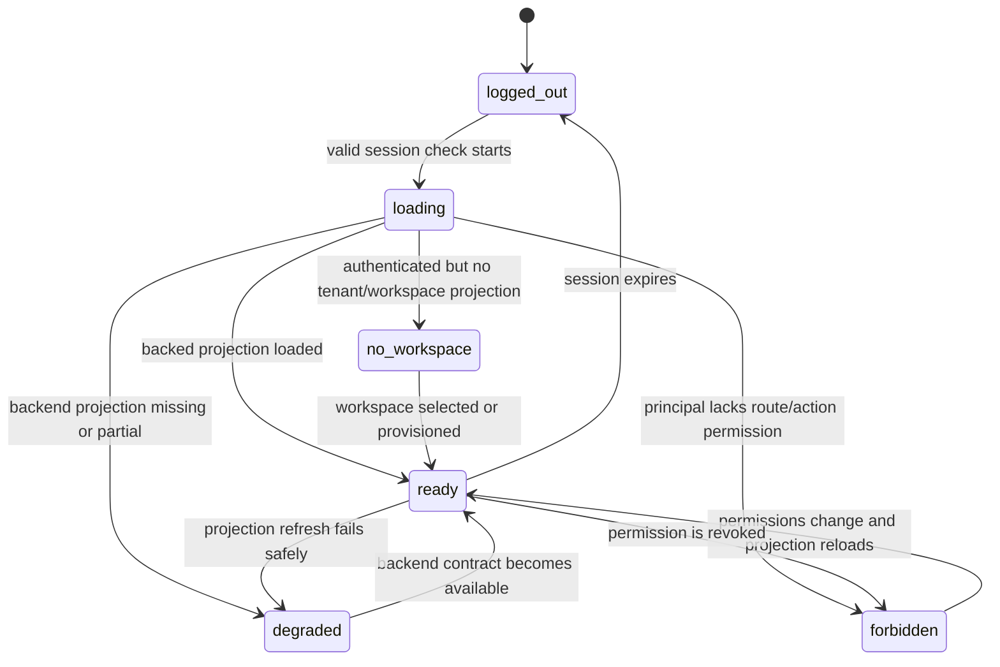

# LibreChat Shell Transplant Phase 1 Design

> Status: draft design/spec gate for user review before implementation planning.
>
> Scope: post-login ai-platform frontend only. This design chooses LibreChat as
> the primary visual and interaction source for the authenticated chat shell,
> while keeping ai-platform as the only backend, auth, RBAC, session, run,
> artifact, Skill, MCP, marketplace, and governance authority.
>
> This document is not implementation evidence, `PR ready`, `reviewed`,
> `merged`, `211 verified`, or `gate closable` evidence.

## 1. Decision

The next frontend slice should stop incremental reskinning and perform a
bounded LibreChat shell transplant.

The phrase "copy LibreChat frontend code" means:

- copy or closely port the UI shell structure, spacing, token vocabulary, and
  interaction patterns from a pinned LibreChat source;
- rewrite the data, route, auth, state, and permission boundaries to use
  ai-platform's existing frontend hooks and service adapters;
- keep one production frontend under `frontend/web`;
- avoid importing LibreChat backend endpoints, `librechat-data-provider`, Recoil
  app state, React Router 6 route trees, Mongo-oriented data models, or provider
  secrets.

## 2. Pinned Reference

Reference repository:

- Repository: `https://github.com/danny-avila/LibreChat`
- Commit: `9e74cc0e57b395926122bd4062c1fcedc48ed465`
- Branch: `main`
- Root license observed: `MIT License`, copyright `2026 LibreChat`
- `client/package.json` license observed: `ISC`

License handling:

- Any implementation PR that copies non-trivial source text from LibreChat must
  list exact source paths and the license handling in the PR body.
- If a source file is copied rather than rewritten from behavior, add a local
  provenance note in the new file header or a repo-local frontend third-party
  notice file.
- If license posture is ambiguous for a file family, treat that file family as
  concept-only and recreate the behavior in ai-platform-owned code.

## 3. Candidate Source Paths

Use these LibreChat paths as the Phase 1 source of visual and interaction truth:

| Area | LibreChat source path | Intake level |
| --- | --- | --- |
| Unified app rail and expanded sidebar | `client/src/components/UnifiedSidebar/UnifiedSidebar.tsx`, `Sidebar.tsx`, `ExpandedPanel.tsx` | Port structure; replace providers and state. |
| Active side panel host | `client/src/components/SidePanel/Nav.tsx`, `SidePanelGroup.tsx`, `ArtifactsPanel.tsx` | Port layout model; replace resizable dependency unless justified. |
| Chat presentation frame | `client/src/components/Chat/Presentation.tsx` | Port layout relationship only; remove file cleanup and LibreChat provider logic. |
| Composer shell | `client/src/components/Chat/Input/ChatForm.tsx` | Port visual structure and interaction model; keep ai-platform command parser and upload hooks. |
| Skill/MCP command affordances | `client/src/components/Chat/Input/SkillsCommand.tsx`, `MCPSelect.tsx`, `MCPSubMenu.tsx`, `PendingManualSkillsChips.tsx` | Port UX patterns only; map to ai-platform Skills/MCP projections. |
| File attachment affordances | `client/src/components/Chat/Input/Files/*` | Port visual behavior where compatible; keep ai-platform upload handles and ACL rules. |
| Artifact panel pattern | `client/src/components/Artifacts/*` | Port panel shape and tabs; keep ai-platform artifact preview/download allowlist. |
| Token palette | `client/src/style.css`, `client/tailwind.config.cjs` | Map token vocabulary into ai-platform CSS variables; do not wholesale import CSS. |

Do not import these LibreChat paths as active product authority:

- `client/src/data-provider/*`
- `client/src/store/*`
- `client/src/routes/*` route ownership
- `client/src/Providers/*` state providers, except as a conceptual reference
- backend, Docker, Mongo, API, auth, file-store, and provider configuration

## 4. Target Experience

Phase 1 changes only the authenticated app after login.

The first screen after login should read as a LibreChat-style ai-platform
workbench:

- left side uses one LibreChat-like control rail plus one expanded conversation
  and app panel;
- central area is a calm chat canvas with no white/right or pale/left mismatch;
- composer is the dominant action surface at the bottom, with chips and command
  menus anchored to it;
- right panel behaves like a contextual artifacts/run/details panel, not a
  decorative dashboard card stack;
- `/skills`, `/marketplace`, `/mcp`, `/roles`, `/channels`, `/agents`,
  `/models`, `/persona`, `/files`, and `/apps` stay reachable from the same
  shell and fail closed inside the page when backend authority is unavailable;
- admin/governance affordances remain discoverable but cannot bypass
  ai-platform permission checks.

The visual target is closer to LibreChat's neutral shell tokens:

- `surface-primary`, `surface-primary-alt`, `surface-secondary`, `surface-chat`
  style relationships;
- compact 8px radius controls and dense rail buttons;
- minimal shadow use;
- neutral gray workbench canvas in light mode and dark charcoal shell in dark
  mode;
- one restrained teal/green ai-platform action color for active and submit
  states;
- no marketing hero, decorative cards, playful brand accents, split white
  canvases, or nested card stacks in the authenticated app.

## 5. UI State Machine

Every post-login route must render one explicit state:



Required page behavior:

- `logged_out`: route redirects to login or shows existing auth shell only.
- `loading`: skeleton uses the same workbench shell dimensions as `ready`.
- `no_workspace`: clear company/workspace unavailable state; no fake catalog.
- `forbidden`: route remains visible, page content explains missing permission.
- `degraded`: page is clickable/readable, but unavailable actions are disabled
  and explain which backend projection is missing.
- `ready`: page can perform backed read or write actions through ai-platform
  adapters only.

## 6. Architecture

Implementation stays in `frontend/web`.

```text
LibreChat reference shell
  -> ai-platform shell components and CSS tokens
  -> ai-platform React hooks and service adapters
  -> ai-platform public/admin projections
  -> ai-platform backend control plane
```

Required frontend boundaries:

- Auth: use `useAuth`, `ProtectedRoute`, ai-platform permissions, and current
  session/principal contracts.
- Chat/session/run: keep `useAgent`, `useSession`, and ai-platform run/event
  handling.
- Skills: keep `useSkills`, current skill projections, release state, and
  fail-closed availability resolver.
- MCP/tools: keep `useTools` and ai-platform tool-policy projections.
- Files/artifacts: keep ai-platform upload handles, artifact IDs, preview
  allowlists, and raw path guards.
- Governance pages: keep current public/admin projection adapters.
- CSS: map LibreChat token semantics into ai-platform tokens instead of
  importing a second token system.

## 7. Component Plan

### Shell

Create a local shell layer with LibreChat-like boundaries:

- `frontend/web/src/components/librechatShell/LibreChatShell.tsx`
- `frontend/web/src/components/librechatShell/LibreChatRail.tsx`
- `frontend/web/src/components/librechatShell/LibreChatPanel.tsx`
- `frontend/web/src/components/librechatShell/LibreChatSidePanel.tsx`
- `frontend/web/src/components/librechatShell/libreChatSurface.ts`

This shell replaces the current ad hoc relationship between `AppShell`,
`SessionSidebar`, `WorkbenchShell`, and `WorkbenchRightPanel`, but it must reuse
their ai-platform data inputs. The old files may remain as wrappers during the
first PR if that reduces risk, but the active authenticated route should render
the new shell as owner.

### Navigation

Port the LibreChat expanded/collapsed rail behavior:

- collapsed rail width: 52px;
- expanded panel minimum: 320-360px;
- desktop resize is allowed only if it can be implemented without adding a
  large dependency;
- mobile uses a slide-in panel with overlay and Escape close;
- current route active state is shown in rail and expanded panel.

The expanded panel should show:

- new chat and search first;
- recent conversations;
- app/workbench entries grouped as Work, Governance, and Account;
- profile footer.

### Composer

Keep ai-platform's existing command parser and selection reducers, but reshape
the component around the LibreChat composer:

- top chip row for Skill/MCP/model/agent/file/context selections;
- central autosizing textarea with `/`, `$`, and `@` behavior preserved;
- lower toolbar with attach, Skills, MCP, model/agent, context, token/status,
  send/stop;
- command menus use one popover token system and stay anchored outside the
  clipped textarea region;
- disabled-but-clickable affordances show fail-closed state instead of
  disappearing.

### Right Panel

Replace the current placeholder card stack with a panel model:

- tabs or segmented controls: Context, Artifacts, Run, Permissions;
- backed data renders through current ai-platform preview/playback hooks;
- unavailable tabs stay visible with explicit `degraded` copy;
- mobile opens as a full-screen or bottom-sheet panel.

### Catalog Pages

Skills, Marketplace, MCP, Roles, Channels, Agents, Models, Persona, Files, and
Apps should inherit the same shell and token system. Phase 1 does not need to
fully redesign every internal table, but it must remove obvious split-canvas,
white panel, and mixed-style regressions from the first viewport.

## 8. Backend Contract Boundary

This phase should not create backend work unless the frontend discovers a true
contract gap.

Report an issue to the backend agent only when a page or action cannot honestly
reach `ready` because an ai-platform API is missing or returns an unusable
projection. Examples:

- Skills marketplace availability cannot distinguish tenant/department/group
  scopes.
- MCP ordinary-user tool list lacks permission mode, server/source, or deny
  reason.
- Role plaza cannot load role directory/request/approval/audit projection.
- Channel import lacks authorized source/channel projection.
- Session share cannot represent expiration, revocation, or ACL state.

Do not report a backend issue for visual problems, local CSS inconsistency,
route grouping, placeholder copy, or frontend state-machine gaps.

## 9. Testing And Evidence

Implementation must follow test-first for behavior and source-contract changes.

Required test coverage:

- shell source tests prove LibreChat reference commit/path/provenance is
  recorded and forbidden imports are absent;
- workbench visual source tests prove the post-login shell uses one surface
  token system and does not reintroduce split white/pale canvases;
- navigation tests prove rail and expanded panel expose Skills, Marketplace,
  MCP, Roles, Channels, Agents, Models, Persona, Files, and Apps;
- composer tests prove `/`, `$`, Skill chip, MCP chip, file chip, unavailable
  chip, and keyboard close/selection behavior;
- state-machine tests cover `loading`, `no_workspace`, `forbidden`,
  `degraded`, and `ready` surfaces for at least chat, Skills, Marketplace, MCP,
  Roles, and Apps;
- projection audit remains clean.

Required verification before `PR ready`:

- focused frontend tests for changed files;
- `pnpm run ci:verify` from `frontend/web`;
- `git diff --check`;
- browser screenshots or CDP smoke for `/chat`, `/skills`, `/marketplace`,
  `/mcp`, `/roles`, and `/apps` in the new shell.

Required evidence before `211 verified`:

- deployed frontend provenance matches the merged commit;
- 211 HTTP smoke for `/`, `/auth/login`, `/chat`, `/skills`, `/marketplace`,
  `/mcp`, `/roles`, `/apps`;
- browser smoke against `http://10.56.0.211:18001/` or the accepted preview
  entry;
- screenshot evidence for shell, composer command menu, selected Skill/MCP/file
  chip, and one denied/degraded route state.

## 10. Delivery Slices

### Slice 1: Design And Provenance

Deliver this design spec and an implementation plan. No production UI changes.

### Slice 2: Shell Owner And Tokens

Introduce the local LibreChat shell component family and map token semantics.
Keep existing data hooks. Replace the active post-login layout owner for chat
and catalog pages.

### Slice 3: Sidebar Transplant

Port LibreChat rail and expanded panel behavior, including mobile overlay,
active route state, recent conversations, and first-level app/governance
entries.

### Slice 4: Composer Transplant

Reshape `ChatInput` around the LibreChat composer pattern while retaining
ai-platform command parser, selectors, chips, uploads, and run submission.

### Slice 5: Right Panel Transplant

Replace placeholder run/context cards with a tabbed contextual panel using
current ai-platform run, artifact, permission, and degraded-state projections.

### Slice 6: Browser Evidence And 211 Deployment

Build, smoke, screenshot, deploy to the existing Python static service on 211,
and record provenance. Do not rebuild or redeploy an unchanged artifact.

## 11. Acceptance

Phase 1 is accepted when:

- the login-after shell clearly reads as LibreChat-style ai-platform workbench,
  not as the previous mixed enterprise shell;
- left, center, and right surfaces share one token system in light and dark
  modes;
- `/`, `$`, Skill/MCP/model/agent/file/context chips remain functional or fail
  closed with clear user copy;
- ordinary user pages remain login reachable and show page-level `forbidden` or
  `degraded` states instead of route-level dead ends;
- no LibreChat backend/data-provider imports enter the active browser graph;
- tests, build, projection audit, screenshots, and 211 smoke support the exact
  claimed status label.

The work is not `gate closable` until the implementation PR is merged,
deployed, browser-smoked on 211, and the linked issue closure evidence covers
ordinary and admin workflows.

## 12. Open Risks

| Risk | Mitigation |
| --- | --- |
| Direct copy pulls in incompatible React 18/Router 6/Recoil assumptions | Copy component boundaries and markup only; use ai-platform hooks and Router 7 routes. |
| License ambiguity between root MIT and client ISC | Record source paths and license handling in PR; recreate behavior when uncertain. |
| Visual transplant still leaves mixed pages | Make shell owner and token mapping the first implementation slice before catalog deep polish. |
| Backend gaps are mistaken for frontend bugs | Use the UI state machine and open backend issues only for missing ai-platform projections. |
| Current tests are source-string heavy | Add behavior/state tests around new shell helpers and keep source tests only for guardrails. |
| 211 deployment repeats unchanged artifacts | Check build provenance before upload/deploy; use the configured fixed 211 frontend release upload directory instead of the remote home root for new packages. |
